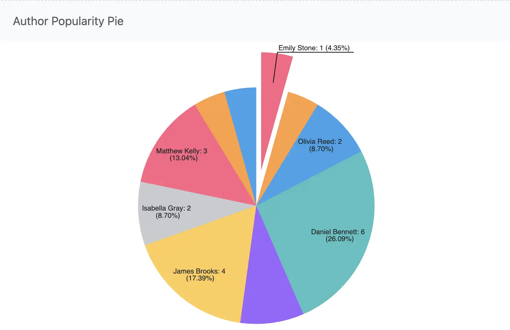

= Graphs
:doctype: book
:taack-category: 4|advanced
:toc:
:source-highlighter: rouge

== Introduction

This section explains how to generate data and implement different types of graphs in your library management application using Grails and the Taack UI framework.

== Set Up
The solution and skeletons for this task are available to clone on this repository

[,shell]
----
git clone git@github.com:Taack/myLibrary.git
----

.To access the skeleton for this part, go to your terminal cd into the project (`myLibrary`) and copy the following line.
[,bash]
----
git checkout part-4-skeleton
----

Or in IntelliJ you can select the wanted branch directly. Select in the top left corner main/myLibrary/remote, and you will see all the branches. Select a branch add checkout.

== Creating Data

We need data from our users to create graphs. The data is created using Grails domain classes and services to generate realistic entries for users, authors, books, and borrow records. For more information, refer to the xref:https://gorm.grails.org/latest/hibernate/manual/index.html#_data_service_queries[GORM Documentation].

You can also have a look at the newly added file located in `app/myLibrary/grails-app/controllers/my/library/MyLibraryDataController.groovy`.

To create the data, simply call `/myLibraryData/createDataUsers` in the address bar of your browser. Note this will not erase previously created data, and will not create the data again if the data was already created.

== Creating Graphs

=== Example Code

To create a graph, you will use a `UiDiagramSpecifier()`. There are a variety of different graph options (bar, line, pie, whiskers, area). To have a look at how to implement all of them, refer to link:../doc/DSLs/diagram-dsl.adoc[Diagram DSL].

In this example, we want to visualize the number of books per author for the top 10 authors with the most books in the library.

First, we need to retrieve the information from MyLibraryBook.

.Hql code (example code):
[,groovy]
----
List<Object[]> results = MyLibraryBorrowed.executeQuery("""\
    select book.author, count(book)
    from MyLibraryBook book
    group by book.author
     """, [max: 10])
----
Here we store each of the top 10 authors’ lastName with their associated number of books.

We now need to put this information in a readable format for the DiagramSpecifier.

[,groovy]
.Example code:
----
Map<String, BigDecimal> authorCounts = [:]
results.each { row ->
    String lastName = row[0] as String
    Long count = row[1] as Long
    authorCounts[lastName] = count.toBigDecimal()
}
----

We can now create the pie diagram.

.Pie Diagram (example code):
[,groovy]
----
new UiDiagramSpecifier().ui {
    pie(hasSlice, {
        List<String> authorsSorted = authorCounts.keySet().toList()
        List<BigDecimal> counts = authorsSorted.collect { authorCounts[it] }

        // For pie, each dataset entry is a separate slice with its label
        labels "Author Pie"
        (0..<authorsSorted.size()).each { i ->
            dataset(authorsSorted[i], counts[i])
        }
    })
}
----

This code has already been implemented for you in `MyLibraryUiService`, along with the Diagram menu. We have started the implementation of `listDiagram` for your convenience. Have a look at `MyLibraryController`.

You can run the server and navigate to the Diagram menu to see the example pie diagram.
Let's create our own diagrams.

.Graph

=== Pie Diagram
We want to be able to visualize which books are the most popular among the borrowers. For that, we decided to create a pie graph displaying the top 10 books that are the most borrowed.

.Implementation
[%collapsible]
====
[,groovy]
----
UiDiagramSpecifier buildBookPopularityPieDiagram(boolean hasSlice) {
    Map<String, BigDecimal> bookCounts = [:]

    List<Object[]> results = MyLibraryBorrowed.executeQuery("""\
        select bi.book.title, count(borrowed)
        from MyLibraryBorrowed borrowed
        join borrowed.bookInstance bi
        group by bi.book.title
        order by count(borrowed) desc
         """, [max: 10])

    results.each { row ->
        String title = row[0] as String
        Long count = row[1] as Long
        bookCounts[title] = count.toBigDecimal()
    }

    new UiDiagramSpecifier().ui {
        pie(hasSlice, {
            List<String> titlesSorted = bookCounts.keySet().toList()
            List<BigDecimal> counts = titlesSorted.collect { bookCounts[it] }

            labels "Pie"
            (0..<titlesSorted.size()).each { i ->
                dataset(titlesSorted[i], counts[i])
            }
        })
    }
}
----
====

.Rendering the graph
[%collapsible]
====
[,groovy]
----
UiDiagramSpecifier diagramPieSpec = myLibraryUiService.buildBookPopularityPieDiagram(true) // TODO 1.2.1

diagram diagramPieSpec, {label "Book Popularity Pie"} // TODO 1.2.2
----
====

You now run the server again and navigate to the Diagram menu to see the newly created pie diagram.

.Graph

=== Bar Diagram
We want to visualize the number of books requested by the borrowers. For that, we decided to create a bar graph displaying the number of requests (per year, month and day).

.Implementation
[%collapsible]
====
[,groovy]
----
UiDiagramSpecifier barDiagram(boolean isStacked) {
    new UiDiagramSpecifier().ui {
        bar(isStacked, {
            labels "T1", "T2", "T3", "T4"
            dataset 'Truc1', 1.0, 2.0, 1.0, 4.0
            dataset 'Truc2', 2.0, 0.1, 1.0, 0.0
            dataset 'Truc3', 2.0, 0.1, 1.0, 1.0
        })
    }
}
----

.Implement `buildBarDiagram`:
[,groovy]
----
UiDiagramSpecifier buildBarDiagram(boolean isStacked, String labelDateFormat) {
    Map<Date, BigDecimal> borrowedCounts = [:]

    List<Object[]> results1 = MyLibraryBorrowed.executeQuery("""\
        select count(borrowed), borrowed.requestDate
        from MyLibraryBorrowed borrowed
        group by borrowed.requestDate
        """)

    results1.each { row ->
        Long count = row[0] as Long
        Date date = row[1] as Date
        borrowedCounts[date] = (borrowedCounts[date] ?: 0) + count.toBigDecimal()
    }

    new UiDiagramSpecifier().ui {
        bar(isStacked, {
            List<Map.Entry<Date, BigDecimal>> countsSorted = borrowedCounts.entrySet().sort { it.key }.collect { it }

            labels((labelDateFormat ?: 'YEAR') as DiagramXLabelDateFormat, countsSorted*.key as Date[]) //<1>
            dataset('Borrowed Books', countsSorted*.value as BigDecimal[])
        })
    }
}
----
====

By default, the graph will display per year.

.Rendering
[%collapsible]
====
[,groovy]
----
UiDiagramSpecifier diagramBarSpec = myLibraryUiService.buildBarDiagram(true, labelDateFormat) // TODO 2.2.1

// TODO 2.2.2
diagram(diagramBarSpec, {
    menu 'Yearly', this.&listDiagrams as MethodClosure, [labelDateFormat: 'YEAR']
    menu 'Monthly', this.&listDiagrams as MethodClosure, [labelDateFormat: 'MONTH']
    menu 'Daily', this.&listDiagrams as MethodClosure, [labelDateFormat: 'DAY']
})
----
====

You can now run the server again to see the newly created bar diagram.

.Graph

=== Whiskers Diagram

We want to be able to visualize the number of days a book is rented for by the borrowers. To achieve this, we decided to create a whisker graph displaying the number of books rented within each specified range of days (1–3, 4–7, 8–14, 15–20, and more than 21).

.Implementation
[%collapsible]
====
[,groovy]
----
diagram new UiDiagramSpecifier().ui({
    whiskers {
        labels "T1", "T2", "T3", "T4"

        dataset 'Truc1', {
            boxData 1.0, 2.0, 3.0, 3.5, 4.0, 4.5, 5.0
            boxData 1.5, 2.5, 3.5, 6.0, 7.0, 8.0, 9.0
            boxData 2.0, 2.0, 2.1, 2.5, 5.5, 5.6, 6.7
            boxData 1.7, 1.8, 1.9, 2.0, 2.1, 2.2, 2.3
        }
    }
})

----

.Implement `buildBorrowDurationWhiskersDiagram`:
[,groovy]
----
UiDiagramSpecifier buildBorrowDurationWhiskersDiagram() {
    Map<Integer, BigDecimal> borrowedDates = [:]
    Map<String, List<BigDecimal>> bins = [
            "1-3d"  : [],
            "4-7d"  : [],
            "8-14d" : [],
            "15-20d": [],
            "21+d"  : []
    ]

    List<Object[]> results1 = MyLibraryBorrowed.executeQuery("""\
        select borrowed.approvalDate, borrowed.returnDate
        from MyLibraryBorrowed borrowed
        where borrowed.approvalDate is not null and borrowed.returnDate is not null
""")

    results1.each { row ->
        Date approvalDate = row[0] as Date
        Date returnDate = row[1] as Date

        long durationMillis = returnDate.time - approvalDate.time
        int duration = (durationMillis / (1000 * 60 * 60 * 24)).toInteger()
        borrowedDates[duration] = (borrowedDates[duration] ?: 0.toBigDecimal()) + 1.toBigDecimal()
        BigDecimal durationBD = duration as BigDecimal

        if (duration <= 3) bins["1-3d"] << durationBD
        else if (duration <= 7) bins["4-7d"] << durationBD
        else if (duration <= 14) bins["8-14d"] << durationBD
        else if (duration <= 20) bins["15-20d"] << durationBD
        else bins["21+d"] << durationBD
    }

    new UiDiagramSpecifier().ui {
        whiskers {
            labels bins.keySet() as String[]

            dataset('Borrow Durations', {
                bins.each { label, values ->
                    if (values) {
                        List<BigDecimal> sorted = values.sort()
                        // min, Q1, median, Q3, max + dummy outliers if needed
                        boxData sorted[0], sorted[(int)(sorted.size()*0.25)], sorted[(int)(sorted.size()*0.5)],
                                sorted[(int)(sorted.size()*0.75)], sorted[-1],
                                sorted[0], sorted[-1]
                    } else {
                        boxData 0.0, 0.0, 0.0, 0.0, 0.0, 0.0, 0.0
                    }
                }
            })
        }
    }
}

----
====

.Rendering
[%collapsible]
====
[,groovy]
----
UiDiagramSpecifier durationDiagramSpec = myLibraryUiService.buildBorrowDurationWhiskersDiagram() // TODO 3.2.1

diagram durationDiagramSpec // TODO 3.2.2
----
====
You now run the server again to see the newly created whiskers diagram.

.Graph

.Solution
[%collapsible]
====
[,groovy]
----
package sid.books

import crew.Role
import crew.User
import crew.UserRole
import grails.compiler.GrailsCompileStatic
import grails.gorm.transactions.Transactional
import grails.plugin.springsecurity.annotation.Secured

import java.text.SimpleDateFormat
import java.time.LocalDate
import java.time.ZoneId

@Secured(['ROLE_ADMIN'])
@GrailsCompileStatic
class GraphsController {
    Random random = new Random(42)

    def index() {
        redirect action: 'createDataUsers'
    }

    @Secured(['ROLE_ADMIN'])
    @Transactional
    def createDataUsers() {
        Role borrowerRole = Role.findByAuthority('ROLE_BORROWER') ?: new Role(authority: "ROLE_BORROWER")
        borrowerRole.save(flush: true)
        Role adminRole = Role.findByAuthority('ROLE_ADMIN') ?: new Role(authority: "ROLE_ADMIN")
        adminRole.save(flush: true)
        List<Map> adminUsers = [
                [firstName: 'John', lastName: 'Doe', username: 'jdoe'],
                [firstName: 'Alice', lastName: 'Smith', username: 'asmith'],
                [firstName: 'Brian', lastName: 'Williams', username: 'bwilliams']
        ]

        List<Map> borrowerUsers = [
                [firstName: 'Emily', lastName: 'Johnson', username: 'ejohnson'], [firstName: 'Michael', lastName: 'Brown', username: 'mbrown'],
                [firstName: 'Jessica', lastName: 'Davis', username: 'jdavis'], [firstName: 'David', lastName: 'Miller', username: 'dmiller'],
                [firstName: 'Sarah', lastName: 'Wilson', username: 'swilson'], [firstName: 'Daniel', lastName: 'Moore', username: 'dmoore'],
                [firstName: 'Laura', lastName: 'Taylor', username: 'ltaylor'], [firstName: 'James', lastName: 'Anderson', username: 'janderson'],
                [firstName: 'Olivia', lastName: 'Thomas', username: 'othomas'], [firstName: 'Matthew', lastName: 'Jackson', username: 'mjackson'],
                [firstName: 'Sophia', lastName: 'White', username: 'swhite'], [firstName: 'Anthony', lastName: 'Harris', username: 'aharris'],
                [firstName: 'Isabella', lastName: 'Martin', username: 'imartin'], [firstName: 'Andrew', lastName: 'Thompson', username: 'athompson'],
                [firstName: 'Megan', lastName: 'Garcia', username: 'mgarcia'], [firstName: 'Joshua', lastName: 'Martinez', username: 'jmartinez'],
                [firstName: 'Grace', lastName: 'Robinson', username: 'grobinson'], [firstName: 'Christopher', lastName: 'Clark', username: 'cclark'],
                [firstName: 'Natalie', lastName: 'Rodriguez', username: 'nrodriguez'], [firstName: 'Brandon', lastName: 'Lewis', username: 'blewis'],
                [firstName: 'Ashley', lastName: 'Walker', username: 'awalker'], [firstName: 'Ryan', lastName: 'Hall', username: 'rhall'],
                [firstName: 'Abigail', lastName: 'Allen', username: 'aallen'], [firstName: 'Justin', lastName: 'Young', username: 'jyoung'],
                [firstName: 'Samantha', lastName: 'Hernandez', username: 'shernandez'], [firstName: 'Jacob', lastName: 'King', username: 'jking'],
                [firstName: 'Madison', lastName: 'Wright', username: 'mwright'], [firstName: 'Ethan', lastName: 'Lopez', username: 'elopez'],
                [firstName: 'Elizabeth', lastName: 'Hill', username: 'ehill'], [firstName: 'Alexander', lastName: 'Scott', username: 'ascott'],
                [firstName: 'Victoria', lastName: 'Green', username: 'vgreen'], [firstName: 'Benjamin', lastName: 'Adams', username: 'badams'],
                [firstName: 'Chloe', lastName: 'Baker', username: 'cbaker'], [firstName: 'William', lastName: 'Nelson', username: 'wnelson'],
                [firstName: 'Ella', lastName: 'Carter', username: 'ecarter'], [firstName: 'Joseph', lastName: 'Mitchell', username: 'jmitchell'],
                [firstName: 'Mia', lastName: 'Perez', username: 'mperez'], [firstName: 'Noah', lastName: 'Roberts', username: 'nroberts'],
                [firstName: 'Lily', lastName: 'Turner', username: 'lturner'], [firstName: 'Logan', lastName: 'Phillips', username: 'lphillips'],
                [firstName: 'Zoe', lastName: 'Campbell', username: 'zcampbell'], [firstName: 'Jayden', lastName: 'Parker', username: 'jparker'],
                [firstName: 'Hannah', lastName: 'Evans', username: 'hevans'], [firstName: 'Lucas', lastName: 'Edwards', username: 'ledwards'],
                [firstName: 'Avery', lastName: 'Collins', username: 'acollins'], [firstName: 'Mason', lastName: 'Stewart', username: 'mstewart'],
                [firstName: 'Scarlett', lastName: 'Sanchez', username: 'ssanchez'], [firstName: 'Jack', lastName: 'Morris', username: 'jmorris'],
                [firstName: 'Aria', lastName: 'Rogers', username: 'arogers'], [firstName: 'Henry', lastName: 'Reed', username: 'hreed'],
                [firstName: 'Amelia', lastName: 'Cook', username: 'acook'], [firstName: 'Sebastian', lastName: 'Morgan', username: 'smorgan'],
                [firstName: 'Layla', lastName: 'Bell', username: 'lbell'], [firstName: 'Owen', lastName: 'Murphy', username: 'omurphy'],
                [firstName: 'Ella', lastName: 'Bailey', username: 'ebailey'], [firstName: 'Gabriel', lastName: 'Rivera', username: 'grivera'],
                [firstName: 'Aubrey', lastName: 'Cooper', username: 'acooper'], [firstName: 'Carter', lastName: 'Richardson', username: 'crichardson'],
                [firstName: 'Sofia', lastName: 'Cox', username: 'scox'], [firstName: 'Wyatt', lastName: 'Howard', username: 'whoward'],
                [firstName: 'Riley', lastName: 'Ward', username: 'rward'], [firstName: 'Dylan', lastName: 'Torres', username: 'dtorres'],
                [firstName: 'Camila', lastName: 'Peterson', username: 'cpeterson'], [firstName: 'Nathan', lastName: 'Gray', username: 'ngray'],
                [firstName: 'Leah', lastName: 'Ramirez', username: 'lramirez'], [firstName: 'Elijah', lastName: 'James', username: 'ejames'],
                [firstName: 'Hazel', lastName: 'Watson', username: 'hwatson'], [firstName: 'Isaac', lastName: 'Brooks', username: 'ibrooks'],
                [firstName: 'Lillian', lastName: 'Sanders', username: 'lsanders'], [firstName: 'Matthew', lastName: 'Price', username: 'mprice']
        ]

        def allUsers = adminUsers.collect {it -> it + [role: 'ADMIN'] } +
                borrowerUsers.collect { it -> it + [role: 'BORROWER'] }
        allUsers.each {
            item ->
                {
                    User user = User.findByUsername(item.username as String)
                    if (!user) {
                        user = new User(
                                username: item.username,
                                password: '{noop}123',
                                businessUnit: 'IT',
                                firstName: item.firstName,
                                lastName: item.lastName
                        )
                        user.save(flush: true)
                        println "Created ${item.role} user: ${user.username} with errors:=${user.errors}"
                    } else {
                        println "Admin user: ${user.username} already created"
                    }
                    UserRole userRole = null
                    if (item.role == "ADMIN") {
                        if (!UserRole.findByUserAndRole(user, adminRole)) {
                            userRole = new UserRole(user: user, role: adminRole)
                        }
                    } else {
                        if (!UserRole.findByUserAndRole(user, borrowerRole)) {
                            userRole = new UserRole(user: user, role: borrowerRole)
                        }
                    }
                    if (userRole) {
                        userRole?.save(flush: true)
                        println "Linked ${item.username} to ROLE_${item.role}"
                    }
                }
        }
        createDataAuthorsBooks()
    }

    @Transactional
    def createDataAuthorsBooks() {

        List<Map> authorData = [
                [firstName: 'Emily', lastName: 'Stone', dob: '1975-04-12'],
                [firstName: 'Michael', lastName: 'King', dob: '1968-11-03'],
                [firstName: 'Olivia', lastName: 'Reed', dob: '1982-06-25'],
                [firstName: 'Daniel', lastName: 'Bennett', dob: '1959-09-17'],
                [firstName: 'Sophia', lastName: 'Ward', dob: '1970-12-29'],
                [firstName: 'James', lastName: 'Brooks', dob: '1965-03-05'],
                [firstName: 'Isabella', lastName: 'Gray', dob: '1987-10-14'],
                [firstName: 'Matthew', lastName: 'Kelly', dob: '1978-07-21'],
                [firstName: 'Mia', lastName: 'Cook', dob: '1990-02-09'],
                [firstName: 'Alexander', lastName: 'Murphy', dob: '1963-01-31'],
                [firstName: 'Charlotte', lastName: 'Bailey', dob: '1984-05-16'],
                [firstName: 'David', lastName: 'Cooper', dob: '1955-08-27'],
                [firstName: 'Amelia', lastName: 'Rivera', dob: '1981-04-03'],
                [firstName: 'Benjamin', lastName: 'Richardson', dob: '1973-09-12'],
                [firstName: 'Evelyn', lastName: 'Cox', dob: '1969-06-18'],
                [firstName: 'Lucas', lastName: 'Howard', dob: '1976-02-22'],
                [firstName: 'Harper', lastName: 'Ward', dob: '1985-10-30'],
                [firstName: 'Henry', lastName: 'Torres', dob: '1960-07-04'],
                [firstName: 'Ella', lastName: 'Peterson', dob: '1989-03-27'],
                [firstName: 'Jack', lastName: 'Gray', dob: '1974-12-08'],
        ]

        authorData.each { data ->
            Author author = Author.findByFirstNameAndLastName(data.firstName as String, data.lastName as String)
            if (!author) {
                author = new Author(
                        firstName: data.firstName,
                        lastName: data.lastName,
                        dateOfBirth: new SimpleDateFormat('yyyy-MM-dd').parse(data.dob as String),
                        listOfBooks: []
                )
                author.save(flush: true)
                println "Created author: ${author.firstName} ${author.lastName} with errors:=${author.errors}"
            } else {
                println "Author: ${author.firstName} ${author.lastName} already created"
            }

        }

        List<Map> booksData = [
                [title: "The Silent Patient", description: "A thrilling psychological mystery novel.", numberOfPages: "336"],
                [title: "Educated: A Memoir", description: "An inspiring journey through education and resilience.", numberOfPages: "352"],
                [title: "Becoming", description: "A powerful memoir exploring identity and purpose.", numberOfPages: "448"],
                [title: "Where the Crawdads Sing", description: "A captivating blend of mystery and nature writing.", numberOfPages: "384"],
                [title: "Normal People", description: "A complex love story set in Ireland.", numberOfPages: "288"],
                [title: "Atomic Habits", description: "A comprehensive guide to building good habits and breaking bad ones.", numberOfPages: "320"],
                [title: "The Subtle Art of Not Giving a F*ck", description: "A brutally honest self-help book.", numberOfPages: "224"],
                [title: "Thinking, Fast and Slow", description: "An in-depth analysis of human decision-making and psychology.", numberOfPages: "512"],
                [title: "Sapiens: A Brief History of Humankind", description: "A sweeping exploration of human history.", numberOfPages: "464"],
                [title: "Dune", description: "A classic science fiction epic.", numberOfPages: "896"],
                [title: "The Great Gatsby", description: "A timeless novel of wealth, love, and loss.", numberOfPages: "180"],
                [title: "1984", description: "A chilling dystopian classic about surveillance and control.", numberOfPages: "328"],
                [title: "To Kill a Mockingbird", description: "A powerful novel about justice and morality.", numberOfPages: "336"],
                [title: "The Catcher in the Rye", description: "A coming-of-age story of teenage alienation.", numberOfPages: "277"],
                [title: "Brave New World", description: "A dystopian vision of a technologically controlled society.", numberOfPages: "311"],
                [title: "The Alchemist", description: "A philosophical novel about destiny and dreams.", numberOfPages: "208"],
                [title: "The Road", description: "A bleak and beautiful post-apocalyptic novel.", numberOfPages: "287"],
                [title: "Gone Girl", description: "A dark psychological thriller with shocking twists.", numberOfPages: "422"],
                [title: "The Girl on the Train", description: "A gripping psychological thriller about memory and murder.", numberOfPages: "395"],
                [title: "The Book Thief", description: "A story of hope and loss in Nazi Germany.", numberOfPages: "552"],
                [title: "Life of Pi", description: "An imaginative survival story with spiritual undertones.", numberOfPages: "460"],
                [title: "The Kite Runner", description: "A novel of friendship and redemption set in Afghanistan.", numberOfPages: "371"],
                [title: "The Fault in Our Stars", description: "A touching love story between teenagers with cancer.", numberOfPages: "313"],
                [title: "Memoirs of a Geisha", description: "An immersive journey into Japanese culture and history.", numberOfPages: "434"],
                [title: "The Help", description: "A novel about race, class, and friendship in the American South.", numberOfPages: "464"],
                [title: "The Hunger Games", description: "A dystopian young adult adventure of survival.", numberOfPages: "374"],
                [title: "Catch-22", description: "A satirical novel about the absurdities of war.", numberOfPages: "453"],
                [title: "Pride and Prejudice", description: "A classic romantic novel with wit and insight.", numberOfPages: "279"],
                [title: "Jane Eyre", description: "A gothic novel exploring love and independence.", numberOfPages: "500"],
                [title: "Wuthering Heights", description: "A dark, passionate story of love and revenge.", numberOfPages: "416"],
                [title: "Little Women", description: "A timeless novel about family and womanhood.", numberOfPages: "759"],
                [title: "Beloved", description: "A haunting novel about slavery and memory.", numberOfPages: "324"],
                [title: "One Hundred Years of Solitude", description: "A magical realism epic of a family’s generations.", numberOfPages: "417"],
                [title: "The Handmaid’s Tale", description: "A dystopian novel exploring gender and power.", numberOfPages: "311"],
                [title: "The Shining", description: "A terrifying psychological horror novel.", numberOfPages: "447"],
                [title: "Dracula", description: "The classic gothic horror story of the vampire count.", numberOfPages: "418"],
                [title: "Frankenstein", description: "The original science fiction horror novel.", numberOfPages: "280"],
                [title: "Moby Dick", description: "An epic tale of obsession and revenge at sea.", numberOfPages: "635"],
                [title: "War and Peace", description: "A sweeping historical epic set during Napoleon’s invasion of Russia.", numberOfPages: "1225"],
                [title: "Crime and Punishment", description: "A psychological exploration of guilt and redemption.", numberOfPages: "671"],
                [title: "The Brothers Karamazov", description: "A philosophical novel about faith, doubt, and family.", numberOfPages: "796"],
                [title: "Les Misérables", description: "A story of injustice, redemption, and love in 19th-century France.", numberOfPages: "1463"],
                [title: "Anna Karenina", description: "A tragic novel of love and societal constraints.", numberOfPages: "864"],
                [title: "Madame Bovary", description: "A realist novel about desire and dissatisfaction.", numberOfPages: "329"],
                [title: "The Odyssey", description: "The epic Greek poem of adventure and homecoming.", numberOfPages: "541"],
                [title: "The Iliad", description: "An epic poem about heroism and the Trojan War.", numberOfPages: "683"],
                [title: "A Tale of Two Cities", description: "A historical novel set during the French Revolution.", numberOfPages: "489"],
                [title: "Great Expectations", description: "A coming-of-age story about ambition and love.", numberOfPages: "505"],
                [title: "Oliver Twist", description: "A social novel exposing the plight of orphans in Victorian London.", numberOfPages: "554"],
                [title: "David Copperfield", description: "A semi-autobiographical novel of personal growth.", numberOfPages: "624"],
                [title: "Bleak House", description: "A satirical novel about the flaws of the legal system.", numberOfPages: "768"],
        ]

        List<Author> authors = Author.list()

        booksData.eachWithIndex { data, index ->
            Author author = authors[random.nextInt(authors.size() - 1) + 1]
            Book book = Book.findByTitle(data.title as String)
            if (!book) {
                book = new Book(
                        title: data.title,
                        author: author,
                        description: data.description,
                        numberOfPages: data.numberOfPages as int,
                        listOfBookInstance: []
                )
                book.save(flush: true)
                println "Created book: ${book.title} by ${book.author.firstName} ${book.author.lastName} (${data.numberOfPages} pages) with errors:=${author.errors}"
            } else {
                println "Book: ${book.title} by ${book.author.firstName} ${book.author.lastName} (${data.numberOfPages} pages) already created"
            }
        }
        createDataBookInstances()
    }

    @Transactional
    def createDataBookInstances() {
        List<Integer> instanceCounts = [
                50, 43, 0, 39, 50, 10, 33, 30, 50, 5, 38, 4, 12, 43, 47, 0, 19, 22, 3, 17,
                14, 4, 50, 27, 43, 1, 2, 25, 31, 0, 7, 4, 20, 7, 3, 29, 0, 44, 24, 9,
                44, 8, 0, 31, 28, 13, 15, 20, 6, 17, 26, 0, 40, 27, 13, 0, 15, 10, 32, 4,
                41, 10, 22, 0, 25, 19, 4, 3, 30, 27, 9, 18, 22, 0, 8, 12, 31, 26, 18, 0,
                13, 24, 50, 11, 3, 0, 12, 5, 4, 37, 2, 49, 12, 21, 35, 0, 50, 33, 0, 17,
                44, 10, 33, 30, 50, 5, 38, 4, 12, 43, 47, 0, 10, 22, 3, 17, 14, 4, 50, 27,
                43, 1, 10, 25, 31, 0, 7, 4, 20, 7, 3, 29, 0, 44, 24, 9, 44, 8, 0, 31, 28,
                13, 15, 19, 6, 17, 26
        ]

        List<Book> books = Book.list(sort: 'id')

        books.eachWithIndex { book, idx ->
            if (book.numberOfInstances == 0) {
                int count = instanceCounts[idx]
                (1..count).each { index ->
                    BookInstance instance = new BookInstance(
                            book: book,
                            isActive: true,
                            serialNumber: random.nextInt(100000),
                            isAvailableB: true,
                            borrowHistoryOfBook: []
                    )
                    instance.save(flush: true)
                }
                println "Created ${count} instances for book: ${book.title}"
            } else {
                println "Book instances for book: ${book.title} already created"
            }
        }

        createDataBorrowed()
    }

    @Transactional
    def createDataBorrowed() {
        Role borrowerRole = Role.findByAuthority('ROLE_BORROWER')
        List<UserRole> userRoles = UserRole.findAllByRole(borrowerRole)
        List<User> borrowerUsers = userRoles*.user
        List<BookInstance> bookInstances = BookInstance.list(sort: 'id')
        List<User> someUsers = User.findAll();
        bookInstances.each { instance ->
            if (BorrowedBooks.countByBookInstance(instance) > 0) {
                println "Skipping bookInstance id=${instance.id}, already has borrow records"
                return
            }

            int borrowCount = random.nextInt(31)

            LocalDate currentDate = LocalDate.of(2020, 1, 1).plusDays(random.nextInt(365 * 3))

            (1..borrowCount).each { idx ->
                int duration = 1 + random.nextInt(22)

                Date requestDate = Date.from(currentDate.atStartOfDay(ZoneId.systemDefault()).toInstant())
                Date approvalDate = null

                Date returnDate = null
                ApprovalStatus status
                Boolean isAvailableB = true
                if (idx == borrowCount && borrowCount % 2 == 0) {
                    if (borrowCount % 3 == 0) {
                        status = ApprovalStatus.APPROVED
                        approvalDate = requestDate
                    } else {
                        status = ApprovalStatus.PENDING
                    }
                    isAvailableB = false
                } else {
                    approvalDate = requestDate
                    currentDate = currentDate.plusDays(duration)
                    returnDate = Date.from(currentDate.atStartOfDay(ZoneId.systemDefault()).toInstant())
                    status = ApprovalStatus.APPROVED

                    int gap = 1 + random.nextInt(30)
                    currentDate = currentDate.plusDays(gap)
                }
                User user = borrowerUsers[random.nextInt(borrowerUsers.size())]
                BorrowedBooks borrowed = new BorrowedBooks(
                        bookInstance: instance,
                        user: user,
                        requestDate: requestDate,
                        approvalDate: approvalDate,
                        returnDate: returnDate,
                        statusOfApproval: status,
                )
                instance.isAvailableB = isAvailableB
                borrowed.save(flush: false)
                instance.save(flush: false)
            }
            println "Created ${borrowCount} borrowed entries for bookInstance id=${instance.id}"
        }
        redirect controller: 'sidBooks', action: 'listAuthor'
    }
}

----

====