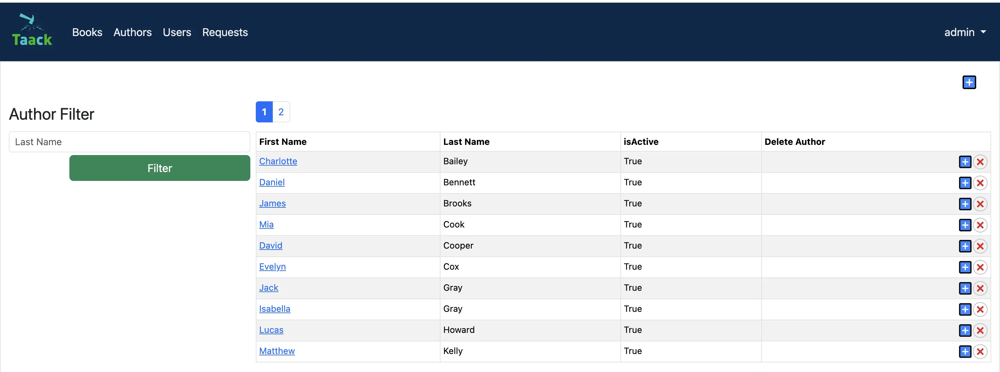
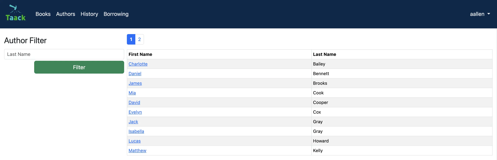

= Security and Constraints
:doctype: book
:taack-category: 3|advanced
:toc:
:source-highlighter: rouge

== Set Up
.To access the skeleton for this part, go to your terminal cd into the project (`myLibrary`) and copy the following line.
[,bash]
----
git checkout part-3-skeleton
----

Or in IntelliJ you can select the wanted branch directly. Select in the top left corner main/myLibrary/remote, and you will see all the branches. Select a branch add checkout.
== Introduction

In this section, we will learn about security and constraints. First, we will learn how to implement these constraints, which will allow us to restrict user inputs. Then, we will dive into security by creating two types of users: admins and borrowers, each having access to different features.

Admins will be able to:

- add, delete and reactivate authors in the Author menu.
- add books in the Book menu.
- purchase and delete bookInstances in the Book menu.
- have access to the list of users and information about each of them in a User menu.
- approve books in the Borrowed Menu.

Borrowers will be able to:

- see the authors in the Author menu.
- see the books in the Book menu.
- request a bookInstance in the Book menu.
- return a bookInstance in the Borrowed menu.
- see their past requests in the History menu.

.Admins

.Borrowers

== Constraints

If an admin is approving a request, it would not make sense for them to be able to approve the book on a date before the request was made; they should not be allowed to do that. The same goes with the date the user returns the book, they should not be able to return it before the approval date. Let's implement this in `MyLibraryBorrowed`.

.Class Diagram for your convenience
[plantuml, format="svg", opts="inline"]
----
@startuml

enum ApprovalStatus {
    PENDING
    APPROVED
    REJECTED
}

class MyLibraryAuthor {
    String firstName
    String lastName
    Date dateOfBirth
    Boolean isActive = true
    String toString()
}

class MyLibraryBook {
    String title
    String description
    int numberOfPages
    int count = 0
    int getNumberOfInstances()
    int getNumberOfBooksBorrowable()
}

class MyLibraryBookInstance {
    Boolean isActive = true
    Integer serialNumber
    Boolean isAvailableB = true
}

class MyLibraryBorrowed {
    Date requestDate
    Date approvalDate
    Date returnDate
    ApprovalStatus statusOfApproval = ApprovalStatus.PENDING
}

MyLibraryAuthor "1" --> "*" MyLibraryBook : listOfBooks
MyLibraryBook "1" --> "*" MyLibraryBookInstance : listOfBookInstance
MyLibraryBookInstance "*" --> "1" MyLibraryBook : belongsTo
MyLibraryBookInstance "1" --> "*" MyLibraryBorrowed : borrowHistoryOfBook
MyLibraryBorrowed "*" --> "1" MyLibraryBookInstance : bookInstance
MyLibraryBorrowed "*" --> "1" User : user
MyLibraryBorrowed --> ApprovalStatus

@enduml
----

Pro Mode: modify the class [TODO 1]

.Add the following constraints:
[,groovy]
----
static constraints = {
    approvalDate nullable: true, validator: { Date val, MyLibraryBorrowed obj ->
        if (val == null) return true
        return val >= obj.requestDate
    }

    returnDate nullable: true, validator: { Date val, MyLibraryBorrowed obj ->
        if (val == null) return true
        return val >= obj.approvalDate
    }

    bookInstance nullable:false
    user nullable:false
}
----
For more information, refer to the link:https://docs.grails.org/latest/ref/Constraints/Usage.html[Grails documentation] about constraints.

== Define menus

As explained earlier, there will be two new menus only available to admins. Let's add them in `MyLibraryUiService` in `buildMenu`.

Pro Mode: Add the menus [TODO 2]

.Add the following menus:
[,groovy]
----
menu MyLibraryController.&listOfUsers as MC
menu MyLibraryController.&listOfRequests as MC
----

== Set up the Users

First, we will create a method to determine what type of user is connected in `MyLibraryUiService`.

Pro Mode: implement `isAdmin` [TODO 3.1].

.Implement `isAdmin`:
[,groovy]
----
boolean isAdmin() {
    User currentUser = springSecurityService.currentUser as User
    return currentUser?.authorities?.any { it.authority == 'ROLE_ADMIN' }
}
----

Second, we will create a method that allows us to determine what type of user is connected in `MyLibraryController`.

Pro Mode: modify `index` [TODO 3.2].

.Modify `index`:
[,groovy]
----
def index() {
    currentUser = springSecurityService.currentUser as User
    isAdmin = currentUser?.authorities?.any { it.authority == 'ROLE_ADMIN' }
    redirect action: 'listAuthor'
}
----

== Modify the Builders

To accommodate the changes, we will have to modify the author, book and userBorrowed table.

Pro Mode: modify `buildAuthorTable` [TODO 4.1]

.Modify `buildAuthorTable` TODO 4.1.1–4.1.4:
[,groovy]
----
boolean isAdmin = isAdmin() //TODO 4.1.1
if(!isSelect && isAdmin) { // TODO 4.1.2 & TODO 4.1.4
if(!isAdmin) {filter.addFilter(buildIsActiveAuthorFilter(author))} //TODO 4.1.3
----

Pro Mode: modify `buildBookTable` [TODO 4.2]

.Modify `buildBookTable` TODO 4.2.1–4.2.8:
[,groovy]
----
boolean isAdmin = isAdmin() //TODO 4.2.1
if(isAdmin) column {label "Number of instances "} // TODO 4.2.2
if(isAdmin) column {label "Modify number of Book Instances"} // TODO 4.2.3
if (!isAdmin) label "Request Form" // TODO 4.2.4

// TODO 4.2.5
if(!isAdmin) {
    MyLibraryBookInstance bookInstance = new MyLibraryBookInstance()
    filter.addFilter(new FilterExpression(true, Operator.EQ, book.listOfBookInstance_,bookInstance.isAvailableB_))
}

if (isAdmin) {rowColumn {rowField bookIterator.numberOfInstances_}} // TODO 4.2.6

// TODO 4.2.7 & 4.2.8
if(isAdmin) {
    rowColumn {
        rowAction ActionIcon.DELETE * IconStyle.SCALE_DOWN, MyLibraryController.&selectBookInstance as MC, bookIterator.id
        rowAction ActionIcon.ADD * IconStyle.SCALE_DOWN, MyLibraryController.&purchaseBook as MC, bookIterator.id
    }
} else {
    rowColumn {
        rowAction ActionIcon.CREATE * IconStyle.SCALE_DOWN, MyLibraryController.&requestBookInstance as MC, bookIterator.id
    }
}
----

Pro Mode: modify `buildUserBorrowedTable` [TODO 4.3 Part 1]

Note we have added two variables that the builder takes. `showUser`, which allows showing borrow records for that specific user and `isUser`, which indicates if the viewer is a user (true) or admin (false).

.Modify `buildUserBorrowsTable` TODO 4.3.1–4.3.7:
[,groovy]
----
Boolean isAdmin = isAdmin() // TODO 4.3.1
if (isCurrently  && !isAdmin) column {label "Return Book"} // TODO 4.3.2

// TODO 4.3.3
if(isAdmin) {
    column { label borrowed.user_ }
    if (!showUser) {
        label "Approve Book"
    }
}

// TODO 4.3.4
User currentUser = springSecurityService.currentUser as User
if (showUser) {
    currentUser = showUser
}

// TODO 4.3.5
if(!isUser || showUser) {
    filter.addFilter(new FilterExpression(currentUser, Operator.EQ, borrowed.user_))
}

if (isCurrently && !isAdmin) {  // TODO 4.3.6

// TODO 4.3.7: Add condition isAdmin, to display borrowed user and Approve Book (if !showUser) rowColumns
if(isAdmin) {
    rowColumn { rowField borrowedIterator.user.username_ }
    if (!showUser) {
        rowColumn {
            rowAction ActionIcon.DELETE * IconStyle.SCALE_DOWN, MyLibraryController.&approveBook as MC, borrowedIterator.id
        }
    }
}
----

Note that we have added the necessary elements to display all the requests of all the users. Let's render this table.

Pro Mode: modify `listOfRequests` [TODO 4.3 Part 2]

.Modify `listOfRequests` TODO 4.3.8–4.3.12:
[,groovy]
----
def listOfRequests() {
    UiTableSpecifier tableUserBorrowsSpecifier = myLibraryUiService.buildUserBorrowsTable(true, null, true)
    UiFilterSpecifier filterUserBorrowsSpecifier = myLibraryUiService.buildUserBorrowsFilter()

    taackUiService.show(new UiBlockSpecifier().ui {
        tableFilter filterUserBorrowsSpecifier, tableUserBorrowsSpecifier
    }, myLibraryUiService.buildMenu())
}
----

== User Menu
As explained earlier, we also want to have a table displaying all the users for admins.
Let's start by implementing the `buildUsersTable`.

Pro Mode: implement `buildUsersTable` [TODO 5.1]

.Implement `buildUsersTable`:
[,groovy]
----
UiTableSpecifier buildUsersTable() {
    UiTableSpecifier buildUsersSpecifier = new UiTableSpecifier()
    User user = new User()

    buildUsersSpecifier.ui {
        header {
            label user.username_
            label "Authorities"
        }

        TaackFilter taackFilter = taackFilterService.getBuilder(User)
                .setSortOrder(TaackFilter.Order.ASC, user.username_)
                .setMaxNumberOfLine(10).build()

        iterate taackFilter, {User userIterator ->
            rowColumn {
                rowAction ActionIcon.SHOW * IconStyle.SCALE_DOWN, MyLibraryController.&showUser as MC, userIterator.id
                rowField userIterator.username_
            }
            rowField userIterator.authorities_
        }
    }
}
----

Let's render it on a page. Go to `MyLibraryController`.

Pro Mode: implement `listOfUsers` [TODO 5.2]

.Implement `listOfUsers`:
[,groovy]
----
def listOfUsers() {
    UiTableSpecifier tableUsersSpecifier = myLibraryUiService.buildUsersTable()

    taackUiService.show(new UiBlockSpecifier().ui {
        table tableUsersSpecifier
    }, myLibraryUiService.buildMenu())
}
----

Let's implement a `showUser`.
Go to `MyLibraryUiService`

Pro Mode: implement `buildUserShow` [TODO 5.3]

.Implement `buildUserShow`:
[,groovy]
----
UiShowSpecifier buildUserShow(User user) {
    UiShowSpecifier userShowSpecifier = new UiShowSpecifier()

    userShowSpecifier.ui(user, {
        fieldLabeled user.username_
        fieldLabeled user.firstName_
        fieldLabeled user.lastName_
        fieldLabeled user.authorities_
    })
}
----

Go to `MyLibraryController`

Pro Mode: implement `showUser` [TODO 5.4]

.Implement `showUser`:
[,groovy]
----
def showUser(User user) {
    UiShowSpecifier showSpec = myLibraryUiService.buildUserShow(user)
    UiTableSpecifier userBorrowsSpecifier = myLibraryUiService.buildUserBorrowsTable(false, user)
    UiFilterSpecifier userBorrowsFilterSpecifier = myLibraryUiService.buildUserBorrowsFilter(user)
    UiTableSpecifier userBorrowsCurrentlySpecifier = myLibraryUiService.buildUserBorrowsTable(true, user)

    taackUiService.show(new UiBlockSpecifier().ui {
        modal {
            show showSpec
            tableFilter userBorrowsFilterSpecifier, userBorrowsSpecifier
            tableFilter userBorrowsFilterSpecifier, userBorrowsCurrentlySpecifier
        }
    })

}
----

== Security Part 1
Great, we now have everything we need. We just have to add the layer of security.
One of the great things about taack is how simple this is. Just by adding `@Secured(['ROLE_ADMIN'])` above a method, you are protecting the method from any user that does not have the `ROLE_ADMIN`.  `@Secured(['ROLE_ADMIN'])`  will not only hide the icon but also make the method inaccessible via direct link.

Let's go ahead and add  `@Secured(['ROLE_ADMIN'])` and  `@Secured(['ROLE_BORROWER'])` to the necessary methods. [TODO 6.1] Hint: there is a total of 11 SECURED to add in `MyLibraryController`.

In larger projects, adding conditional statements to hide buttons or columns can become very complex. This is why we recommend trying to have the same number of rows on display for all the pages/modals using the same builder. To hide buttons in this case, you can use another technique.

== Security Part 2
You can create a file where you will specify the methods that have to be secured as well as the conditions in which some methods have to be secured.

Navigate to `intranet/app/myLibrary/grails-app/services/my/library/MyLibrarySecurityService.groovy` that has been created for you.

Most of the methods have been implemented for you. Read the documentation in the file for more information.

Using the same idea as `returnSecurityClosure` (which checks if the ApprovalStatus is Approved to allow the user to see the button to return a book) you will implement `approvedSecurityClosure`.

Pro Mode: implement `approvedSecurityClosure`  [TODO 6.2]

.Implement the following method:
[,groovy]
----
private static boolean approvedSecurityClosure(Long id, Map p) {
    MyLibraryBorrowed borrowed = MyLibraryBorrowed.get(id)
    return (borrowed.statusOfApproval != ApprovalStatus.APPROVED)
}
----

.Add the following lines of code in `init`:
[,groovy]
----
TaackUiEnablerService.securityClosure(
    this.&approvedSecurityClosure,
    MyLibraryController.&approveBook as MethodClosure)
----

Congratulations! You have finished implementing the project.

In the next part, you are going to learn how to create graphs.