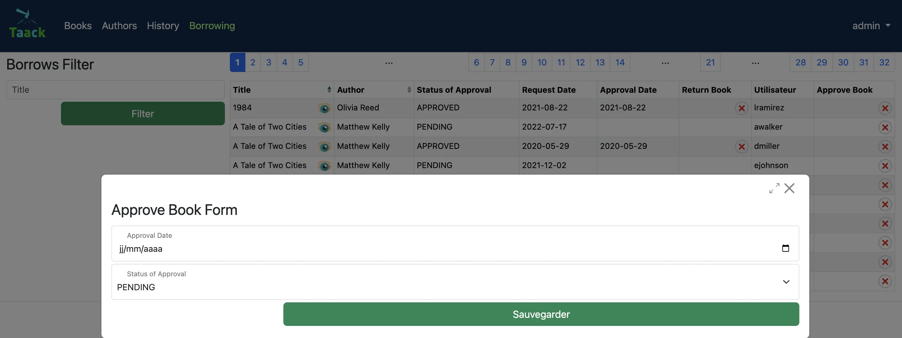

= Part Two
:doctype: book
:taack-category: 2|advanced
:toc:
:source-highlighter: rouge

== Set Up

.To access the skeleton for this part, go to your terminal cd into the project (`myLibrary`) and copy the following line.
[,bash]
----
git checkout part-2-skeleton
----

Or in IntelliJ you can select the wanted branch directly. Select in the top left corner main/myLibrary/remote, and you will see all the branches. Select a branch add checkout.

== Introduction

You have now created a personal library, let's add some features. We want to add a borrowing system. After this part, you will be able to borrow books from your own library, approve the request and return the books, and you will also have access to your borrowing request history.

We have updated the code in `myLibrary`. Pull this version to have access to the new skeleton code.

.Form

== Define and Update Domain Classes
Edit: `app/library/src/main/groovy/myLibrary/domain/`

.Updated class Diagram for your convenience
[plantuml, format="svg", opts="inline"]
----
@startuml

enum ApprovalStatus {
    PENDING
    APPROVED
    REJECTED
}

class MyLibraryAuthor {
    String firstName
    String lastName
    Date dateOfBirth
    Boolean isActive = true
    String toString()
}

class MyLibraryBook {
    String title
    String description
    int numberOfPages
    int count = 0
    int getNumberOfInstances()
    int getNumberOfBooksBorrowable()
}

class MyLibraryBookInstance {
    Boolean isActive = true
    Integer serialNumber
    Boolean isAvailableB = true
}

class MyLibraryBorrowed {
    Date requestDate
    Date approvalDate
    Date returnDate
    ApprovalStatus statusOfApproval = PENDING
}

class User

MyLibraryAuthor "1" --> "*" MyLibraryBook : listOfBooks
MyLibraryBook "1" --> "*" MyLibraryBookInstance : listOfBookInstance
MyLibraryBookInstance "*" --> "1" MyLibraryBook : belongsTo
MyLibraryBookInstance "1" --> "*" MyLibraryBorrowed : borrowHistoryOfBook
MyLibraryBorrowed "*" --> "1" MyLibraryBookInstance : bookInstance
MyLibraryBorrowed "*" --> "1" User : user

@enduml
----

Pro Mode: [TODO 1.1, 1.2 & 1.3]

.Modify a `MyLibraryBook` class and add the following method (TODO 1.1):
[,groovy]
----
int getNumberOfBooksBorrowable() {
        return MyLibraryBookInstance.countByIsAvailableBAndIsActiveAndBook(true, true, this) //<1>
    }
----
<1> `countByIsAvailableBAndIsActiveAndBook` is a dynamic finder method in Grails/GORM that automatically counts the number of records in a domain class matching the given conditions for the fields `isAvailableB`, `isActive`, and `book`. For more information, link:https://docs.grails.org/latest/ref/Domain%20Classes/countBy.html[Grails Documentation (countBy)].

.Modify a `MyLibraryBookInstance` class and add the following variables and hasMany relationship (TODO 1.2):
[,groovy]
----
List<MyLibraryBorrowed> borrowHistoryOfBook
Boolean isAvailableB = true

static hasMany = [borrowHistoryOfBook: MyLibraryBorrowed]
----

.Implement a `MyLibraryBorrowed` class (TODO 1.3):
[,groovy]
----
enum ApprovalStatus {
    PENDING, APPROVED, REJECTED
}

@GrailsCompileStatic
@TaackFieldEnum
class MyLibraryBorrowed {
    MyLibraryBookInstance bookInstance
    User user
    Date requestDate
    Date approvalDate
    Date returnDate
    ApprovalStatus statusOfApproval= ApprovalStatus.PENDING

    static constraints = {
        approvalDate nullable: true
        returnDate nullable: true
    }
}
----

You have now implemented all the necessary classes for this section!

== Define Menus

For this section, we need to create two new menus. The user will request to borrow a bookInstance in the Book menu. The bookInstances that have been requested and not yet returned (either pending requests or approved requests) will be in the borrowed menu. The bookInstances that have been returned will be in the History menu.

Let's start by adding these menus to the `buildMenu`.

Pro Mode: Add the menus in `buildMenu`. [TODO 2]

.Add the following lines to `buildMenu`:
[,groovy]
----
menu MyLibraryController.&listBooksBorrowed as MC
menu MyLibraryController.&listBooksCurrentlyBorrowed as MC
----

== Define Borrowed Menu

=== Borrowed Table

We want to display the borrowed (not yet returned) in a table. For that we need to create a `UiTableSpecifier`. Go to `app/library/services/myLibrary/MyLibraryUiService` in `Author Menu`.

Note: the only differences between the borrowed and history menus are the `returnDate` and `StatusOfApproval`. The variable `isCurrently` will define this. Therefore, we will use the same TableSpecifier for both menus; this is one of the big advantages of using a separate file (`MyLibraryUiService`) to implement the Specifiers: they can be reused in different contexts with small modifications.

Pro Mode: implement the Table by yourself [TODOS 3.1].

.Implement the `buildBorrowedTable`:
[,groovy]
----
MyLibraryBook book = new MyLibraryBook()
MyLibraryBorrowed borrowed = new MyLibraryBorrowed()
UiTableSpecifier buildUserBorrowsSpecifier = new UiTableSpecifier()
MyLibraryBookInstance bookInstance = new MyLibraryBookInstance()

buildUserBorrowsSpecifier.ui {
    header {
        sortableFieldHeader borrowed.bookInstance_,bookInstance.book_,book.title_
        sortableFieldHeader borrowed.bookInstance_,bookInstance.book_,book.author_
        if (isCurrently) {label borrowed.statusOfApproval_}
        label borrowed.requestDate_
        label borrowed.approvalDate_
        // TODO 3.11.1: If isCurrently is true, add column with label "Return Book".
        column {label borrowed.user_}
        // TODO 3.11.2: If isCurrently is true, add label "Approve Book".
    }

    TaackFilter.FilterBuilder filter = taackFilterService.getBuilder(MyLibraryBorrowed)
            .setMaxNumberOfLine(10)
            .setSortOrder(
                TaackFilter.Order.ASC,
                borrowed.bookInstance_,
                bookInstance.book_,book.title_)

    if(isCurrently) {filter.addFilter(new FilterExpression(null, Operator.EQ, borrowed.returnDate_))} //<1>
    else {filter.addFilter(new FilterExpression(null, Operator.NE, borrowed.returnDate_))} //<1>

    iterate(
            filter.build()) { MyLibraryBorrowed borrowedIterator ->
        rowColumn {
            // TODO 3.18: Add SHOW action with book title.
            rowField borrowedIterator.bookInstance.book.title
        }
        rowField borrowedIterator.bookInstance.book.author.toString()
        if(isCurrently) {rowField borrowedIterator.statusOfApproval_}
        rowField borrowedIterator.requestDate_
        rowField borrowedIterator.approvalDate_
        // TODO 3.11.3: If isCurrently and statusOfApproval is APPROVED, add DELETE action linked to returnBook.
        rowColumn {rowField borrowedIterator.user.username_}
        // TODO 3.11.4: If isCurrently is true, add DELETE action linked to approveBook.
    }
}
----
<1> This is another way to create a filter if you are not planning on reusing it somewhere else.

We also want to add a filter that filters the authors by last name. Let's implement this filter.

Pro Mode: implement the Filter by yourself [TODO 3.2].

.Implement the `buildUserBorrowsFilter`:
[,groovy]
----
UiFilterSpecifier buildUserBorrowsFilter(User user = null) {
    MyLibraryBook book = new MyLibraryBook()
    UiFilterSpecifier UserBorrowsFilterSpecifier = new UiFilterSpecifier()
    MyLibraryBorrowed borrowed = new MyLibraryBorrowed()
    MyLibraryBookInstance bookInstance = new MyLibraryBookInstance()

    UserBorrowsFilterSpecifier.ui MyLibraryBorrowed, {
        if (user) hiddenId(user.id)
        section "Borrows Filter", {
            filterField borrowed.bookInstance_,bookInstance.book_,book.title_
        }
    }
}
----
Your table is now complete; we just need to render it on the page. We will do this in a module called `listBooksCurrentlyBorrowed`. Go to `app/library/controller/myLibrary/MyLibraryController` in `Borrowed Menu`.

Pro Mode: implement `listBooksCurrentlyBorrowed` by yourself [TODO 3.3].

.Implement the `listBooksCurrentlyBorrowed` method:
[,groovy]
----
def listBooksCurrentlyBorrowed() {
    UiTableSpecifier tableUserBorrowsSpecifier = myLibraryUiService.buildUserBorrowsTable(true)
    UiFilterSpecifier filterUserBorrowsSpecifier = myLibraryUiService.buildUserBorrowsFilter()

    taackUiService.show(new UiBlockSpecifier().ui {
        tableFilter filterUserBorrowsSpecifier, tableUserBorrowsSpecifier
    }, myLibraryUiService.buildMenu())
}
----

You can now start the server. The borrowed table should be functional, but currently you will only see the table headers since there are no borrows in your database. So let’s proceed with creating a form and saving objects into the database. We now have to implement `requestBookInstance`, which requires creating a `UiFormSpecifier`.
Let's go back to `MyLibraryUiService`.

==== Borrowed Form
Pro Mode: implement `buildRequestBookForm` [TODO 3.4].

.Implement `buildRequestBookForm`:
[,groovy]
----
UiFormSpecifier buildRequestBookForm(MyLibraryBook book) {
    User user = springSecurityService.currentUser as User
    MyLibraryBorrowed borrowed = new MyLibraryBorrowed()
    borrowed.user = user
    book ?= new MyLibraryBook(params)
    UiFormSpecifier requestBookFormSpecifier = new UiFormSpecifier()

    requestBookFormSpecifier.ui borrowed, {
        section "Request Book Form", {
            hiddenField borrowed.user_ //<1>
            field borrowed.requestDate_
            ajaxField borrowed.bookInstance_, MyLibraryController.&selectBookInstanceOne as MC, book.id
        }
        formAction MyLibraryController.&saveBookForm as MC
    }
}
----
<1> Passes parameters in the form without the user seeing.

Let's go back to `MyLibraryController`. We will render this form in a modal.

Pro Mode: implement `requestBookInstance` [TODO 3.5]

.Implement `requestBookInstance`:
[,groovy]
----
def requestBookInstance(MyLibraryBook book){
    UiFormSpecifier requestBookInstanceForm = myLibraryUiService.buildRequestBookForm(book)

    taackUiService.show new UiBlockSpecifier().ui {
        modal {
            form requestBookInstanceForm
        }
    }
}
----

We now need to save the borrowed record, so let's implement `saveBookForm`.

Pro Mode: implement `saveBookForm` [TODO 3.6].
[,groovy]
----
@Transactional
def saveBookForm() {
    MyLibraryBorrowed borrowed = taackSaveService.save(MyLibraryBorrowed)
    borrowed.bookInstance?.isAvailableB = false
    taackSaveService.redirectOrRenderErrors(borrowed)
}
----

We now need to implement `selectBookInstanceOne` which will use `buildInstanceBookTable`, we need to modify this Specifier first.

Pro Mode: modify `buildInstanceBookTable` [TODO 3.7].

.Replace TODO 3.7.1:
[,groovy]
----
column {
    if (isOne) {
        label "Select Book Instance"
    } else {
        label "Delete"
    }
}
----
.Replace TODO 3.7.2:
[,groovy]
----
filter.addFilter(buildIsAvailableBookInstances(book))
----
.Replace TODO 3.7.3:
[,groovy]
----
rowColumn {
    if(isOne) {
        rowAction tr('default.serialNumber.label'), ActionIcon.SELECT * IconStyle.SCALE_DOWN, bookInstanceIterator.id, bookInstanceIterator.serialNumber.toString()
    } else {
        rowAction ActionIcon.DELETE * IconStyle.SCALE_DOWN, MyLibraryController.&deleteBookInstances as MC, bookInstanceIterator.id, [bookId:book.id]
    }
}
----

We have used the `buildIsAvailableBookInstances` filter; let's implement it.

Pro Mode: Implement `buildIsAvailableBookInstances` [TODO 3.8].

.Implement `buildIsAvailableBookInstances`:
[,groovy]
----
UiFilterSpecifier buildIsAvailableBookInstances(MyLibraryBook book) {
    MyLibraryBookInstance bookInstance = new MyLibraryBookInstance()
    UiFilterSpecifier bookInstanceFilterSpecifier = new UiFilterSpecifier()
    bookInstanceFilterSpecifier.sec MyLibraryBookInstance, {
        filterFieldExpressionBool new FilterExpression(true, Operator.EQ, bookInstance.isAvailableB_)
    }
}
----

Pro Mode: Implement `selectBookInstanceOne` [TODO 3.9].

.Implement `selectBookInstanceOne`:
[,groovy]
----
def selectBookInstanceOne(MyLibraryBook book) {
    UiTableSpecifier bookInstanceTable = myLibraryUiService.buildInstanceBookTable(book, true)

    taackUiService.show new UiBlockSpecifier().ui {
        modal {
            table bookInstanceTable
        }
    }
}
----

Let's now add the button to access the request form. We also want to know how many books are available (can be borrowed), we will implement this in `buildBookTable`.

Pro Mode: Modify `buildBookTable` [TODO 3.10]

.Replace TODO 3.10.1:
[,groovy]
----
label "Number of Available Book Instances"
----

.Replace TODO 3.10.2:
[,groovy]
----
label "Request Form"
----

.Replace TODO 3.10.3:
[,groovy]
----
rowField bookIterator.numberOfBooksBorrowable_
----

.Replace TODO 3.10.4:
[,groovy]
----
rowColumn {
    rowAction ActionIcon.CREATE * IconStyle.SCALE_DOWN, MyLibraryController.&requestBookInstance as MC, bookIterator.id
}
----

You have a fully functional table where we can display and create borrow requests. Start the server again, you should now be able to click on the button and fill out the form.

We now want to be able to approve requests and return borrowed bookInstances. Let's implement the `approveBook` and `returnBook` methods. Let's navigate to `MyLibraryUiService` in the `buildUserBorrowsTable` method.

==== Approve Requests and Return BookInstances

Go to `myLibraryUiService` in the `buildUserBorrowsTable`.

Pro Mode: add the buttons [TODO 3.11].

.Add the return buttons. Replace the TODOS 3.11.1 & 3.11.3:
[,groovy]
----
if (isCurrently) column {label "Return Book"}

if (isCurrently) {
    rowColumn {
        if (borrowedIterator.statusOfApproval == ApprovalStatus.APPROVED) {
            rowAction ActionIcon.DELETE * IconStyle.SCALE_DOWN, MyLibraryController.&returnBook as MC, borrowedIterator.id
        }
    }
}
----

.Add the approval buttons. Replace the TODOS 3.11.2 & 3.11.4:
[,groovy]
----
if (isCurrently) {label "Approve Book"}

if (isCurrently) {
    rowColumn {
        rowAction ActionIcon.DELETE * IconStyle.SCALE_DOWN, MyLibraryController.&approveBook as MC, borrowedIterator.id
    }
}
----

Let's now implement the forms for `approveBook` and `returnBook`.

Pro Mode implement `buildApproveBookTable` [TODO 3.12]

.Implement `buildApproveBookTable`:
[,groovy]
----
UiFormSpecifier buildApproveBookTable(MyLibraryBorrowed borrowed) {
    UiFormSpecifier approveBookSpecifier = new UiFormSpecifier()

    approveBookSpecifier.ui borrowed, {
        section "Approve Book Form", {
            field borrowed.approvalDate_
            field borrowed.statusOfApproval_
        }
        formAction MyLibraryController.&saveApprovalBookForm as MC
    }
}
----

Pro Mode implement `buildRequestReturnBookForm` [TODO 3.13]

.Implement `buildRequestReturnBookForm`:
[,groovy]
----
UiFormSpecifier buildRequestReturnBookForm(MyLibraryBorrowed borrowed) {
    UiFormSpecifier requestBookFormSpecifier = new UiFormSpecifier()

    requestBookFormSpecifier.ui borrowed, {
        section "Request Return Book Form", {
            field borrowed.returnDate_
        }
        formAction MyLibraryController.&saveReturnBookForm as MC
    }
}
----

Navigate back to `MyLibraryController` to implement the methods `approveBook` & `returnBook`.

Pro Mode: implement the methods [TODO 3.14 & 3.15]

.Implement the `approveBook`:
[,groovy]
----
def approveBook(MyLibraryBorrowed borrowed) {
    UiFormSpecifier approveBookSpecifier = myLibraryUiService.buildApproveBookTable(borrowed)

    taackUiService.show(new UiBlockSpecifier().ui {
        modal {
            form approveBookSpecifier
        }
    })
}
----

.Implement the `returnBook`:
[,groovy]
----
def returnBook(MyLibraryBorrowed borrowed) {
    UiFormSpecifier requestReturnBookInstanceForm = myLibraryUiService.buildRequestReturnBookForm(borrowed)

    taackUiService.show new UiBlockSpecifier().ui {
        modal {
            form requestReturnBookInstanceForm
        }
    }
}
----

Let's implement the saves, `saveApprovalBookForm` & `saveReturnBookForm`.

Pro Mode: implement the methods  [TODO 3.16 & 3.17]

.Implement `saveApprovalBookForm`:
[,groovy]
----
 @Transactional
def saveApprovalBookForm() {
    Calendar cal = Calendar.getInstance()
    cal.set(999999, Calendar.DECEMBER, 31)
    Date date = cal.time
    MyLibraryBorrowed borrowed = taackSaveService.save(MyLibraryBorrowed)
    if(borrowed.statusOfApproval == ApprovalStatus.REJECTED) {
        borrowed.returnDate = date
    }
    taackSaveService.redirectOrRenderErrors(borrowed)
}
----
Note: The Calendar is set to a far future date (year 999999) to indicate rejection as permanent.

.Implement `saveReturnBookForm`:
[,groovy]
----
@Transactional
def saveReturnBookForm() {
    MyLibraryBorrowed borrowed = taackSaveService.save(MyLibraryBorrowed)
    borrowed.bookInstance?.isAvailableB = true
    taackSaveService.redirectOrRenderErrors(borrowed)
}
----

You should now be able to approve and return books. Run the server and try it!

We want to be able to display more information about the request in a modal.
Let's now implement the `showBorrowed` method. We first need to create a link to this method and a `UiShowSpecifier` in `myLibraryUiService`.

Let’s navigate to `MyLibraryUiService` in `buildUserBorrowsTable`.

Pro Mode: add the buttons [TODO 3.18].

Add the show action. Replace the TODO 3.18:
[,groovy]
----
rowAction ActionIcon.SHOW * IconStyle.SCALE_DOWN, MyLibraryController.&showBorrowed as MC, borrowedIterator.id
----

Pro Mode: implement `buildBorrowedShow` [TODO 3.19]

.Implement the `buildBorrowedShow`:
[,groovy]
----
UiShowSpecifier buildBorrowedShow(MyLibraryBorrowed borrowed) {
    UiShowSpecifier borrowedShowSpecifier = new UiShowSpecifier()

    borrowedShowSpecifier.ui(borrowed, {
        fieldLabeled borrowed.bookInstance.book.title_
        fieldLabeled borrowed.bookInstance.book.author_
        fieldLabeled borrowed.user.username_
        fieldLabeled borrowed.statusOfApproval_
        fieldLabeled borrowed.requestDate_
        fieldLabeled borrowed.approvalDate_
        fieldLabeled borrowed.returnDate_
    })
}
----

We will render the buildBorrowedShow in a modal using `showBorrowed`.

Pro Mode: implement `showBorrowed` [TODO 3.20]

.Implement the `showBorrowed`:
[,groovy]
----
def showBorrowed(MyLibraryBorrowed borrowed) {
    UiShowSpecifier showSpec = myLibraryUiService.buildBorrowedShow(borrowed)

    taackUiService.show(new UiBlockSpecifier().ui {
        modal {
            show showSpec
        }
    })
}
----

Congratulations! You now have implemented everything you need to request, approve, and return books, as well as display all the requests in progress. Start the server again and test all the new implementations.

== Define History Menu

We now want to display the previous results in a table. As explained earlier, this is simple and fast since we already have our builder, and we have implemented the `isCurrently`. Let's go to `MyLibraryController` and render the past requests.

Pro Mode: implement `listBooksBorrowed` [TODOS 4.1].

.Implement the `listBooksBorrowed`:
[,groovy]
----
def listBooksBorrowed() {
    UiTableSpecifier tableUserBorrowsSpecifier = myLibraryUiService.buildUserBorrowsTable()
    UiFilterSpecifier filterUserBorrowsSpecifier = myLibraryUiService.buildUserBorrowsFilter()

    taackUiService.show(new UiBlockSpecifier().ui {
        tableFilter filterUserBorrowsSpecifier, tableUserBorrowsSpecifier
    }, myLibraryUiService.buildMenu())
}
----

Congratulations! You have completed the second part of this project.

In the next part, we will dive into Security and Constraints.

