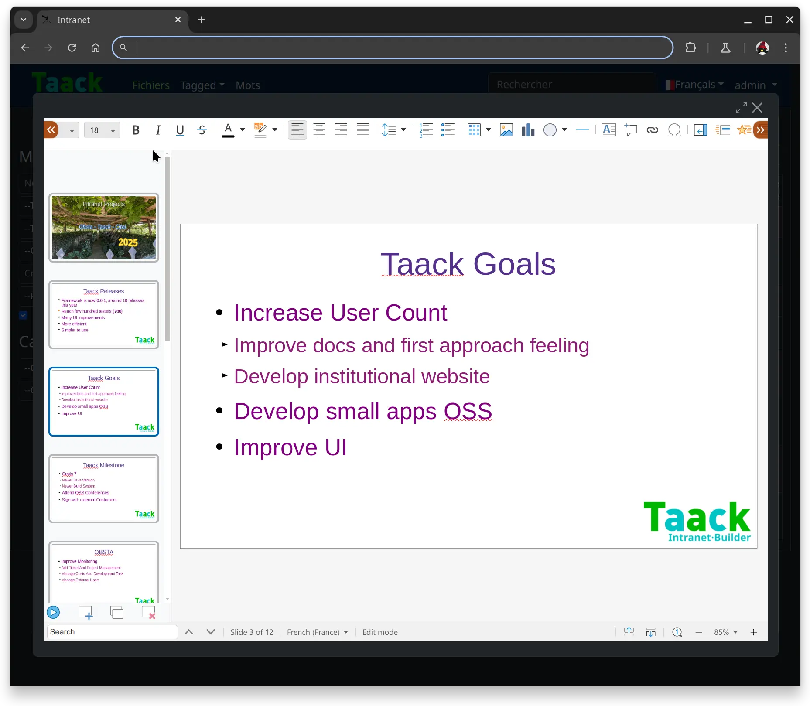

= Collabora Editor
:doctype: book
:taack-category: 4|App
:toc:
:source-highlighter: rouge

== Purpose

Extends Attachment Controller in Crew App.

Allow editing office document using https://www.collaboraonline.com/[Collabora Online]. All attachment become editable online.

== Roles

* `ROLE_TEMPLATE_ADMIN`: Allow users to create new template for to create new Attachment

== Install And Run Collabora CODE Docker Image

.Start Docker
[source,bash]
----
sudo systemctl restart docker
----

.Run Collabora CODE
[source,bash]
----
sudo docker run -t -e username test -e password test  -e "extra_params=--o:ssl.enable=false" -d -p 127.0.0.1:9980:9980 collabora/code   <1>
----

<1> For testing purpose only, we deactivate SSL and choose simple user / passwd.

.Test it is launched
[source,bash]
----
$ LANG=C wget http://localhost:9980/
--2025-02-18 22:35:56--  http://localhost:9980/
Resolving localhost (localhost)... ::1, 127.0.0.1
Connecting to localhost (localhost)|::1|:9980... connected.
HTTP request sent, awaiting response... 200 OK

    The file is already fully retrieved; nothing to do.
----

== Clone and link `editor-collabora` repo

[source,bash]
----
$ git clone https://github.com/Taack/collabora-editor.git
----

== Screenshot

.Editing an ODP

== Video

video::tB6mL07pzQQ[youtube,width=1024,height=680]

