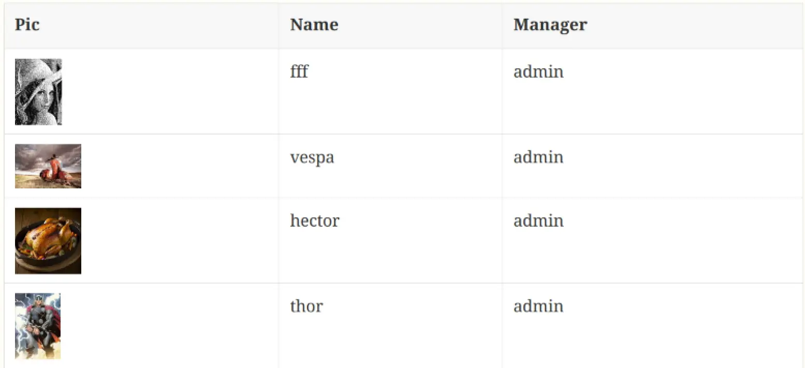
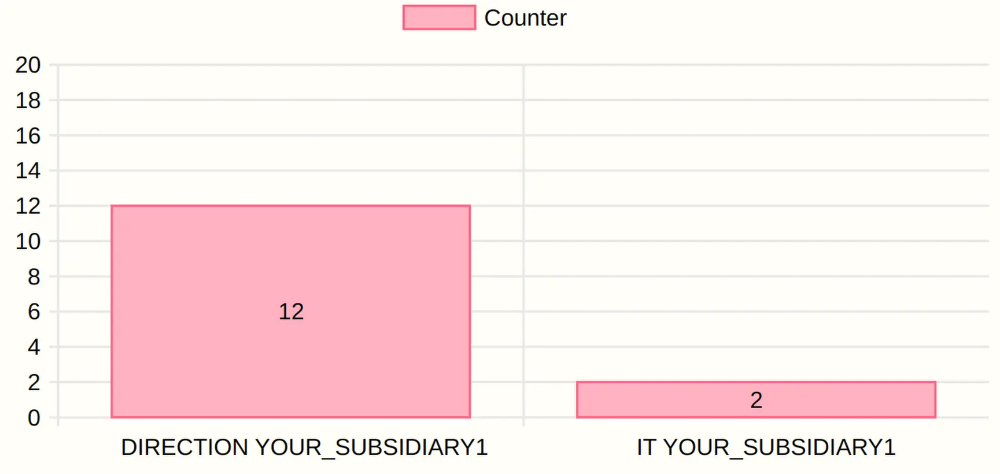

= Intercom
:doctype: book
:taack-category: 4|App
:toc:
:source-highlighter: rouge

== Objectif

Serveur SSH, serveur git et outil de rendu Asciidoctor, téléchargé via git.

== Rôles

* `ROLE_INTERCOM_DIRECTOR`
* `ROLE_INTERCOM_MANAGER`

Voir le link:Crew.adoc#_purpose[configure roles in Crew] pour ajouter le rôle à votre Intranet

== Extensions AsciidoctorJ

Vidéo illustrant l'intégration d'Intellij :

video::2r0fSRmL2Io[youtube,width=1024,height=680]

=== TQL et TDL intégrés dans asciidoc

Intercom prend en charge l'intégration de documents dans les diaporamas reveal.js et TQL avec TDL. Voir https://github.com/Taack/infra/releases/tag/v0.5.2[taack-jdbc-client-1.0-SNAPSHOT-all download page]

.Exemple de table
====
[[tql_tdl]]
.TQL et TDL (Taack Display Language)
[source,sql]
----
select <1>
    u.rawImg,
    u.username,
    u.manager.username as manager
from User u
where u.dateCreated > '2024-01-01' and
      u.manager.username = 'admin';
-- <2>
table rawImg as "Pic",
username as "Name",
manager as "Manager"

----

<1> TQL (Taack Query Language), sorte de sous-ensemble HQL
<2> TDL (Taack Display Language), indique comment afficher les données interrogées.

.Résultats

====

.Exemple de diagramme
====
[[tql_tdl]]
.TQL et TDL (Taack Display Language)
[source,sql]
----
select
    u.businessUnit,
    u.subsidiary,
    count(u.id) as counter
from User u
group by u.businessUnit;
--
barchart counter as "Counter"

----

.Résultats

====

=== Diaporama intégré

`slide::[fn=<préfixe du nom du fichier du diaporama>]`

Voir la page d'accueil de ce site Web.