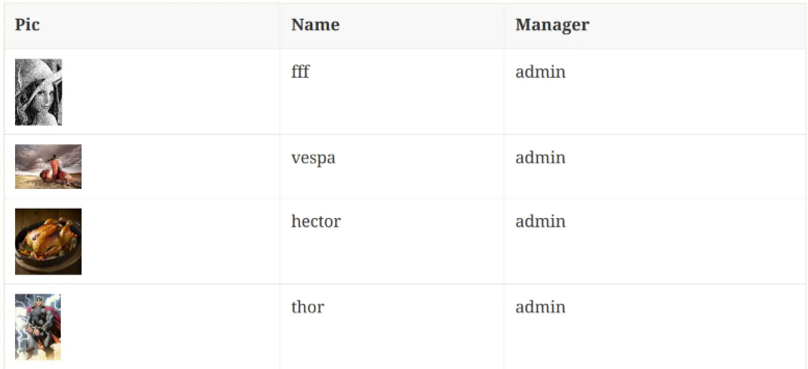
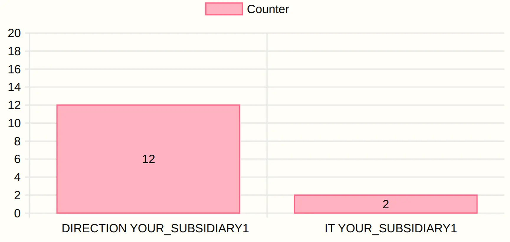

= Intercom
:doctype: book
:taack-category: 4|App
:toc:
:toc-title: 目录
:source-highlighter: rouge

== 目的

Ssh 服务器、git 服务器和 Asciidoctor 渲染工具，通过 git 上传。

== 角色

* `ROLE_INTERCOM_DIRECTOR`
* `ROLE_INTERCOM_MANAGER`

请参阅 link:Crew.adoc#_purpose[Crew 中的配置角色]，将角色添加到您的 Intranet 中

== AsciidoctorJ 扩展

演示 Intellij 集成的视频：

video::2r0fSRmL2Io[youtube,width=1024,height=680]

=== TQL 和 TDL 内联到 asciidoc 中

Intercom 支持使用 TDL 内联 reveal.js 幻灯片和 TQL 的文档。请参阅 https://github.com/Taack/infra/releases/tag/v0.5.2[taack-jdbc-client-1.0-SNAPSHOT-all 下载界面]

.表格示例
====
[[tql_tdl]]
.TQL 和 TDL (Taack 语法示例)
[source,sql]
----
select                              <1>
    u.rawImg,
    u.username,
    u.manager.username as manager
from User u
where u.dateCreated > '2024-01-01' and
    u.manager.username = 'admin';
--                                  <2>
table rawImg as "Pic",
      username as "Name",
      manager as "Manager"

----

<1> TQL (Taack 查询语言)，一种 HQL 子集
<2> TDL (Taack 显示语言)，告诉如何显示查询的数据。

.结果

====

.图表示例
====
[[tql_tdl]]
.TQL 和 TDL (Taack 语法示例)
[source,sql]
----
select
    u.businessUnit,
    u.subsidiary,
    count(u.id) as counter
from User u
group by u.businessUnit;
--
barchart counter as "Counter"

----

.结果

====

=== 内联幻灯片

`slide::[fn=<slideshow file name prefix>]`

请参阅此网站的主页。