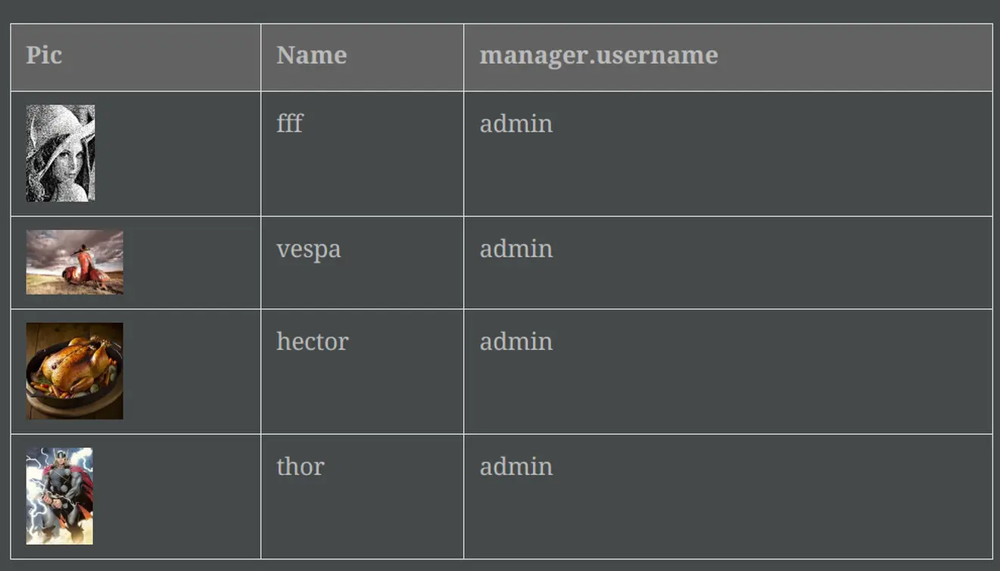

= Intercom
:doctype: book
:taack-category: 4|App
:toc:
:source-highlighter: rouge

== Purpose

Ssh server, git server and Asciidoctor rendering facility, uploaded via git.

== Roles

* `ROLE_INTERCOM_DIRECTOR`
* `ROLE_INTERCOM_MANAGER`

See link:Crew.adoc#_purpose[configure roles in Crew] to add the role into your Intranet

== AsciidoctorJ extensions

Vidéo demonstrating Intellij integration:

video::2r0fSRmL2Io[youtube]

=== TQL and TDL inlined into asciidoc

Intercom supports docs inlining reveal.js slideshows and TQL with TDL.

[[tql_tdl]]
.TQL and TDL (Taack Display Language)
[source,sql]
----
select                              <1>
    u.rawImg,
    u.username,
    u.manager.username
from User u
where u.dateCreated > '2024-01-01' and
    u.manager.username = 'admin';
--                                  <2>
table rawImg as "Pic",
      username as "Name",
      manager as "Manager"

----

<1> TQL (Taack Query Language), kind of HQL subset
<2> TDL (Taack Display Language), tell how to display queried data.

.Results

=== Inlined slideshow

`slide::[fn=<slideshow file name prefix>]`

See home of this website.