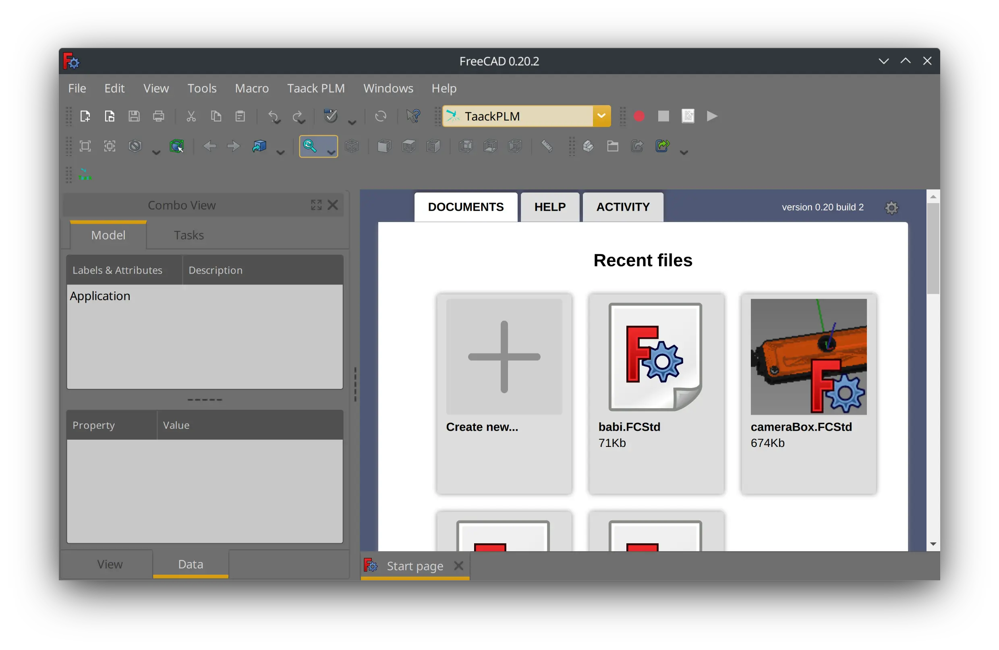

= FreeCAD PLM
:doctype: book
:taack-category: 2|App
:toc:
:toc-title: 目录

== 目的

管理 FreeCAD 模型共享和线性版本控制。这是一个示例的子应用，更多是为了了解框架功能，而不是使用真正的 PLM。

== 角色

* `ROLE_ADMIN`
* `ROLE_PLM_USER`

请参阅 link:Crew.adoc#_purpose[Crew 中的配置角色]，将角色添加到您的 Intranet 中

== 服务器安装

=== 在服务器上启动 FreeCAD

在 Linux 服务器上，最好从发行版安装以下包：

* #Weston# Wayland 服务器
* #FreeCAD 0.21.2#
* #python-protobuf# package (参见 <<python-protobuf-install>>)

FreeCAD 和 Weston 在 Wayland 上允许使用与 X11 下运行的 Xvfb 类似的功能。

=== 通过服务器二进制文件安装

从 https://github.com/Taack/plm/releases[releases]下载最新的服务器二进制文件。

启动服务器应用程序：

[source,bash]
.启动服务器
----
java -jar server-0.6.jar
----

==== 服务器参数

查看 `server/grails-app/conf/application.yml` 可用选项列表

可以通过这种方式向服务器传递选项：

[source,bash]
.组合选项
----
java -DOption1=Value1 -DOption2=Value2 ... -jar server-0.3.jar
----

===== 选项

* Intranet 存储文件的路径: `-Dintranet.root=/home/test/someDir`
* 服务器端口: `-Dserver.port=9444`
* 数据库 url: `-DdataSource.url='jdbc:h2./prodDb2;LOCK_TIMEOUT=10000;DB_CLOSE_ON_EXIT=FALSE'`
* Freecad app 图片路径: `-Dplm.freecadPath=/somePath...`
* .exe 路径: `-Dexe.dot.path=/somePath...`

=== 通过源安装

克隆 #plm# 仓库:

[source,bash]
.克隆 PLM 仓库
----
git clone git@github.com:Taack/plm.git
----

然后将文件夹的内容复制 `plm` 到您的 intranet `app` 文件夹中 (参阅 link:../installation.adoc[intranet 的安装])

在文件中设置 FreeCAD 路径 `server/conf/application.yml`。

在文件夹路径下启动你 `intranet`:

[source,bash]
.通过源代码运行服务器
----
./gradlew server:bootRun
----

您可以生成一个 Jar 文件：

[source,bash]
.通过源代码构建服务器二进制文件
----
./gradlew server:assemble
----

服务器将位于 `server/build/libs`

[[python-protobuf-install]]
== FreeCAD Workbench 的安装

首先，安装 `python-protobuf`。如果您使用 FreeCAD ⇐ 0.21，则工作台时不会自动安装依赖项。

[source,bash]
.当 FreeCAD <0.21 安装 Protobuf
----
pip install protobuf
----

进入 #Tools# > #Addon Manager# 然后刷新本地缓存并搜索 *Taack*.

image::addon-screenshot.webp[]

单击安装按钮。

== 用法

.选择 Taack PLM Workbench

.单击 Taack 图标
image::plm2-screenshot.webp[]

.将您的凭证输入到您的服务器
image::plm3-screenshot.webp[]

单击“确定”按钮将文件上传到您的 intranet。intranet 将创建预览，此过程可能需要一些时间

.该部分的历史…
image::plmweb1-screenshot.webp[]

WARNING: 如果您有多个链接，请从同一台计算机导入它们。 对于其他计算机，从您的 intranet 下载 zip 文件。

就是这样，我将录制一些视频来演示该应用程序的功能。

video::kdbvjWPI2UQ[youtube, width=640, height=480]

== 待办事项

* 添加模型图标
* 更新模型的依赖（使用 Deep 选项）
* 删除最新版本
* ...