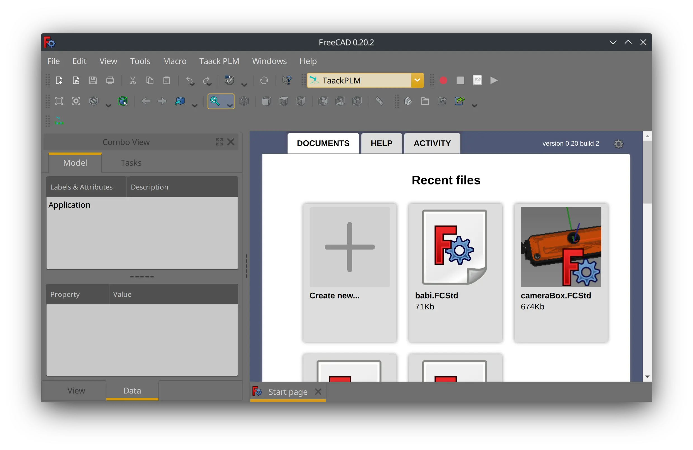
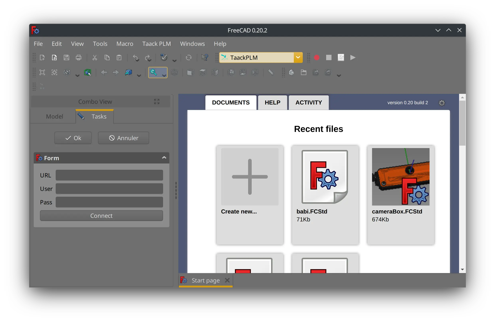
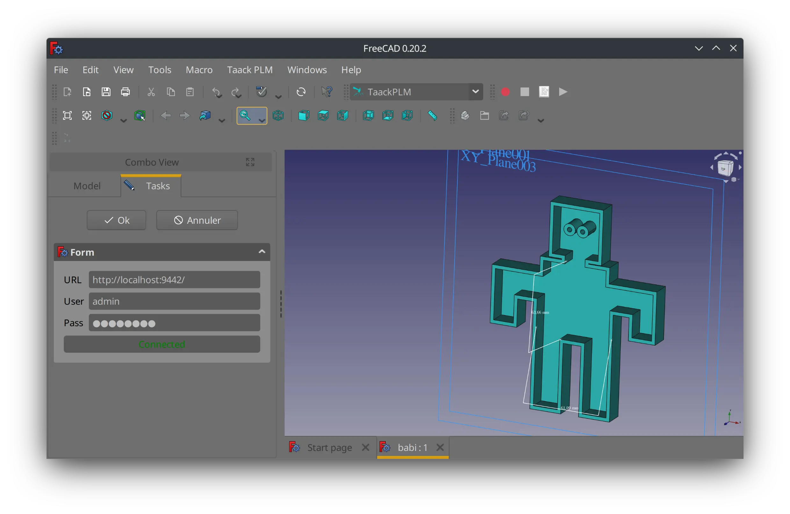
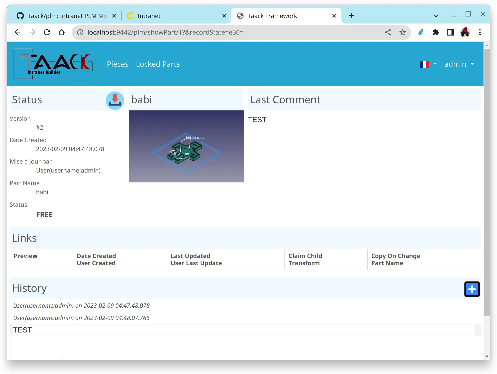

= FreeCAD PLM
:doctype: book
:taack-category: 2|App
:toc:

== Server Installation

=== Linux

On a Linux server, grab FreeCAD AppImage file, install `xvfb-run`, then launch in background FreeCAD:

[source,bash]
----
xvfb-run ./FreeCAD_0.20.2-2022-12-27-conda-Linux-x86_64-py310.AppImage
----

Once it is launched, clone the #plm# repository:

[source,bash]
----
git clone git@github.com:Taack/plm.git
----

Then copy the content of the `plm` folder into your intranet `app` folder (see link:../installation.adoc[intranet installation])

Then configure the server to know about this new app by changing `server/build.gradle` file. Grails section should look like this after changes:

[source,gradle]
----
grails {
    exploded = true
    plugins {
        implementation project(':crew')
        // other apps here ...
        implementation project(':plm')
    }
}
----

Start your intranet issuing under the `intranet` folder:
[source,bash]
----
./gradlew server:bootRun
----

== FreeCAD Workbench Installation

Clone the #taack-plm-freecad# repository:

[source,bash]
----
git clone git@github.com:Taack/taack-plm-freecad.git
----

Then create a link into `.local/share/FreeCAD/Mod`

[source,bash]
----
cd .local/share/FreeCAD/Mod
ln -s [clone_dir] .
----

== Usage

.Select Taack PLM Workbench

.Click on Taack icon

.Enter your credential into your server

Clicking on OK button will upload the file into your Intranet. The Intranet will create a preview, this process might take time.

.The history of the part...

WARNING: If you have many links, import them from the same computer. From other computers, download the zip file from your intranet.

That's all, I will record some videos demonstrating this app capabilities.