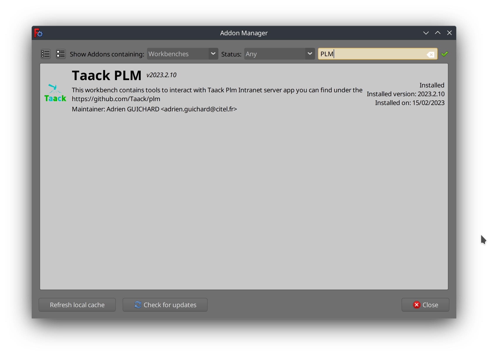

= FreeCAD PLM
:doctype: book
:taack-category: 2|App
:toc:
:icons: font

== Purpose

Manage FreeCAD model sharing and linear versioning. This is a sample app, more to see framework capabilities than to use as a real PLM (Product Lifecycle Management).

== Roles

* `ROLE_ADMIN`
* `ROLE_PLM_USER`

See link:Crew.adoc#_purpose[configure roles in Crew] to add the role into your Intranet

== Server Installation

=== Install everything in a new user (optional)

It is better to isolate Freecad in a specific user, in order to not override your Freecad configuration for your user.

To do so:

. create a new user:
+
[source,bash]
----
sudo useradd plm --create-home
----
. Add current `plm` group to current user
+
[source,bash]
----
sudo usermod -a -G plm <current user>
----
. Eventually change right of `plm` to allow group `rxw`
. Restart logout / login cycle or restart to apply group change to your user

=== Launch FreeCAD on the server

On a Linux server, it is better to install the following package from your distribution:

* #Weston# Wayland server
* #FreeCAD >1.0#
* #python-protobuf# package (See <<python-protobuf-install>>)

Freecad and Weston allow similar features on Wayland than Xvfb-run under X11.

=== Install from Server Binaries

Download the latest server binaries from https://github.com/Taack/plm/releases[releases].

Launch the server app:

[source,bash]
.Launch the server
----
java -jar server-0.6.jar
----

==== Server Arguments

See `server/grails-app/conf/application.yml` for a list of available options

Options to the server can be passed this way:

[source,bash]
.Combining Options
----
java -DOption1=Value1 -DOption2=Value2 ... -jar server-0.3.jar
----

===== Options

* Path the Intranet store its files: `-Dintranet.root=/home/test/someDir`
* Server port: `-Dserver.port=9444`
* Database url: `-DdataSource.url='jdbc:h2./prodDb2;LOCK_TIMEOUT=10000;DB_CLOSE_ON_EXIT=FALSE'`
* Freecad path: `-Dplm.freecadPath=/somePath...`
* Dot exe path: `-Dexe.dot.path=/somePath...`

=== Install from Source

Clone the #plm# repository:

[source,bash]
.Clone PLM repository
----
git clone git@github.com:Taack/plm.git
----

Then copy the content of the `plm` folder into your intranet `app` folder (see link:../installation.adoc[intranet installation])

Set the FreeCAD path in the `server/conf/application.yml` file.

Start your intranet issuing under the `intranet` folder:

[source,bash]
.Run Server from Source
----
./gradlew server:bootRun
----

You can produce a Jar file:

[source,bash]
.Build Server Binary from Source
----
./gradlew server:assemble
----

The server will be located under `server/build/libs`

[[python-protobuf-install]]
== FreeCAD Workbench Installation

First, install `python-protobuf`. If you use FreeCAD <= 0.21, dependencies are not installed automatically when installing the workbench.

[source,bash]
.Install Protobuf for FreeCAD
----
pip install protobuf
----

Go into #Tools# > #Addon Manager# then refresh local cache and search for *Taack*.

Click on install button.

== Usage

.Select Taack PLM Workbench
image::plm1-screenshot.webp[]

.Click on Taack icon
image::plm2-screenshot.webp[]

.Enter your credential into your server
image::plm3-screenshot.webp[]

Clicking on OK button will upload the file into your Intranet. The Intranet will create a preview, this process might take time.

.The history of the part...
image::plmweb1-screenshot.webp[]

WARNING: If you have many links, import them from the same computer. From other computers, download the zip file from your intranet.

That's it; I will record some videos demonstrating this app capabilities.

video::kdbvjWPI2UQ[youtube, width=640, height=480]

== Todo

* Add model graph icon
* Update deps for a model (with Deep option)
* Delete latest version
* ...

// # [auo@auo-systemproductname FreeCAD]$ yay -S boost cmake coin curl desktop-file-utils eigen gcc-fortran git glew hicolor-icon-theme jsoncpp libspnav med nlohmann-json opencascade pyside6-tools pyside6 python-matplotlib python-netcdf4 python-packaging python-pivy qt6-svg qt6-tools qt6-webengine shared-mime-info shiboken6 swig utf8cpp xerces-c yaml-cpp
// git submodule update --init
// ccmake -DFREECAD_QT_VERSION=6 ..
// cmake .
// make -j$(nproc --ignore=2)
