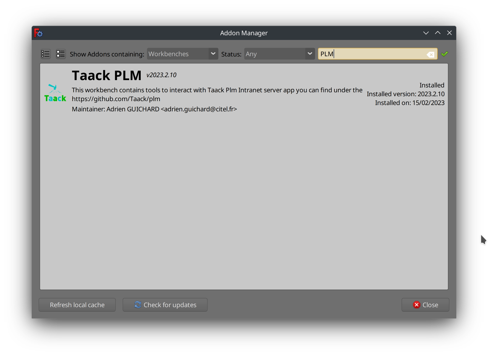
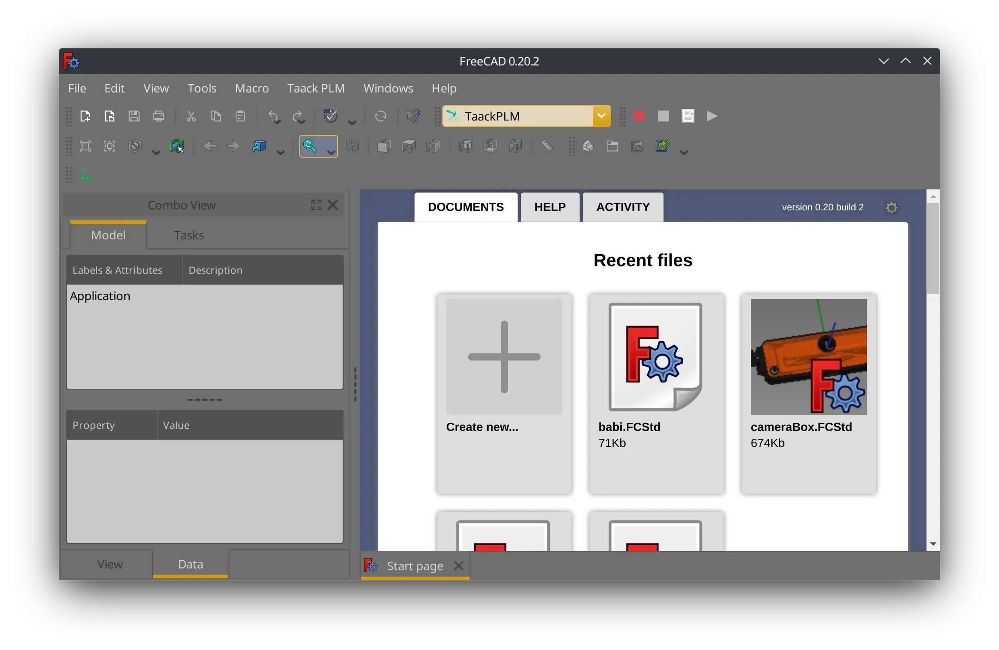
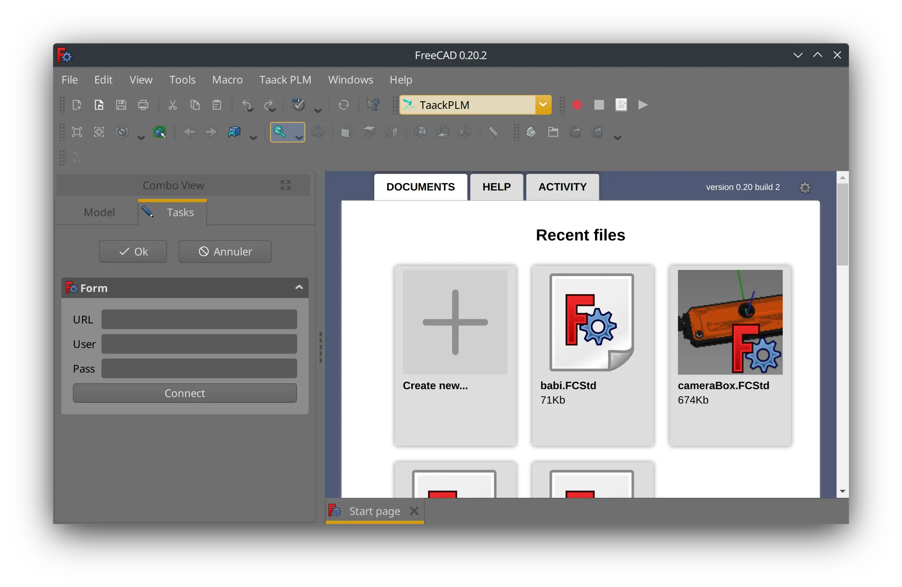
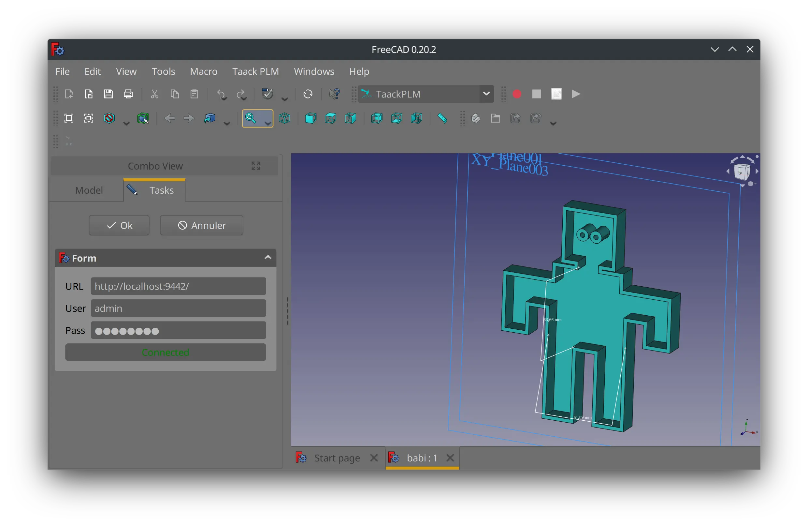
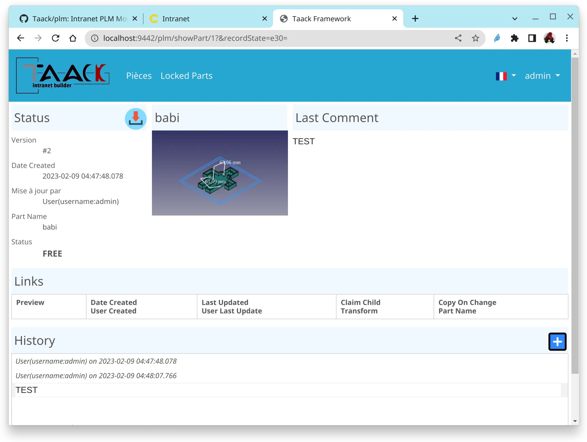

= FreeCAD PLM
:doctype: book
:taack-category: 2|App
:toc:
:icons: font

== Purpose

Manage FreeCAD model sharing and linear versioning. This app shows the framework capabilities. Very few line of code describe the user interface and manage persistent data. We can view this application as a small PLM (Product Lifecycle Management) for FreeCAD.

== Roles

* `ROLE_ADMIN`
* `ROLE_PLM_USER`

See link:Crew.adoc#_purpose[configure roles in Crew] to add the role into your Intranet

== Server Installation

=== Install everything in a new user (optional)

It is better to isolate Freecad in a specific user, in order to not override your Freecad configuration for your user.

To do so:

. create a new user:
+
[source,bash]
----
sudo useradd plm --create-home
----
. Add current `plm` group to current user
+
[source,bash]
----
sudo usermod -a -G plm <current user>
----
. Eventually change right of `plm` to allow group `rxw`
. Restart logout / login cycle or restart to apply group change to your user

=== Prepare FreeCAD to be used by the server

On a Linux server, it is better to install the following packages from your distribution:

* #Weston# Wayland server
* #FreeCAD >1.0#

Freecad must use Qt6 for Weston and Wayland. The PLM module will launch FreeCAD in a Weston desktop using the Framebuffer, so nothing is chown.

=== Configure the PLM Server

If you want just an overview, you can download the demo server, with default configuration, go directly in <<_launch_server_binaries>>.

Here are the step by step commands:

.Clone the Intranet repository
[source,bash]
----
git clone https://github.com/Taack/intranet.git
OR
git clone git@github.com:Taack/intranet.git
----

.Go to `app` folder
[source,bash]
----
cd intranet/app
----

.Clone the PLM repository
[source,bash]
----
git clone https://github.com/Taack/plm.git
OR
git clone git@github.com:Taack/plm.git
----

.Edit the `server/grails-app/conf/application.yml` adding the following variables:
[source,yaml]
----
# PLM
plm.freecadPath: ${HOME}/freecad-app-link
----

.Copy freecad launch script
[source,bash]
----
cd
cp plm/freecad-app-link-distrib.sh freecad-app-link
----

From here, you can build the server or run it. Change current directory to the intranet folder and either:

.Build the server binaries (for production environment)
[source,bash]
----
./gradlew bootJar
----

.Launch the server (for development environment)
[source,bash]
----
./gradlew bootRun
----

=== Launch Server Binaries

Demo version is available here: https://github.com/Taack/plm/releases[Taack PLM releases], download `server-0.6.jar`

If you choose to build the server binaries, go to :

[source,bash]
.Launch the server
----
java -jar server/build/libs/server-0.6.jar
----

==== Server Arguments

See `server/grails-app/conf/application.yml` for a list of available options

Options to the server can be passed this way:

[source,bash]
.Combining Options
----
java -DOption1=Value1 -DOption2=Value2 ... -jar server-0.3.jar
----

===== Options

* Path the Intranet store its files: `-Dintranet.root=/home/test/someDir`
* Server port: `-Dserver.port=9444`
* Database url: `-DdataSource.url='jdbc:h2./prodDb2;LOCK_TIMEOUT=10000;DB_CLOSE_ON_EXIT=FALSE'`
* Freecad path: `-Dplm.freecadPath=/somePath...`
* Dot exe path: `-Dexe.dot.path=/somePath...`

.Current Configuration in `server/grails-app/conf/application.yml`
[source,yaml]
----
plm:
  freecadPath: ${HOME}/freecad-app-link
----

=== Install from Source

Clone the #plm# repository:

[source,bash]
.Clone PLM repository
----
git clone https://github.com/Taack/plm.git
----

Then copy the content of the `plm` folder into your intranet `app` folder (see link:../installation.adoc[intranet installation])

Set the FreeCAD path in the `server/conf/application.yml` file.

In the `plm` folder, you have 2 scripts you can use : `freecad-app-link-distrib.sh` if you use your distribution version of FreeCAD or `freecad-app-link-flatpak.sh` if you choose to install FreeCAD using Flatpak

Create a symlink in your home folder pointing to one of those scripts `ln -s <path-to-plm-folder>/freecad-app-link-distrib.sh freecad-app-link`.

Start your intranet issuing under the `intranet` folder:

[source,bash]
.Run Server from Source
----
./gradlew server:bootRun
----

You can produce a Jar file:

[source,bash]
.Build Server Binary from Source
----
./gradlew server:assemble
----

The server will be located under `server/build/libs`

[[python-protobuf-install]]
== FreeCAD Workbench Installation

Go into #Tools# > #Addon Manager# then refresh local cache and search for *Taack*.

Click on installation button.

== Usage

.Select Taack PLM Workbench

.Click on Taack icon

.Enter your credential into your server

Clicking on OK button will upload the file into your Intranet. The Intranet will create a preview, this process might take time.

.The history of the part...

WARNING: If you have many links, import them from the same computer. From other computers, download the zip file from your intranet.

That's it; I will record some videos demonstrating this app capabilities.

video::28JkqJMlMrM[youtube, width=820, height=480]

// # [auo@auo-systemproductname FreeCAD]$ yay -S boost cmake coin curl desktop-file-utils eigen gcc-fortran git glew hicolor-icon-theme jsoncpp libspnav med nlohmann-json opencascade pyside6-tools pyside6 python-matplotlib python-netcdf4 python-packaging python-pivy qt6-svg qt6-tools qt6-webengine shared-mime-info shiboken6 swig utf8cpp xerces-c yaml-cpp
// git submodule update --init
// ccmake -DFREECAD_QT_VERSION=6 ..
// cmake .
// make -j$(nproc --ignore=2)
