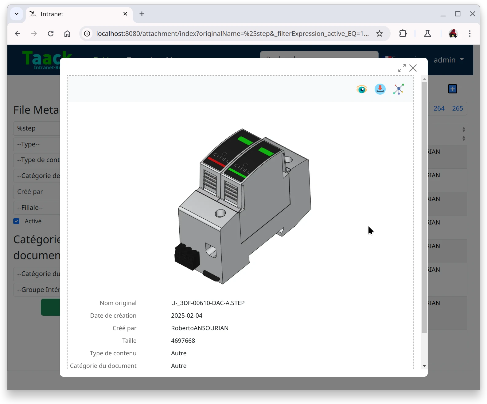
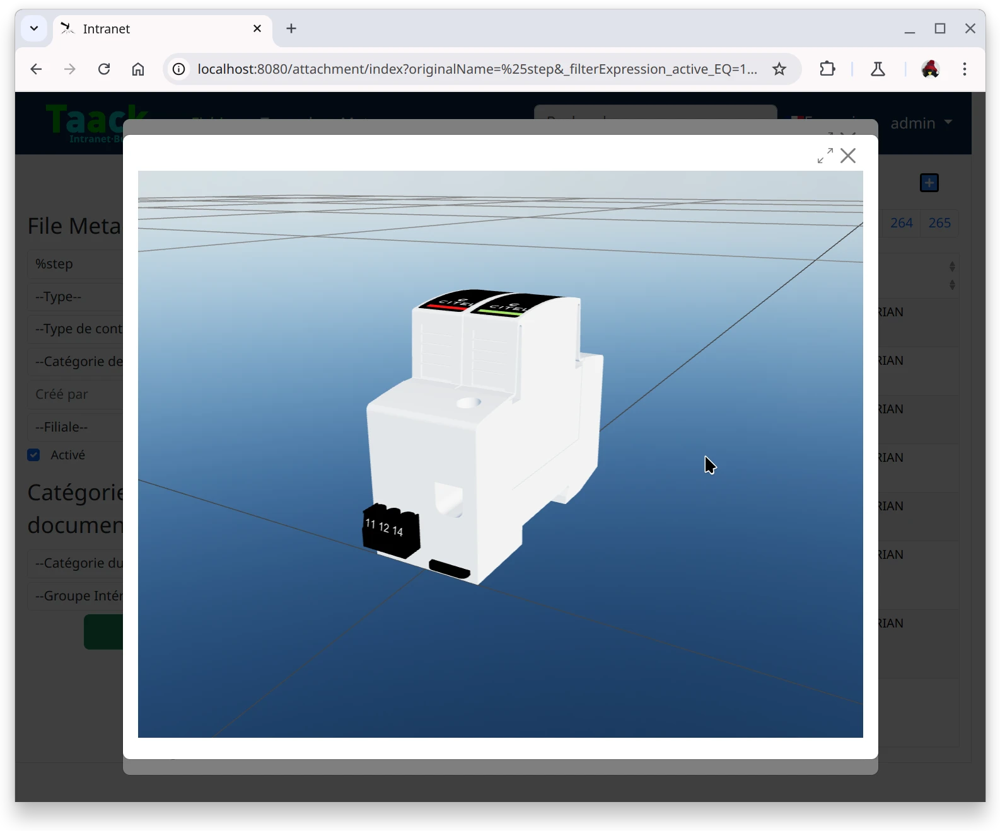

= Viewers
:doctype: book
:taack-category: 4|App
:toc:
:source-highlighter: rouge

== Purpose

Convert and preview files.

.STEP Image Preview

.STEP Custom Preview

== Sources

[source,bash]
----
$ git clone https://github.com/Taack/viewers.git
----
