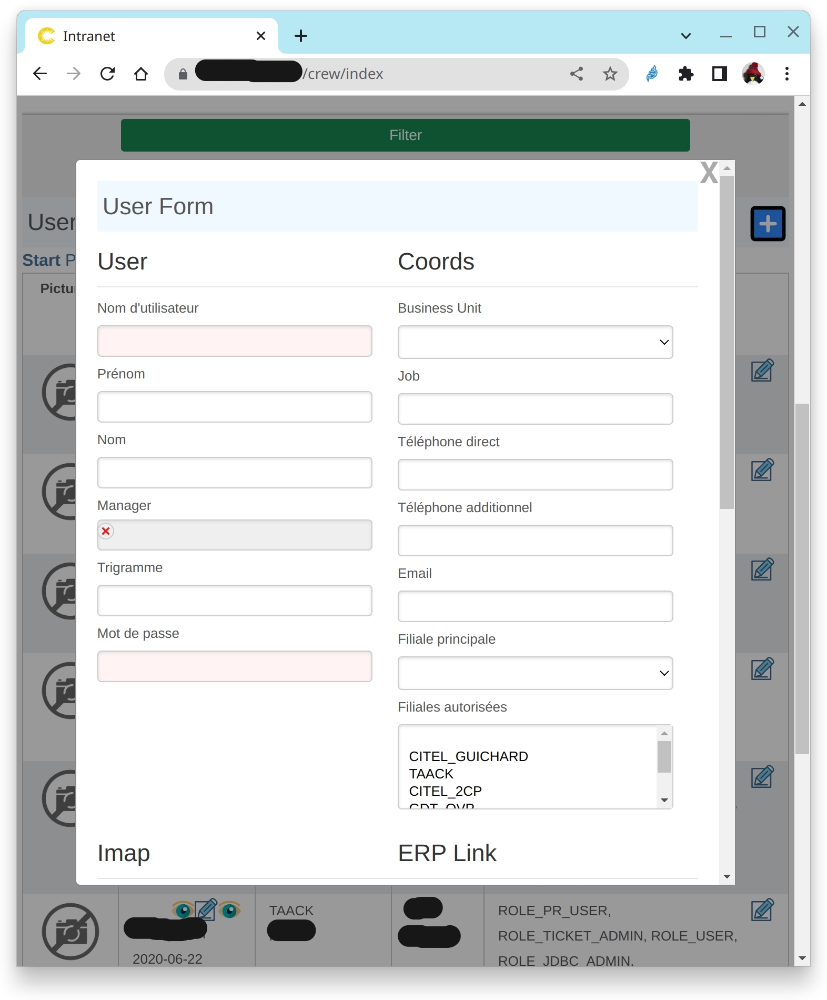

= Taack UI DSLs
:doctype: book
:taack-category: 2|doc/Concepts
:toc:
:source-highlighter: rouge

== Block DSL
Allows specifying page layout by defining blocs that contain other graphical elements. A block can be an ajax block, updated by some ajax actions.

[source,groovy]
----
        UiBlockSpecifier b = new UiBlockSpecifier() <1>
        b.ui {
            modal { <2>
                ajaxBlock "userForm", { <3>
                    form "User Form", f, BlockSpec.Width.MAX <4>
                }
            }
        }
----

<1> create the block, constructed via the ui method
<2> This block will contain a modal window
<3> This modal window will contain 1 ajax block with the ID `userForm`
<4> This ajax block will contain one form, with the captation `User Form`

[[form-html-output]]
.Form inside a modal Window.

== Block Elements DSLs

* Form DSL: Allows to define a form to be included in a block

* Show DSl: Allows to Show an object summary. It supports limited field edition

* Table and Table filter DSL: a Table is associated to one or zero filter, filter cannot be displayed without a table.
** Table DSL allows grouping and sorting columns
** Pagination is included

* Chart DSL: Allows drawing graphs into a bloc

* Custom DSL: to insert custom html code to be inserted into a block.
