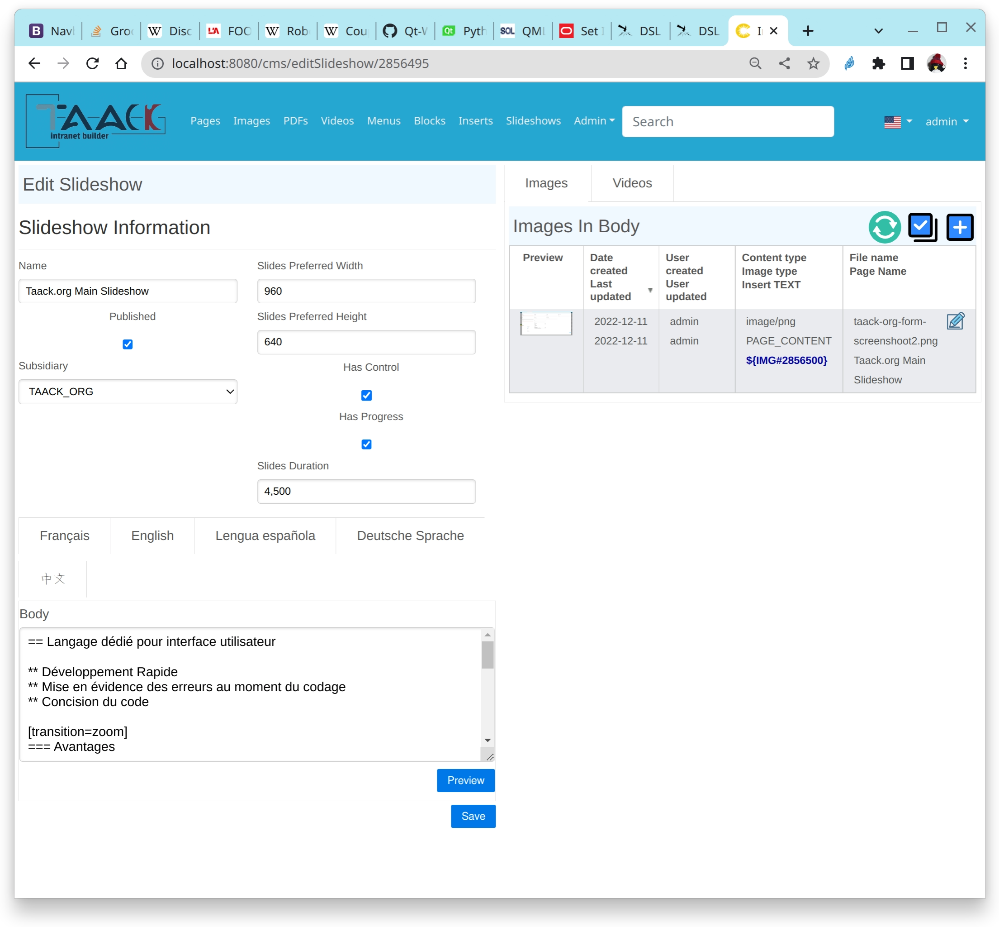

= Block
:doctype: book
:taack-category: 10|doc/DSLs
:toc:
:source-highlighter: rouge

* [*] Rendered into HTML
* [*] Rendered into PDF
* [ ] Rendered into CSV

Top level DSL that is responsible for arranging page graphical elements and update ajaxBlock altogether. In case we are rendering a complete page, we also have to specify the page menu via the <<menu-dsl>>.

This DSL is also responsible for managing modal windows. Open a modal using `modal` or close modal using `closeModalAndUpdateBlock`

== Block Building Code Sample

[[block-preview]]
.Sample Block with Tabs (see <<block-sample1>>).

[source,groovy]
[[block-sample1]]
.Block Sample with Tabs
----
    def editSlideshow(CmsPage slideshow) {
        UiBlockSpecifier b = new UiBlockSpecifier()

        Boolean createNew = slideshow == null
        if (!slideshow)
            slideshow = new CmsPage(pageType: CmsPageType.SLIDESHOW)

        b.ui {
            if (createNew)
                modal {
                    ajaxBlock "createNew", {
                        form "Create Slideshow",
                                buildCmsSlideshowForm(slideshow),
                                BlockSpec.Width.MAX
                    }
                }
            else {
                anonymousBlock BlockSpec.Width.HALF, {              <1>
                    ajaxBlock "cmsSlideshowForm", {
                        form "Edit Slideshow",
                            buildCmsSlideshowForm(slideshow),
                            BlockSpec.Width.MAX
                    }
                }

                blockTabs BlockSpec.Width.HALF, {
                    blockTab "Images", buildImagesTab(slideshow)    <2>
                    blockTab "Videos", buildVideosTab(slideshow)
                }
            }
        }
        taackUiSimpleService.show(b, buildMenu())
    }
----

<1> Declare an invisible block of 1/2 window width
<2> Declare 2 tabs inside, the first one is displayed when the page appear

== Manage Modal Code Sample

[source,groovy]
----
        taackSimpleSaveService.saveThenDisplayBlockOrRenderErrors(EngineeringChangeRequest, <1>
        new UiBlockSpecifier().ui { <2>
            closeModalAndUpdateBlock { <3>
                ajaxBlock ajaxBlockId, { <4>
                    show "Projects", buildShowProjects(ecr),
                        BlockSpec.Width.MAX, {
                            action "Edit projects 2", ActionIcon.ADD,
                                Ecr2Controller.&projectsForm as MC,
                                [id: ecr.id, ajaxBlockId: ajaxBlockId], true
                    }
                }
            }
        })

----

<1> After an action implying to save an object is called into a modal, you can close the modal and refresh page elements in one action
<2> `saveThenDisplayBlockOrRenderErrors` take a `UiBlockSpecifier` as parameter
<3> `closeModalAndUpdateBlock` will first close the last opened modal and then apply the modification
<4> Here, the block with the name contained in `ajaxBlockId` will be updated

== Block DSL Symbols Hierarchy

[graphviz,format="svg",align=center]
.Symbols hierachy diagram for Block DSL
----
digraph mygraph {
  node [shape=box];
  ui -> modal, closeModalAndUpdateBlock [label = "0,1"]
  closeModalAndUpdateBlock -> blockTabs, ajaxBlock [label = "1,N"]
  ui, anonymousBlock, modal -> anonymousBlock, ajaxBlock [label = "0,N"]
  ui, anonymousBlock, modal -> blockTabs [label = "0,1"]
  blockTabs -> ajaxBlockTab [label = "1,N"]
  ajaxBlock, ajaxBlockTab -> form, show, tableFilter, table, graphs, custom, anonymousBlock [label = "1,N"]
}
----

