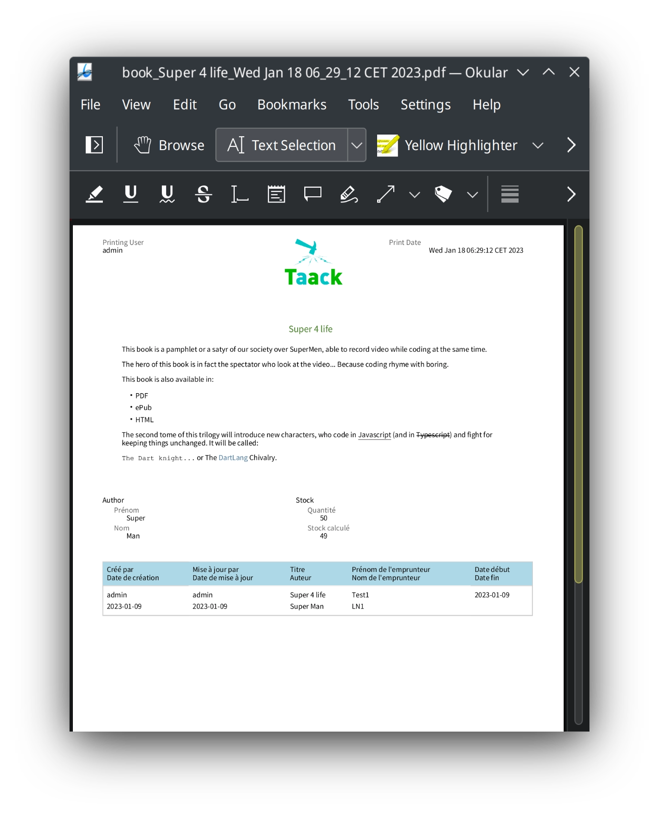

= Bloc DSL imprimable
:doctype: book
:taack-category: 11|doc/DSLs
:toc:
:source-highlighter: rouge

* [*] Rendu en HTML
* [*] Rendu en PDF
* [ ] Rendu en CSV

DSL pour les documents imprimables, qui est responsable de l'organisation des éléments graphiques de la page sur un document statique (généralement un PDF, mais d'autres formats peuvent être ajoutés à l'avenir).

== Exemple de code de construction de blocs imprimables

[source,groovy]
[[printable-block-sample1]]
.PDF de base
----
def p = new UiPrintableSpecifier().ui {
    printableHeader "3.5cm", {                  <1>
        show new UiShowSpecifier().ui {
            fieldLabeled u.username_            <2>
        }, BlockSpec.Width.THIRD
        show new UiShowSpecifier().ui {
            field """
            

                
            

            """
        }, BlockSpec.Width.THIRD
        show new UiShowSpecifier().ui {
            field 'Print Date', new Date().toString(),
                  Style.ALIGN_RIGHT
        }, BlockSpec.Width.THIRD
    }
    printableBody {                             <3>
        def a = book.author
        show new UiShowSpecifier().ui {
            field """<h1>${book.name}</h1>""",
                  Style.ALIGN_CENTER
            fieldUnlabeled Style.MARKDOWN_BODY,
                  book.abstractTextHtml_
        }, BlockSpec.Width.MAX
        show new UiShowSpecifier().ui {
                fieldLabeled book.isbn_
            section 'Author', {
                fieldLabeled book.author_, a.firstName_
                fieldLabeled book.author_, a.lastName_
            }
        }, BlockSpec.Width.HALF
        show new UiShowSpecifier().ui {
            section 'Stock', {
                fieldLabeled book.number_
                fieldLabeled book.stock_
            }
        }, BlockSpec.Width.HALF
        table bookstoreUiService.buildBorrowedBookTable(),
              BlockSpec.Width.MAX               <4>
    }
    printableFooter {                           <5>
    }
}
----

<1> `printableHeader` permet de définir un en-tête qui sera répété sur toutes les pages, le paramètre hauteur est obligatoire si vous avez besoin d'une hauteur différente de 2cm.
<2> Vous pouvez utiliser des fermetures #show# classiques
<3> `printableBody` définit le contenu du PDF sur plusieurs pages.
<4> Vous pouvez utiliser des fermetures #table# classiques
<5> `printableFooter` permet de définir le pied de page qui sera répété sur toutes les pages la taille ne doit pas être supérieure à 2cm.

== Hiérarchie des symboles DSL du bloc imprimable

[graphviz,format="svg",align=center]
.Diagramme de hiérarchie des symboles pour le bloc imprimable DSL
----
digraph mygraph {
  node [shape=box];
  ui -> printableHeader, printableHeaderLeft, printableHeaderRight
  ui -> printableFooter, printableBody
  printableHeader, printableHeaderLeft, printableHeaderRight, printableFooter, printableBody -> anonymousBlock, show, table, custom
  anonymousBlock -> anonymousBlock, show, table, custom
}
----