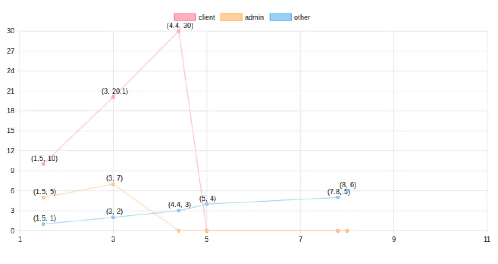
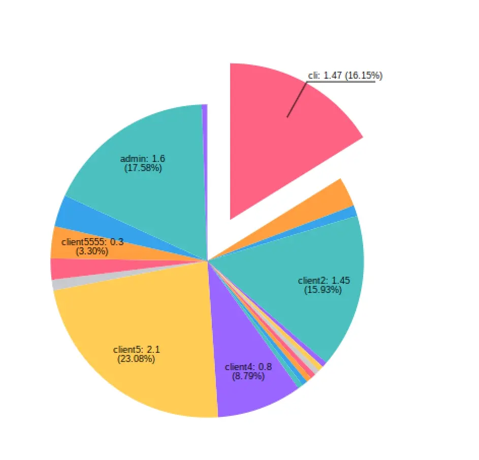
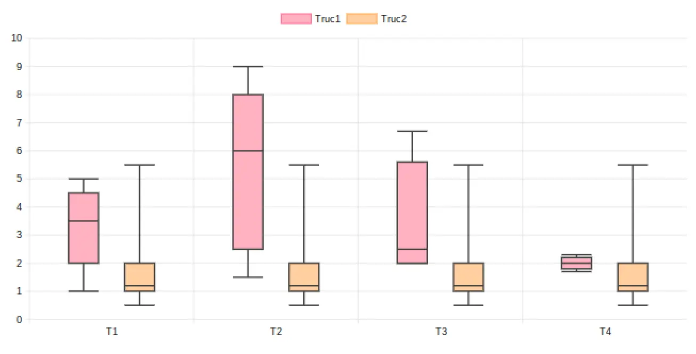
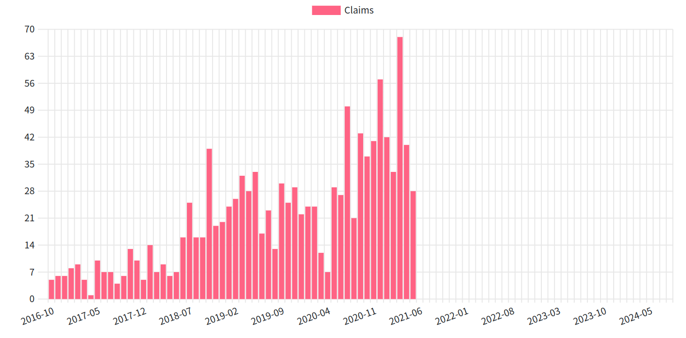
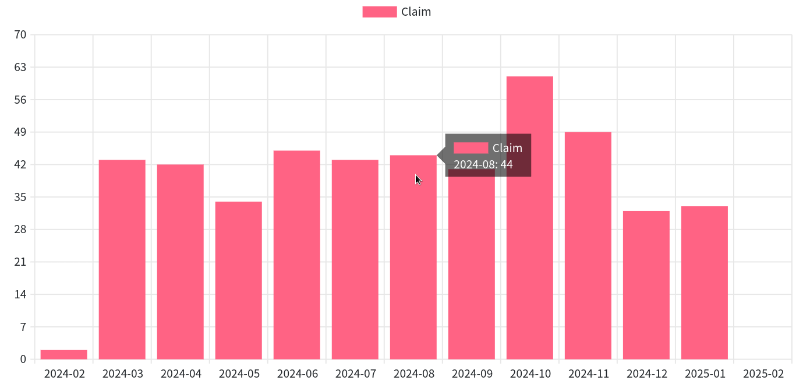

= Diagramme DSL
:doctype: book
:taack-category: 3|doc/DSLs
:toc:
:source-highlighter: rouge
:icons: font

* [*] Rendu en HTML
* [*] Rendu en PDF
* [*] Rendu en Mails
* [ ] Rendu en CSV

Diagram DSL permet de dessiner rapidement des diagrammes à barres, à aires, à secteurs, à nuages de points et à courbes, soit rastérisés au format PNG, soit au format SVG.

== Exemple de code

=== Barre

.Barchart non empilé
====
.Exemple de code Barchart
[source,groovy]
----
private static UiDiagramSpecifier barDiagram(boolean isStacked) {
    new UiDiagramSpecifier().ui {
        bar(isStacked, {
            labels "T1", "T2", "T3", "T4"
            dataset 'Truc1', 1.0, 2.0, 1.0, 4.0
            dataset 'Truc2', 2.0, 0.1, 1.0, 0.0
            dataset 'Truc3', 2.0, 0.1, 1.0, 1.0
        })
    }
}
----

.Résultat
image:diag-dsl-bar.webp[]
====

=== Ligne

.Lignes
====
.Exemple de code de lignes
[source,groovy]
----
diagram new UiDiagramSpecifier().ui({
    line {
        labels 1.5, 3, 4.4, 5, 7.8, 8
        dataset "client", 10.0, 20.1, 30.0
        dataset "admin", 5.0, 7.0
        dataset "other", 1.0, 2.0, 3.0, 4.0, 5.0, 6.0
    }
})
----

.Résultat

====

=== Secteur

.Graphique à secteurs
====
.Exemple de code
[source,groovy]
----
private static UiDiagramSpecifier pieDiagram(boolean hasSlice) {
    new UiDiagramSpecifier().ui({
        pie(hasSlice, {
            labels "Pie"
            dataset("cli", 1.47)
            dataset("client", 0.28)
            dataset("client1", 0.1)
            dataset("client2", 1.45)
            dataset("client3", 0.05)
            dataset("client31", 0.05)
            dataset("client32", 0.05)
            dataset("c33", 0.05)
            dataset("client311", 0.05)
            dataset("client312", 0.05)
            dataset("client313", 0.05)
            dataset("client4", 0.8)
            dataset("client5", 2.1)
            dataset("client55", 0.1)
            dataset("client555", 0.2)
            dataset("client5555", 0.3)
            dataset("client55555", 0.3)
            dataset("admin", 1.6)
            dataset("test1", 0.05)
        })
    })
}
----

.Résultat

====

=== Whiskers

.Graphique des moustaches
====
.Exemple de code
[source,groovy]
----
diagram new UiDiagramSpecifier().ui({
    whiskers {
        labels "T1", "T2", "T3", "T4"

        dataset 'Truc1', {
            boxData 1.0, 2.0, 3.0, 3.5, 4.0, 4.5, 5.0
            boxData 1.5, 2.5, 3.5, 6.0, 7.0, 8.0, 9.0
            boxData 2.0, 2.0, 2.1, 2.5, 5.5, 5.6, 6.7
            boxData 1.7, 1.8, 1.9, 2.0, 2.1, 2.2, 2.3
        }
        dataset 'Truc2', {
            boxData 0.5, 1.0, 1.1, 1.2, 1.3, 2.0, 5.5
            boxData 0.5, 1.0, 1.1, 1.2, 1.3, 2.0, 5.5
            boxData 0.5, 1.0, 1.1, 1.2, 1.3, 2.0, 5.5
            boxData 0.5, 1.0, 1.1, 1.2, 1.3, 2.0, 5.5
        }
    }
})
----

.Résultat

====

== Code de bonus

=== D'autres types pour l'axe X

On a totalement 3 types:

- String (Discret)
- Number (Continu)
- Date (Continu)

[source,groovy]
----
diagram new UiDiagramSpecifier().ui({
    line { // X axis: String
        labels "T1", "T2", "T3"
        dataset "test", 10.0, 20.1, 30.0
    }
    line { // X axis: String
        labels 1.5, 1.7, 3.5
        dataset "test", 10.0, 20.1, 30.0
    }
    line { // X axis: Date
        Date date1 = new Date() // now (2025-02-28 10:55)
        Date date2 = new Date(date1.getTime() + 1000*60*60*2) // 2 hours later
        Date date3 = new Date(date1.getTime() + 1000*60*60*10) // 10 hours later
        labels DiagramXLabelDateFormat.HOUR, date1, date2, date3, <1>
        dataset "test", 10.0, 20.1, 30.0
    }
})
----

<1> DiagramXLabelDateFormat: Définir la forme de Date à afficher, et définir aussi l'intervalle minimum sur l'axe X.

image:screenshot-dsl-diagram-xLabels-type.png[]

=== Second façon à définir les coordonnées

Toujours utilisé par le diagramme dont l'axe X est continu, et dont les datasets possèdent différent X coordonnée.

[source,groovy]
----
diagram new UiDiagramSpecifier().ui({
    // Normal way: different datasets have same X coordinates
    line {
        labels 1.5, 1.7, 3.5

        // 3 data: (1.5, 10.0), (1.7, 20.1), (3.5, 30.0)
        dataset "test1", 10.0, 20.1, 30.0

        // 3 data: (1.5, 1.0), (1.7, 2.0), (3.5, 3.0)
        dataset "test2", 1.0, 2.0, 3.0
    }

    // Second way: different datasets have different X coordinates
    line {
        // 3 data: (1.5, 10.0), (1.7, 20.1), (3.5, 30.0)
        dataset "test1", [1.5: 10.0, 1.7: 20.1, 3.5: 30.0]

        // 2 data: (1.5, 1.0), (6.1, 2.0)
        dataset "test2", [1.5: 1.0, 6.1: 2.0]
    }
})
----

image:screenshot-dsl-diagram-coordinate.png[]

=== DSL pour afficher le nombre de données à intervalles réguliers

On a un grand nombre d'objets et on voudrait avoir un diagramme qui affiche le nombre d'objets année par année (ou mois par mois / jour par jour / heure par heure) en fonction de la date de création de l'objet.

.DSL à utiliser
[source,groovy]
----
    /**
     * Group the given dates according to DiagramXLabelDateFormat, then count every group and put the result as data to draw.
     *
     * For example:
     *      Knowing DiagramXLabelDateFormat.MONTH (Defined by {@link #labels(DiagramXLabelDateFormat dateFormat)}),
     *      and being given dates: 2025-01-01, 2025-01-10, 2025-01-20, 2025-02-01, 2025-02-10, 2025-03-01.
     *
     *      So they are divided to 3 groups with their own count: [2025-01: 3, 2025-02: 2, 2025-03: 1].
     *      The groups will be used as data to draw:
     *          - xLabels = ["2025-01", "2025-02", "2025-03"]
     *          - yDataList = [3.0, 2.0, 1.0]
     *
     * @param key
     * @param dates
     */
    void dataset(final String key, final Date... dates)
----

.Code pour utiliser le DSL
[source,groovy]
----
diagram new UiDiagramSpecifier().ui({
    List<Claim> claims = Claim.findAll()
    bar {
        labels DiagramXLabelDateFormat.MONTH // show claim count month-by-month
        dataset "Claim", claims.collect { it.dateCreated } as Date[]
    }
})
----

.Diagramme

== Partie dynamique (Uniquement en HTML)

=== Zoom (Horizontalement)

Placez la souris sur le diagramme, puis faites glisser la molette de la souris.

- Vers le haut pour Zoom-up.
- Vers le bas pour Zoom-down.

=== Scroll (Horizontalement)

Placez la souris sur le diagramme, puis appuyez sur le bouton gauche et déplacez la souris horizontalement.

WARNING: min and max de Scroll sont limités

=== Tooltip

La valeur de barre/ligne/... ne sera pas affichée initialement. Nous pouvons placer la souris sur une donnée souhaité, et un tooltip qui comprend toutes les informations de la donnée apparaîtra dynamiquement.

=== Légende cliquable

Clic sur une légende nous permet de masquer toute l'affichage de la données cible.

=== Diagram Action

Si une action de diagramme est bien définie, le diagramme sera cliquable pour appeler l'action cible, donnant toutes les informations de la donnée cliquée (*label*, *value*, *dataset name*).

[[_diagram_action]]
.Utilisation des "Diagram Action"
[source,groovy]
----
new UiDiagramSpecifier().ui {
    bar {
        labels 'date1', 'date2', 'date3'
        dataset 'Stuff1', 3.0, 4.0, 5.0

        diagramAction this.&clickDiagram as MC, id, <1>
        [optionalParam: 'value']                    <2>
    }
}

def clickDiagram() {
    println(params)
    // [id: 123456, dataset: "Stuff1",
    // optionalParam: "value"                       <3>
    // x: "date1", y: "3.0"]
}

----

<1> Diagram Action
<2> On peut passer une map optionnel

== Hiérarchie des symboles DSL

[graphviz,format="svg",align=center]
.Diagramme de hiérarchie des symboles pour Diagram DSL
----
digraph mygraph {
  node [shape=box];
  ui
  ui -> bar, scatter, line, area, pie, whiskers
  bar, scatter, line, area, pie, whiskers -> labels [label = "1:1"]
  bar, scatter, line, area, pie -> dataset [label = "1:N"]
  whiskers -> wdataset [label = "1:N"]
  wdataset -> boxData [label = "1:N"]
}
----