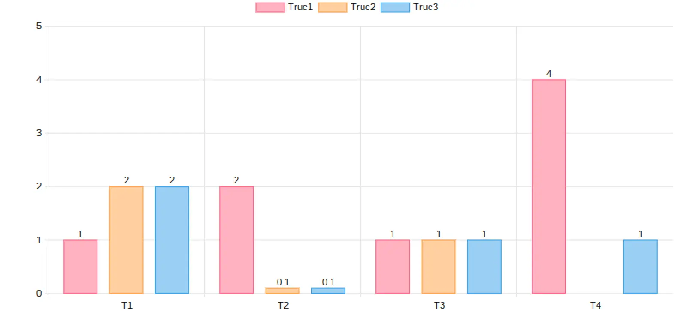
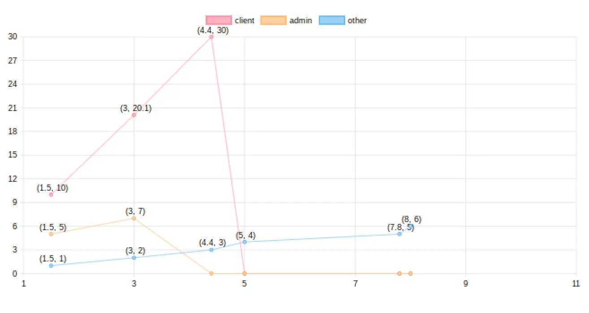
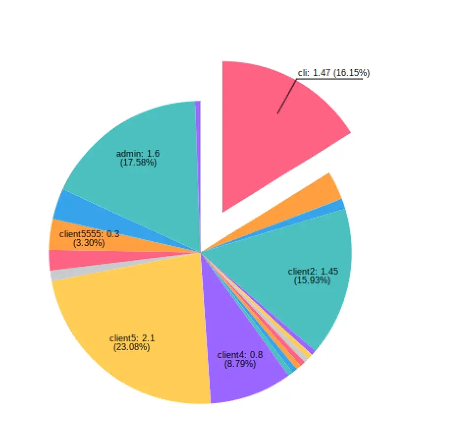
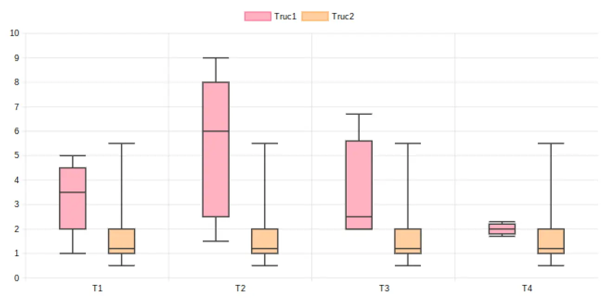
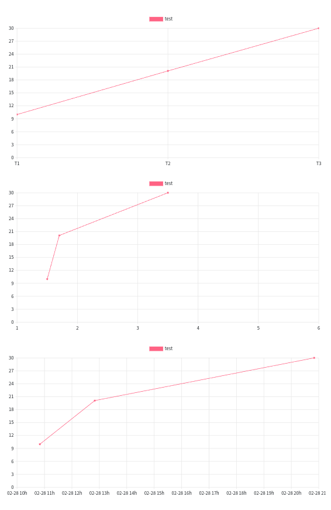
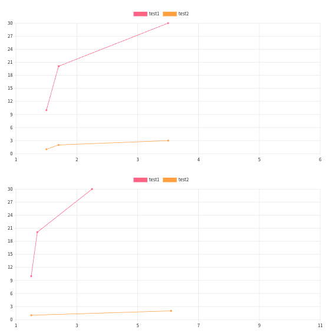
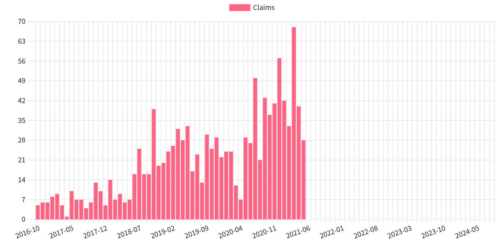
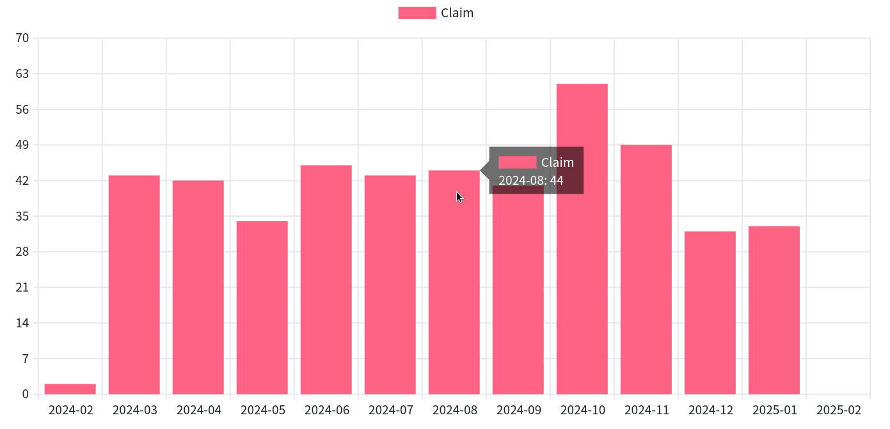

= 图表DSL
:doctype: book
:taack-category: 3|doc/DSLs
:toc:
:source-highlighter: rouge
:icons: font

* [*] 支持HTML
* [*] 支持PDF
* [*] 支持Mails
* [ ] 支持CSV

图表DSL允许快速绘画柱状图、面积图、饼状图、散点图和折线图，可导出至PNG或SVG格式。

== 代码示例

=== 柱状图

.非堆叠柱状图
====
.柱状图代码示例
[source,groovy]
----
private static UiDiagramSpecifier barDiagram(boolean isStacked) {
    new UiDiagramSpecifier().ui {
        bar(isStacked, {
            labels "T1", "T2", "T3", "T4"
            dataset 'Truc1', 1.0, 2.0, 1.0, 4.0
            dataset 'Truc2', 2.0, 0.1, 1.0, 0.0
            dataset 'Truc3', 2.0, 0.1, 1.0, 1.0
        })
    }
}
----

.图表结果

====

=== 折线图

.折线图
====
.折线图代码示例
[source,groovy]
----
diagram new UiDiagramSpecifier().ui({
    line {
        labels 1.5, 3, 4.4, 5, 7.8, 8
        dataset "client", 10.0, 20.1, 30.0
        dataset "admin", 5.0, 7.0
        dataset "other", 1.0, 2.0, 3.0, 4.0, 5.0, 6.0
    }
})
----

.图表结果

====

=== 饼状图

.饼状图
====
.饼状图代码示例
[source,groovy]
----
private static UiDiagramSpecifier pieDiagram(boolean hasSlice) {
    new UiDiagramSpecifier().ui({
        pie(hasSlice, {
            labels "Pie"
            dataset("cli", 1.47)
            dataset("client", 0.28)
            dataset("client1", 0.1)
            dataset("client2", 1.45)
            dataset("client3", 0.05)
            dataset("client31", 0.05)
            dataset("client32", 0.05)
            dataset("c33", 0.05)
            dataset("client311", 0.05)
            dataset("client312", 0.05)
            dataset("client313", 0.05)
            dataset("client4", 0.8)
            dataset("client5", 2.1)
            dataset("client55", 0.1)
            dataset("client555", 0.2)
            dataset("client5555", 0.3)
            dataset("client55555", 0.3)
            dataset("admin", 1.6)
            dataset("test1", 0.05)
        })
    })
}
----

.图表结果

====

=== 盒须图

.盒须图
====
.盒须图代码示例
[source,groovy]
----
diagram new UiDiagramSpecifier().ui({
    whiskers {
        labels "T1", "T2", "T3", "T4"

        dataset 'Truc1', {
            boxData 1.0, 2.0, 3.0, 3.5, 4.0, 4.5, 5.0
            boxData 1.5, 2.5, 3.5, 6.0, 7.0, 8.0, 9.0
            boxData 2.0, 2.0, 2.1, 2.5, 5.5, 5.6, 6.7
            boxData 1.7, 1.8, 1.9, 2.0, 2.1, 2.2, 2.3
        }
        dataset 'Truc2', {
            boxData 0.5, 1.0, 1.1, 1.2, 1.3, 2.0, 5.5
            boxData 0.5, 1.0, 1.1, 1.2, 1.3, 2.0, 5.5
            boxData 0.5, 1.0, 1.1, 1.2, 1.3, 2.0, 5.5
            boxData 0.5, 1.0, 1.1, 1.2, 1.3, 2.0, 5.5
        }
    }
})
----

.图表结果

====

== 拓展用法

=== 不同数据类型的X轴

X轴的数据可为如下3种不同类型:

- String (离散)
- Number (连续)
- Date (连续)

[source,groovy]
----
diagram new UiDiagramSpecifier().ui({
    line { // X轴: String
        labels "T1", "T2", "T3"
        dataset "test", 10.0, 20.1, 30.0
    }
    line { // X轴: String
        labels 1.5, 1.7, 3.5
        dataset "test", 10.0, 20.1, 30.0
    }
    line { // X轴: Date
        Date date1 = new Date() // 此时 (2025-02-28 10:55)
        Date date2 = new Date(date1.getTime() + 1000*60*60*2) // 2小时后
        Date date3 = new Date(date1.getTime() + 1000*60*60*10) // 10小时后
        labels DiagramXLabelDateFormat.HOUR, date1, date2, date3, <1>
        dataset "test", 10.0, 20.1, 30.0
    }
})
----

<1> DiagramXLabelDateFormat: 决定了日期的显示形式，同时也决定了图表中X轴每一间隔的单位长度。

=== 第二种数据输入方式

通常用于X轴数据为连续型的图表，且不同数据源有着不同的X坐标。

[source,groovy]
----
diagram new UiDiagramSpecifier().ui({
    // 常规方式：不同的数据源有着相同的X坐标。
    line {
        labels 1.5, 1.7, 3.5

        // 3个数据: (1.5, 10.0), (1.7, 20.1), (3.5, 30.0)
        dataset "test1", 10.0, 20.1, 30.0

        // 3个数据: (1.5, 1.0), (1.7, 2.0), (3.5, 3.0)
        dataset "test2", 1.0, 2.0, 3.0
    }

    // 第二种方式：不同的数据源有着不同的X坐标。
    line {
        // 3个数据: (1.5, 10.0), (1.7, 20.1), (3.5, 30.0)
        dataset "test1", [1.5: 10.0, 1.7: 20.1, 3.5: 30.0]

        // 2个数据: (1.5, 1.0), (6.1, 2.0)
        dataset "test2", [1.5: 1.0, 6.1: 2.0]
    }
})
----

=== 专用于以周期对数据进行分组并显示各组数量的DSL

例如我们此时有一大串数据 (每个数据都对应有一个创建日期)，且希望按年/月/日/小时划分显示出各个时间段的数据总量

.DSL详情
[source,groovy]
----
    /**
     * Group the given dates according to DiagramXLabelDateFormat, then count every group and put the result as data to draw.
     *
     * For example:
     *      Knowing DiagramXLabelDateFormat.MONTH (Defined by {@link #labels(DiagramXLabelDateFormat dateFormat)}),
     *      and being given dates: 2025-01-01, 2025-01-10, 2025-01-20, 2025-02-01, 2025-02-10, 2025-03-01.
     *
     *      So they are divided to 3 groups with their own count: [2025-01: 3, 2025-02: 2, 2025-03: 1].
     *      The groups will be used as data to draw:
     *          - xLabels = ["2025-01", "2025-02", "2025-03"]
     *          - yDataList = [3.0, 2.0, 1.0]
     *
     * @param key
     * @param dates
     */
    void dataset(final String key, final Date... dates)
----

.使用该DSL的代码示例
[source,groovy]
----
diagram new UiDiagramSpecifier().ui({
    List<Claim> claims = Claim.findAll()
    bar {
        labels DiagramXLabelDateFormat.MONTH // show claim count month-by-month
        dataset "Claim", claims.collect { it.dateCreated } as Date[]
    }
})
----

.图表结果

== 动态交互部分 (仅限HTML)

=== 缩放 (水平方向)

置鼠标于图表，滚动鼠标滚轮:

- 上滚以放大
- 下滚以缩小

=== 滚动 (水平方向)

置鼠标于图表，保持左键按下，水平移动鼠标。

WARNING: 滚动幅度有最大与最小限制

=== 悬浮提示卡

图形的数据不再静态常驻显示。我们可以将鼠标放置在任意图形上，然后一个包含了该图形所有数据信息的悬浮提示卡将会实时显示在鼠标一侧。

=== 图例可点击

单击任一数据源的图例允许我们完全隐藏/重现该数据源的所有数据。

=== 图表可点击

如果用户事先定义了一个图表动作 (Diagram Action)，那么该图表中的所有图形都将变为可点击状态以调用该Action，并附带被点击图形的所有数据信息 (*X坐标*，*Y坐标*，*数据源名称*)。

[[_diagram_action]]
.如何在代码中定义一个图表动作
[source,groovy]
----
new UiDiagramSpecifier().ui {
    bar {
        labels 'date1', 'date2', 'date3'
        dataset 'Stuff1', 3.0, 4.0, 5.0

        diagramAction this.&clickDiagram as MC, id, <1>
        [optionalParam: 'value']                    <2>
    }
}

def clickDiagram() {
    println(params)
    // [id: 123456, dataset: "Stuff1",
    // optionalParam: "value"                       <3>
    // x: "date1", y: "3.0"]
}

----

<1> 点击后所导向的目标Action
<2> 允许传输额外参数
<3> 目标Action中可获得相关参数: *X坐标*，*Y坐标*，*数据源名称* 和 *额外参数*

== 图表DSL架构

[graphviz,format="svg",align=center]
.图表DSL架构图
----
digraph mygraph {
  node [shape=box];
  ui
  ui -> bar, scatter, line, area, pie, whiskers
  bar, scatter, line, area, pie, whiskers -> labels [label = "1:1"]
  bar, scatter, line, area, pie -> dataset [label = "1:N"]
  whiskers -> wdataset [label = "1:N"]
  wdataset -> boxData [label = "1:N"]
}
----
