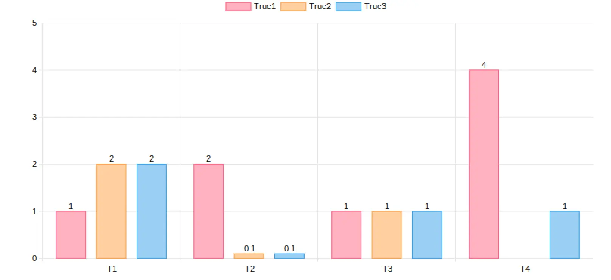
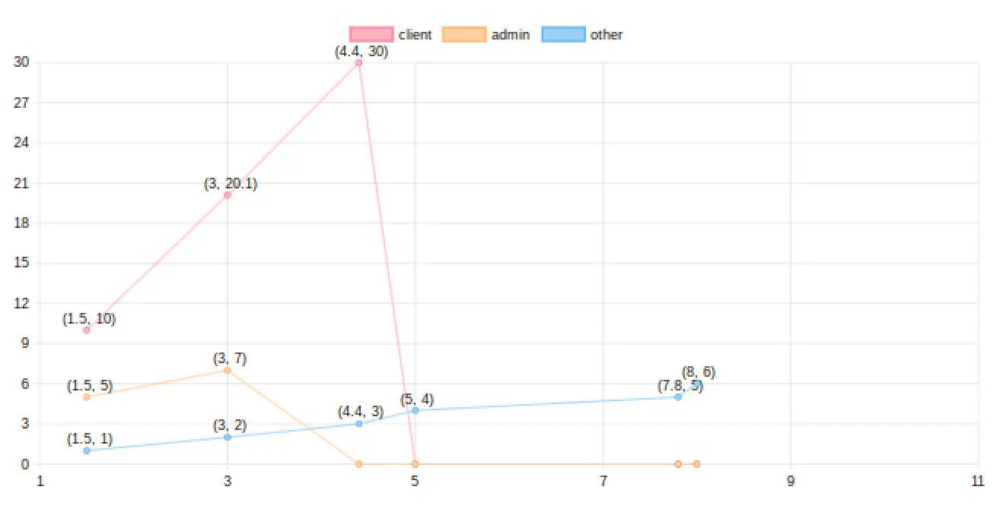
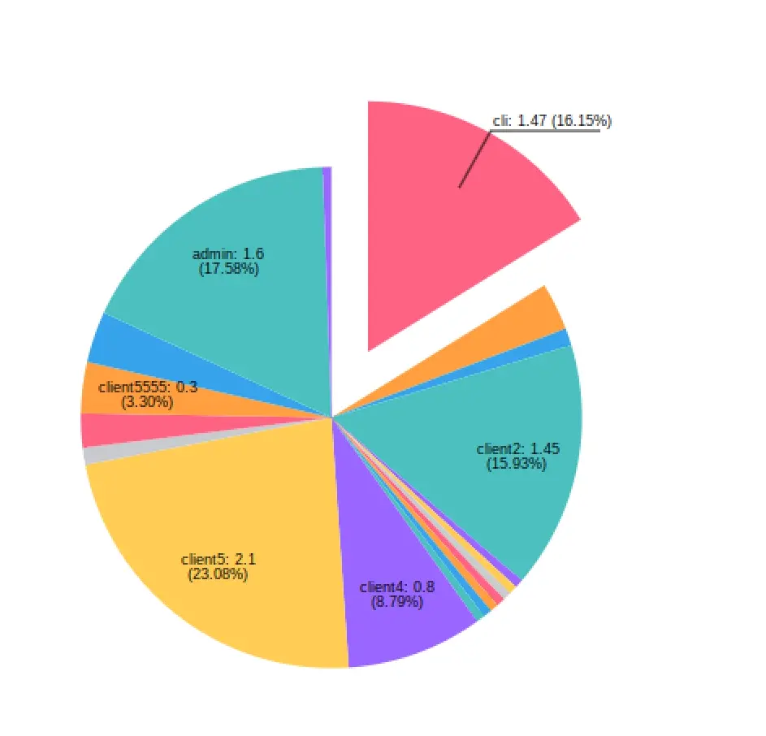
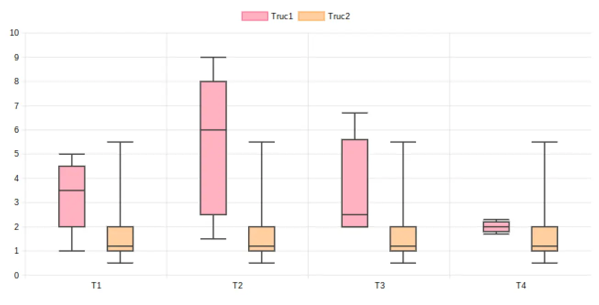
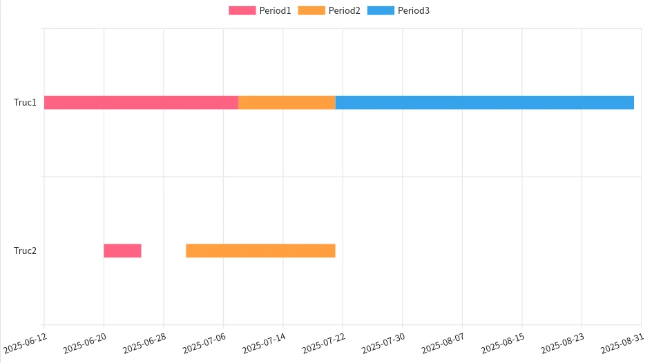
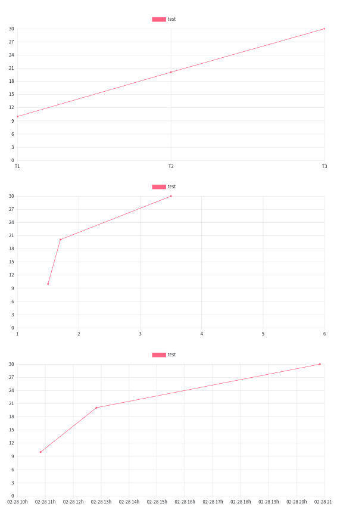
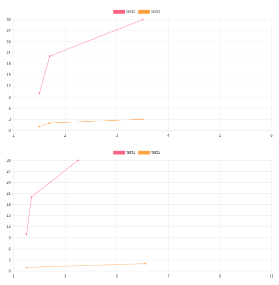
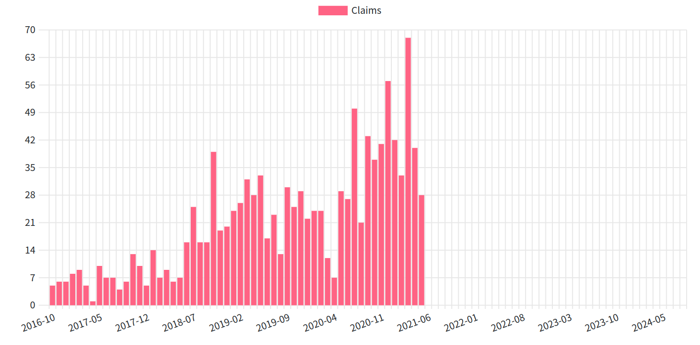
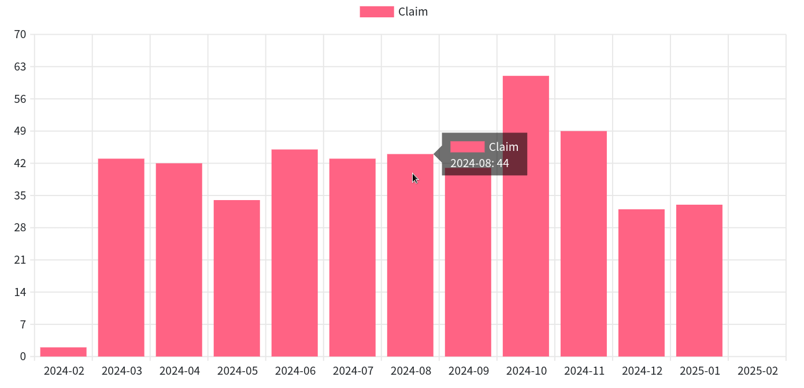

= Diagram DSL
:doctype: book
:taack-category: 3|doc/DSLs
:toc:
:source-highlighter: rouge
:icons: font

* [*] Rendered into HTML
* [*] Rendered into PDF
* [*] Rendered into Mails
* [ ] Rendered into CSV

Diagram DSL allows quickly drawing barchart, area, pie, scatter and line diagram, either rasterized in PNG or in SVG format.

== Chart Sample

=== Bar

.Bar chart
====
.Barchart Code Sample
[source,groovy]
----
private static UiDiagramSpecifier barDiagram(boolean isStacked) {
    new UiDiagramSpecifier().ui {
        bar(isStacked, {
            labels "T1", "T2", "T3", "T4"
            dataset 'Truc1', 1.0, 2.0, 1.0, 4.0
            dataset 'Truc2', 2.0, 0.1, 1.0, 0.0
            dataset 'Truc3', 2.0, 0.1, 1.0, 1.0
        })
    }
}
----

.Result

====

=== Line

.Line chart
====
.Lines Code Sample
[source,groovy]
----
diagram new UiDiagramSpecifier().ui({
    line {
        labels 1.5, 3, 4.4, 5, 7.8, 8
        dataset "client", 10.0, 20.1, 30.0
        dataset "admin", 5.0, 7.0
        dataset "other", 1.0, 2.0, 3.0, 4.0, 5.0, 6.0
    }
})
----

.Result

====

=== Pie

.Pie chart
====
.Pie Code Sample
[source,groovy]
----
private static UiDiagramSpecifier pieDiagram(boolean hasSlice) {
    new UiDiagramSpecifier().ui({
        pie(hasSlice, {
            labels "Pie"
            dataset("cli", 1.47)
            dataset("client", 0.28)
            dataset("client1", 0.1)
            dataset("client2", 1.45)
            dataset("client3", 0.05)
            dataset("client31", 0.05)
            dataset("client32", 0.05)
            dataset("c33", 0.05)
            dataset("client311", 0.05)
            dataset("client312", 0.05)
            dataset("client313", 0.05)
            dataset("client4", 0.8)
            dataset("client5", 2.1)
            dataset("client55", 0.1)
            dataset("client555", 0.2)
            dataset("client5555", 0.3)
            dataset("client55555", 0.3)
            dataset("admin", 1.6)
            dataset("test1", 0.05)
        })
    })
}
----

.Result

====

=== Whiskers

.Whiskers chart
====
.Whiskers Code Sample
[source,groovy]
----
diagram new UiDiagramSpecifier().ui({
    whiskers {
        labels "T1", "T2", "T3", "T4"

        dataset 'Truc1', {
            boxData 1.0, 2.0, 3.0, 3.5, 4.0, 4.5, 5.0
            boxData 1.5, 2.5, 3.5, 6.0, 7.0, 8.0, 9.0
            boxData 2.0, 2.0, 2.1, 2.5, 5.5, 5.6, 6.7
            boxData 1.7, 1.8, 1.9, 2.0, 2.1, 2.2, 2.3
        }
        dataset 'Truc2', {
            boxData 0.5, 1.0, 1.1, 1.2, 1.3, 2.0, 5.5
            boxData 0.5, 1.0, 1.1, 1.2, 1.3, 2.0, 5.5
            boxData 0.5, 1.0, 1.1, 1.2, 1.3, 2.0, 5.5
            boxData 0.5, 1.0, 1.1, 1.2, 1.3, 2.0, 5.5
        }
    }
})
----

.Result

====

=== Timeline

.Timeline chart
====
.Timeline Code Sample
[source,groovy]
----
diagram new UiDiagramSpecifier().ui({
    timeline {
        SimpleDateFormat format = new SimpleDateFormat('yyyy-MM-dd')
        dataset 'Truc1', {
            periodData format.parse('2025-06-12'), format.parse('2025-07-08'), "Period1"
            periodData format.parse('2025-07-08'), format.parse('2025-07-21'), "Period2"
            periodData format.parse('2025-07-21'), format.parse('2025-08-30'), "Period3"
        }
        dataset 'Truc2', {
            periodData format.parse('2025-06-20'), format.parse('2025-06-25'), "Period1"
            periodData format.parse('2025-07-01'), format.parse('2025-07-21'), "Period2"
        }
    }
})
----

.Result

====

== Customized Option

We give various options to allow user to customize the chart, by using `DiagramOption`.

.Barchart using DiagramOption
[source,groovy]
----
private static UiDiagramSpecifier barDiagram(boolean isStacked) {
    new UiDiagramSpecifier().ui {
        bar(isStacked, {
            labels "T1", "T2", "T3", "T4"
            dataset 'Truc1', 1.0, 2.0, 1.0, 4.0
            dataset 'Truc2', 2.0, 0.1, 1.0, 0.0
            dataset 'Truc3', 2.0, 0.1, 1.0, 1.0

            option DiagramOption.builder
                    .setTitle("This is a Bar chart !")
                    .hideLegend()
                    .showDataCount()
                    .setKeyColors(Color.RED, Color.ORANGE, Color.YELLOW, Color.GREEN)
                    .setClickAction(Pr2Controller.&onclickBar as MethodClosure)
                    .setResolution(DiagramResolution.DEFAULT_2K)
                    .build()
        })
    }
}
----

== Bonus way to code

=== Different types of xLabels

The labels on X axis could be of 3 types:

- String (Discrete)
- Number (Continuous)
- Date (Continuous)

[source,groovy]
----
diagram new UiDiagramSpecifier().ui({
    line { // X axis: String
        labels "T1", "T2", "T3"
        dataset "test", 10.0, 20.1, 30.0
    }
    line { // X axis: String
        labels 1.5, 1.7, 3.5
        dataset "test", 10.0, 20.1, 30.0
    }
    line { // X axis: Date
        Date date1 = new Date() // now (2025-02-28 10:55)
        Date date2 = new Date(date1.getTime() + 1000*60*60*2) // 2 hours later
        Date date3 = new Date(date1.getTime() + 1000*60*60*10) // 10 hours later
        labels date1, date2, date3
        dataset "test", 10.0, 20.1, 30.0
        option DiagramOption.builder
                .setXLabelDateFormat(DiagramXLabelDateFormat.HOUR) <1>
                .build()
    }
})
----

<1> DiagramXLabelDateFormat: Define the date format to display, and also define the minimum gap unit (Because X axis is continuous)

=== Second way to give data coordinate

Often used for continuous X axis on which datasets have different X coordinate.

[source,groovy]
----
diagram new UiDiagramSpecifier().ui({
    // Normal way: different datasets have same X coordinates
    line {
        labels 1.5, 1.7, 3.5

        // 3 data: (1.5, 10.0), (1.7, 20.1), (3.5, 30.0)
        dataset "test1", 10.0, 20.1, 30.0

        // 3 data: (1.5, 1.0), (1.7, 2.0), (3.5, 3.0)
        dataset "test2", 1.0, 2.0, 3.0
    }

    // Second way: different datasets have different X coordinates
    line {
        // 3 data: (1.5, 10.0), (1.7, 20.1), (3.5, 30.0)
        dataset "test1", [1.5: 10.0, 1.7: 20.1, 3.5: 30.0]

        // 2 data: (1.5, 1.0), (6.1, 2.0)
        dataset "test2", [1.5: 1.0, 6.1: 2.0]
    }
})
----

=== DSL to show data count at regular intervals

We have a large number of objects, and we would like to have a diagram that shows the number of objects year-by-year (or month-by-month / day-by-day / hour-by-hour) depending on object's dateCreated.

.DSL to use
[source,groovy]
----
    /**
     * Group the given dates according to DiagramXLabelDateFormat, then count every group and put the result as data to draw.
     *
     * For example:
     *      Knowing DiagramXLabelDateFormat.MONTH (Defined by {@link #labels(DiagramXLabelDateFormat dateFormat)}),
     *      and being given dates: 2025-01-01, 2025-01-10, 2025-01-20, 2025-02-01, 2025-02-10, 2025-03-01.
     *
     *      So they are divided to 3 groups with their own count: [2025-01: 3, 2025-02: 2, 2025-03: 1].
     *      The groups will be used as data to draw:
     *          - xLabels = ["2025-01", "2025-02", "2025-03"]
     *          - yDataList = [3.0, 2.0, 1.0]
     *
     * @param key
     * @param dates
     */
    void dataset(final String key, final Date... dates)
----

.Code how to use the DSL
[source,groovy]
----
diagram new UiDiagramSpecifier().ui({
    List<Claim> claims = Claim.findAll()
    bar {
        dataset "Claim", claims.collect { it.dateCreated } as Date[]
        option DiagramOption.builder
                .setXLabelDateFormat(DiagramXLabelDateFormat.MONTH) // show claim count month-by-month
                .build()
    }
})
----

.Diagram

== Dynamic parts (Only in HTML)

=== Zoom (Horizontally)

Put mouse on diagram, then scroll the mouse wheel with CTRL pressed.

- CTRL + Wheel-up for Zoom-up.
- CTRL + Wheel-down for Zoom-down.

=== Scroll (Horizontally)

Put mouse on diagram, press the left mouse button and keep pressing, then move mouse horizontally.

WARNING: Scroll min and max are limited

=== Tooltip

The value of barchart/line/... will not be shown statically. Instead, we can put mouse on any shape, then a tooltip will appear dynamically that shows all information about the target shape.

=== Clickable legend

Click on a dataset legend allows us to hide the showing of target dataset.

== DSL Symbols Hierarchy

[graphviz,format="svg",align=center]
.Symbol hierarchy diagram for Diagram DSL
----
digraph mygraph {
  node [shape=box];
  ui
  ui -> bar, scatter, line, area, pie, whiskers
  bar, scatter, line, area, pie, whiskers -> labels [label = "1:1"]
  bar, scatter, line, area, pie -> dataset [label = "1:N"]
  whiskers -> wdataset [label = "1:N"]
  wdataset -> boxData [label = "1:N"]
}
----
