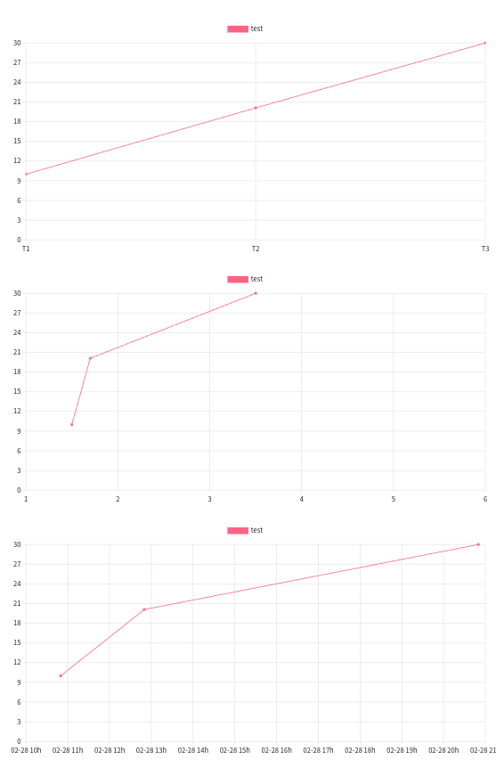

= Diagram DSL
:doctype: book
:taack-category: 3|doc/DSLs
:toc:
:source-highlighter: rouge
:icons: font

* [*] Rendered into HTML
* [*] Rendered into PDF
* [*] Rendered into Mails
* [ ] Rendered into CSV

Diagram DSL allows quickly drawing barchart, area, pie, scatter and line diagram, either rasterized in PNG or in SVG format.

WARNING: the following code sample will work for `taack-ui` 0.5.4 (the current version is 0.5.3).

== Code Sample

=== Bar

.Non-Stacked Barchart
====
.Barchart Code Sample
[source,groovy]
----
private static UiDiagramSpecifier barDiagram(boolean isStacked) {
    new UiDiagramSpecifier().ui {
        bar(isStacked, {
            labels "T1", "T2", "T3", "T4"
            dataset 'Truc1', 1.0, 2.0, 1.0, 4.0
            dataset 'Truc2', 2.0, 0.1, 1.0, 0.0
            dataset 'Truc3', 2.0, 0.1, 1.0, 1.0
        })
    }
}
----

.Result
image:diag-dsl-bar.webp[]
====

=== Line

.Lines
====
.Lines Code Sample
[source,groovy]
----
diagram new UiDiagramSpecifier().ui({
    line {
        labels 1.5, 3, 4.4, 5, 7.8, 8
        dataset "client", 10.0, 20.1, 30.0
        dataset "admin", 5.0, 7.0
        dataset "other", 1.0, 2.0, 3.0, 4.0, 5.0, 6.0
    }
})
----

.Result
image:diag-dsl-line.webp[]
====

=== Pie

.Pie chart
====
.Code Sample
[source,groovy]
----
private static UiDiagramSpecifier pieDiagram(boolean hasSlice) {
    new UiDiagramSpecifier().ui({
        pie(hasSlice, {
            labels "Pie"
            dataset("cli", 1.47)
            dataset("client", 0.28)
            dataset("client1", 0.1)
            dataset("client2", 1.45)
            dataset("client3", 0.05)
            dataset("client31", 0.05)
            dataset("client32", 0.05)
            dataset("c33", 0.05)
            dataset("client311", 0.05)
            dataset("client312", 0.05)
            dataset("client313", 0.05)
            dataset("client4", 0.8)
            dataset("client5", 2.1)
            dataset("client55", 0.1)
            dataset("client555", 0.2)
            dataset("client5555", 0.3)
            dataset("client55555", 0.3)
            dataset("admin", 1.6)
            dataset("test1", 0.05)
        })
    })
}
----

.Result
image:diag-dsl-pie.webp[]
====

=== Wiskers

.Whiskers chart
====
.Code Sample
[source,groovy]
----
diagram new UiDiagramSpecifier().ui({
    whiskers {
        labels "T1", "T2", "T3", "T4"

        dataset 'Truc1', {
            boxData 1.0, 2.0, 3.0, 3.5, 4.0, 4.5, 5.0
            boxData 1.5, 2.5, 3.5, 6.0, 7.0, 8.0, 9.0
            boxData 2.0, 2.0, 2.1, 2.5, 5.5, 5.6, 6.7
            boxData 1.7, 1.8, 1.9, 2.0, 2.1, 2.2, 2.3
        }
        dataset 'Truc2', {
            boxData 0.5, 1.0, 1.1, 1.2, 1.3, 2.0, 5.5
            boxData 0.5, 1.0, 1.1, 1.2, 1.3, 2.0, 5.5
            boxData 0.5, 1.0, 1.1, 1.2, 1.3, 2.0, 5.5
            boxData 0.5, 1.0, 1.1, 1.2, 1.3, 2.0, 5.5
        }
    }
})
----

.Result
image:diag-dsl-whiskers.webp[]
====

== Bonus way to code

=== Different types of xLabels

The labels on X axis could be of 3 types:

- String (Discrete)
- Number (Continuous)
- Date (Continuous)

[source,groovy]
----
diagram new UiDiagramSpecifier().ui({
    line { // X axis: String
        labels "T1", "T2", "T3"
        dataset "test", 10.0, 20.1, 30.0
    }
    line { // X axis: String
        labels 1.5, 1.7, 3.5
        dataset "test", 10.0, 20.1, 30.0
    }
    line { // X axis: Date
        Date date1 = new Date() // now (2025-02-28 10:55)
        Date date2 = new Date(date1.getTime() + 1000*60*60*2) // 2 hours later
        Date date3 = new Date(date1.getTime() + 1000*60*60*10) // 10 hours later
        labels DiagramXLabelDateFormat.HOUR, date1, date2, date3, <1>
        dataset "test", 10.0, 20.1, 30.0
    }
})
----

<1> DiagramXLabelDateFormat: Define the date format to display, and also define the minimum gap unit (Because X axis is continuous)

=== Second way to give data coordinate

Often used for continuous X axis on which datasets have different X coordinate.

[source,groovy]
----
diagram new UiDiagramSpecifier().ui({
    // Normal way: different datasets have same X coordinates
    line {
        labels 1.5, 1.7, 3.5

        // 3 data: (1.5, 10.0), (1.7, 20.1), (3.5, 30.0)
        dataset "test1", 10.0, 20.1, 30.0

        // 3 data: (1.5, 1.0), (1.7, 2.0), (3.5, 3.0)
        dataset "test2", 1.0, 2.0, 3.0
    }

    // Second way: different datasets have different X coordinates
    line {
        // 3 data: (1.5, 10.0), (1.7, 20.1), (3.5, 30.0)
        dataset "test1", [1.5: 10.0, 1.7: 20.1, 3.5: 30.0]

        // 2 data: (1.5, 1.0), (6.1, 2.0)
        dataset "test2", [1.5: 1.0, 6.1: 2.0]
    }
})
----

image:screenshot-dsl-diagram-coordinate.png[]

=== DSL to show data count at regular intervals

We have a large number of objects, and we would like to have a diagram that shows the number of objects year-by-year (or month-by-month / day-by-day / hour-by-hour) depending on object's dateCreated.

.DSL to use
[source,groovy]
----
    /**
     * Group the given dates according to DiagramXLabelDateFormat, then count every group and put the result as data to draw.
     *
     * For example:
     *      Knowing DiagramXLabelDateFormat.MONTH (Defined by {@link #labels(DiagramXLabelDateFormat dateFormat)}),
     *      and being given dates: 2025-01-01, 2025-01-10, 2025-01-20, 2025-02-01, 2025-02-10, 2025-03-01.
     *
     *      So they are divided to 3 groups with their own count: [2025-01: 3, 2025-02: 2, 2025-03: 1].
     *      The groups will be used as data to draw:
     *          - xLabels = ["2025-01", "2025-02", "2025-03"]
     *          - yDataList = [3.0, 2.0, 1.0]
     *
     * @param key
     * @param dates
     */
    void dataset(final String key, final Date... dates)
----

.Code how to use the DSL
[source,groovy]
----
diagram new UiDiagramSpecifier().ui({
    List<Claim> claims = Claim.findAll()
    bar {
        labels DiagramXLabelDateFormat.MONTH // show claim count month-by-month
        dataset "Claim", claims.collect { it.dateCreated } as Date[]
    }
})
----

.Diagram
image:screenshot-dsl-diagram-count-object.png[]

== Dynamic parts (Only in HTML)

=== Zoom (Horizontally)

Put mouse on diagram, then scroll the mouse wheel.

- Wheel-up for Zoom-up.
- Wheel-down for Zoom-down.

=== Scroll (Horizontally)

Put mouse on diagram, press the left mouse button and keep pressing, then move mouse horizontally.

WARNING: Scroll min and max are limited

=== Tooltip

The value of barchart/line/... will not be shown statically. Instead, we can put mouse on any shape, then a tooltip will appear dynamically that shows all information about the target shape.

image:screenshot-dsl-diagram-tooltip.png[]

=== Clickable legend

Click on a dataset legend allows us to hide the showing of target dataset.

=== Diagram action

If a diagram action is defined, the shapes of diagram will be clickable to call target action, giving all information of clicked shape (*label*, *value*, *dataset name*)

[[_diagram_action]]
.How to define diagram action
[source,groovy]
----
new UiDiagramSpecifier().ui {
    bar {
        labels 'date1', 'date2', 'date3'
        dataset 'Stuff1', 3.0, 4.0, 5.0

        diagramAction this.&clickDiagram as MC, id, <1>
        [optionalParam: 'value']                    <2>
    }
}

def clickDiagram() {
    println(params)
    // [id: 123456, dataset: "Stuff1",
    // optionalParam: "value"                       <3>
    // x: "date1", y: "3.0"]
}

----

<1> Diagram Action
<2> Can pass map
<3> Action params contain *label*, *value*, *dataset name* and *map*

== DSL Symbols Hierarchy

[graphviz,format="svg",align=center]
.Symbol hierarchy diagram for Diagram DSL
----
digraph mygraph {
  node [shape=box];
  ui
  ui -> bar, scatter, line, area, pie, whiskers
  bar, scatter, line, area, pie, whiskers -> labels [label = "1:1"]
  bar, scatter, line, area, pie -> dataset [label = "1:N"]
  whiskers -> wdataset [label = "1:N"]
  wdataset -> boxData [label = "1:N"]
}
----
