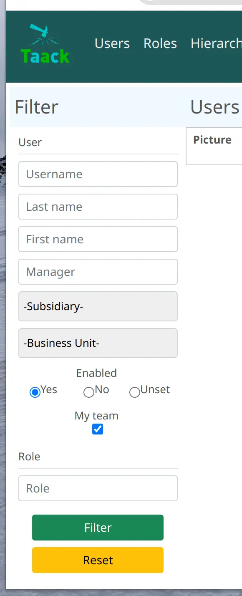
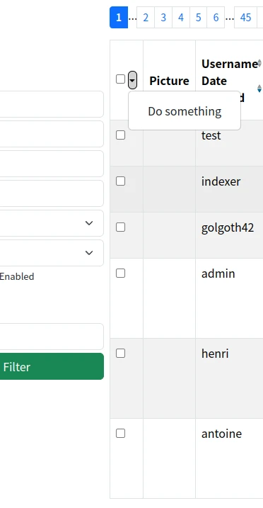

= FilterTable DSL
:doctype: book
:taack-category: 5|doc/DSLs
:toc:
:source-highlighter: rouge
:icons: font

== Filtre

* [*] Rendu en HTML
* [ ] Rendu en PDF
* [ ] Rendu en Mail
* [ ] Rendu en CSV

.Filtre appliqué à un tableau, à partir de <<filter-sample1>>

Le Filter DSL est toujours associé à un tableau ou à un graphique. Un bloc ne peut pas contenir uniquement un filtre au plus.

[[filter-code-sample]]
=== Exemple de code

[[filter-sample1]]
.Exemple de code de filtre 1
[source,groovy]
----
UiFilterSpecifier f = new UiFilterSpecifier()           <1>

f.ui User, {                                            <2>
    section "User", {                                   <3>
        filterField u.username_                         <4>
        filterField u.lastName_
        filterField u.firstName_
        filterField u.manager_, u.manager.username_     <5>
        filterField u.mainSubsidiary_
        filterField u.allowedSubsidiaries_
        filterField u.enabled_
        filterFieldExpressionBool "My Team",            <6>
            new FilterExpression(u.selfObject_,
                    Operator.IN,
                    cu.allManagedUsers_),
            true
    }
}
----

<1> Créer le filtre
<2> Transmettre la classe d'objet et la fermeture contenant les spécifications du filtre via la méthode `ui`
<3> Créer une section intitulée "Utilisateur"
<4> Ajouter un champ au filtre, noter le *soulignement* à la fin du nom du champ
<5> si le champ est un objet, transmettre un tableau avec toutes les étapes nécessaires pour cibler le champ sur lequel vous souhaitez filtrer
<6> `filterFieldExpressionBool` permet un filtre plus complexe

[source,groovy]
[[sample2]]
.Filter Exemple 2
----
UiFilterSpecifier f = new UiFilterSpecifier()

CmsImage i = new CmsImage(cmsPage: new CmsPage())

f.ui CmsImage, cmsPage ? [id: cmsPage.id] : null, { <1>
    section "Image", {
        filterField i.hide_
        filterField i.filePath_
        filterField i.imageType_
    }
    section "Origin", {
        filterField i.cmsPage_, i.cmsPage.name_
        filterField i.cmsPage_, i.cmsPage.subsidiary_
        filterField i.cmsPage_, i.cmsPage.pageLayout_
        filterField i.cmsPage_, i.cmsPage.pageType_
    }
}
f
----

<1> Nous pouvons passer des paramètres optionnels à l'action

=== Hiérarchie des symboles du DSL

[graphviz,format="svg",align=center]
.Diagramme de hiérarchie des symboles pour Filter DSL
----
digraph mygraph {
node [shape=box]; "ui"
"ui" -> hiddenId [label = "0,1"]
"ui" -> "section" [label = "1,N"]
"section" -> "section"
"section" -> "filterField", "filterFieldExpressionBool", "filterFieldInverse" [label = "0,N"]
}
----

=== Éléments DSL

=== Racine
* `ui` : une version permet de passer des paramètres supplémentaires à l'action de filtrage (voir <<sample2>>)

=== Entrées
* `filterField` : ajouter un champ d'objet à transmettre à l'action de filtrage
* `filterFieldInverse` : filtrer les objets si un autre objet pointe dessus.
* `filterFieldExpressionBool` : permet de modifier la clause where dans l'action de filtrage en utilisant FilterExpression, le dernier paramètre est la valeur par défaut.

=== Structure
* `section` : ajouter une section de filtre graphique

== Tableau

* [*] Rendu en HTML
* [*] Rendu en PDF
* [*] Rendu en CSV

=== Exemple de code

La partie droite de l'aperçu correspond à l'exemple DSL ci-dessous.
Le filtre se trouve à gauche de l'image, voir <<DslDescriptions/FilterDSL.adoc#filter-sample1>> pour le code correspondant.

Le tableau comporte une *pagination*, il est trié par défaut par rapport à la colonne *Date de création*, toutes les colonnes sont *triables* sauf Image et Rôles.
Une colonne peut contenir plusieurs cellules.
La date de création est vide pour les anciens utilisateurs, et les cellules du gestionnaire sont également vides pour certains utilisateurs.

[source,groovy]
[[table-sample1]]
.Exemple de tableau : en-tête, lignes, sélection multiple et tri par défaut
----
new UiTableSpecifier().ui {
    User u = new User(manager: new User(), enabled: true)
    header {                                                <1>
        columnSelect "selectedUsers", {                     <2>
            columnSelectButton tr("action.label"), CrewController.&doSomethingForSelectedUsers as MC
        }
        column {
            label tr('picture.header.label')                <3>
        }
        column {
            sortableFieldHeader u.username_                 <4>
            sortableFieldHeader u.dateCreated_
        }
        column {
            sortableFieldHeader u.subsidiary_
            sortableFieldHeader u.manager_, u.manager.username_
        }
        column {
            sortableFieldHeader u.lastName_
            sortableFieldHeader u.firstName_
        }
        label tr('default.roles.label')                     <5>
    }

    TaackFilter tf = taackFilterService.getBuilder(User)
            .setSortOrder(TaackFilter.Order.DESC, u.dateCreated_)
            .setMaxNumberOfLine(20).addFilter(f).build()

    iterate(tf) { User ru ->                                <6>
        rowSelect ru.id.toString(), true                    <7>
        rowField attachmentUiService.preview(ru.mainPicture?.id)
        rowColumn {
            rowField ru.username_
            rowField ru.dateCreated_
        }
        rowColumn {
            rowField ru.subsidiary_
            rowField ru.manager_
        }
        rowColumn {
            rowField ru.lastName_
            rowField ru.firstName_
        }
        rowField ru.authorities*.authority.join(', ')
    }
}
----
<1> Partie en-tête des spécifications de la table
<2> Partie de sélection multiple de la table
<3> En-tête de champ non triable
<4> En-tête de champ triable
<5> Il pourrait être enveloppé *sans* `column` s'il n'y a qu'un seul champ
<6> `iterate`, spécifiant le tri, la pagination et le filtrage
<7> Case à cocher dans la colonne correspondant à `columnSelect` dans l'en-tête

`ActionIcon` peut être modifié par `ActionIconModifier`

Le style de tableau est spécifié par `Style`, un paramètre facultatif sur l'élément `row` ou `rowField`.

=== Hiérarchie des symboles DSL

.Diagramme de hiérarchie des symboles pour le tableau DSL
[graphviz,format="svg",align=center]
----
digraph mygraph {
  node [shape=box];
  ui
  ui -> header, iterate [label = "0,1"]
  ui -> row,rowIndent [label = "0,N"]
  header -> column, columnSelect [label = "0,N"]
  columnSelect -> columnSelectButton [label = "0,N"]
  column, header -> label, sortableFieldHeader [label = "1,N"]
  row, iterate, rowTree -> rowColumn [label = "0,N"]
  rowColumn, row, rowTree, iterate -> rowAction, rowField, rowFieldRaw, rowSelect [label = "0,N"]
  rowIndent -> rowTree [label = "0,N"]
  rowIndent -> rowIndent [label = "0,N"]
}
----