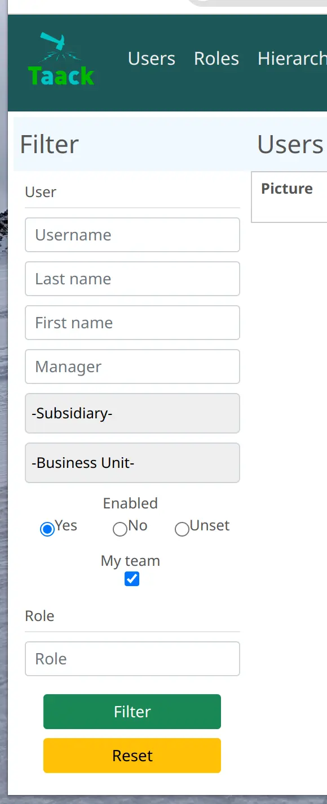

= 附带筛选器的表格DSL
:doctype: book
:taack-category: 5|doc/DSLs
:toc:
:source-highlighter: rouge
:icons: font

== 筛选器

* [*] 支持HTML
* [ ] 支持PDF
* [ ] 支持Mail
* [ ] 支持CSV

.应用于表格的筛选器，取自<<filter-sample1>>

筛选器DSL总是依附于一个表格或一张图表，不可独立存在。

[[filter-code-sample]]
=== 代码示例

[source,groovy]
[[filter-sample1]]
.筛选器代码示例 1
----
UiFilterSpecifier f = new UiFilterSpecifier()           <1>

f.ui User, {                                            <2>
    section "User", {                                   <3>
        filterField u.username_                         <4>
        filterField u.lastName_
        filterField u.firstName_
        filterField u.manager_, u.manager.username_     <5>
        filterField u.mainSubsidiary_
        filterField u.allowedSubsidiaries_
        filterField u.enabled_
        filterFieldExpressionBool "My Team",            <6>
            new FilterExpression(u.selfObject_,
                    Operator.IN,
                    cu.allManagedUsers_),
            true
    }
}
----

<1> 创建筛选器块
<2> 往 `ui` 方法中传入数据对象的Class类和一个定义了所有需求内容的闭包
<3> 创建一个名为“User”的区域
<4> 为筛选器添加需要筛选的字段，请注意该字段后需后接**下划线**
<5> 如果字段类型为一个数据对象，则需再次堆叠填写该对象的字段
<6> `filterFieldExpressionBool` 允许更复杂的筛选判定

[source,groovy]
[[sample2]]
.筛选器代码示例 2
----
UiFilterSpecifier f = new UiFilterSpecifier()

CmsImage i = new CmsImage(cmsPage: new CmsPage())

f.ui CmsImage, cmsPage ? [id: cmsPage.id] : null, { <1>
    section "Image", {
        filterField i.hide_
        filterField i.filePath_
        filterField i.imageType_
    }
    section "Origin", {
        filterField i.cmsPage_, i.cmsPage.name_
        filterField i.cmsPage_, i.cmsPage.subsidiary_
        filterField i.cmsPage_, i.cmsPage.pageLayout_
        filterField i.cmsPage_, i.cmsPage.pageType_
    }
}
f
----

<1> 筛选器可为Action传递参数

=== DSL架构

[graphviz,format="svg",align=center]
.筛选器DSL架构图
----
digraph mygraph {
  node [shape=box];
  "ui"
  "ui" -> hiddenId [label = "0,1"]
  "ui" -> "section" [label = "1,N"]
  "section" -> "section"
  "section" -> "filterField", "filterFieldExpressionBool", "filterFieldInverse" [label = "0,N"]
}
----

=== DSL元素

=== 根
* `ui`: 筛选器可为Action传递额外的参数 (见<<sample2>>)

=== 输入
* `filterField`: 添加筛选所需的字段
* `filterFieldInverse`: 筛选所需的字段类型为一个数据对象，同时只能从该对象索引至自身
* `filterFieldExpressionBool`: 允许手动编辑筛选条件。最后一个参数需填写该筛选条件的默认值。

=== 架构
* `section`: 为筛选器内部添加一个分区

== 表单

* [*] 支持HTML
* [*] 支持PDF
* [*] 支持CSV

=== 代码示例

表格自带**分页**。排序默认以**创建日期**列为基准，除Picture和Roles以外其他列都可点击进行重新排序。
一列可容纳多个单元格。
某些老用户的创建日期为空时，对应的单元格内也会被置空。

[source,groovy]
[[table-sample1]]
.表格示例：表头、内容行、以及默认排序
----
new UiTableSpecifier().ui {
    User u = new User(manager: new User(), enabled: true)
    header {                                                <1>
        if (!hasSelect) {
            fieldHeader tr('picture.header.label')          <2>
        }
        column {
            sortableFieldHeader u.username_                 <3>
            sortableFieldHeader u.dateCreated_
        }
        column {
            sortableFieldHeader u.subsidiary_
            sortableFieldHeader u.manager_, u.manager.username_
        }
        column {
            sortableFieldHeader u.lastName_
            sortableFieldHeader u.firstName_
        }
        column {
            fieldHeader tr('default.roles.label')
        }
    }
    boolean canSwitchUser = crewSecurityService.canSwitchUser()

    TaackFilter tf = taackFilterService.getBuilder(User)
            .setSortOrder(TaackFilter.Order.DESC, u.dateCreated_)
            .setMaxNumberOfLine(20).addFilter(f).build()

    iterate(tf) { User ru ->                                <4>
        row {                                               <5>
            boolean hasActions = crewSecurityService.canEdit(ru)
            if (!hasSelect) {
                rowColumn {
                    rowField attachmentUiService.preview(ru.mainPicture?.id)
                }
            }
            rowColumn {
                rowAction ActionIcon.SHOW * IconStyle.SCALE_DOWN,
                        CrewController.&showUser as MC, ru.id
                if (hasSelect)
                    rowAction "Select User",
                        ActionIcon.SELECT * IconStyle.SCALE_DOWN,
                        ru.id, ru.toString()
                else if (hasActions) {
                    rowAction ActionIcon.EDIT * IconStyle.SCALE_DOWN,
                        CrewController.&editUser as MC, ru.id
                    if (canSwitchUser && ru.enabled)
                        rowAction ActionIcon.SHOW * IconStyle.SCALE_DOWN,
                            CrewController.&switchUser as MC, ru.id
                    else if (canSwitchUser && !ru.enabled) {
                        rowAction ActionIcon.MERGE * IconStyle.SCALE_DOWN,
                            CrewController.&replaceUser as MC, ru.id
                        rowAction ActionIcon.DELETE * IconStyle.SCALE_DOWN,
                            CrewController.&deleteUser as MC, ru.id
                    }
                }
                rowField ru.username_
                rowField ru.dateCreated_
            }
            rowColumn {
                rowField ru.subsidiary_
                rowField ru.manager?.username
            }
            rowColumn {
                rowField ru.lastName_
                rowField ru.firstName_
            }
            rowColumn {
                if (hasActions && !hasSelect)
                    rowAction ActionIcon.EDIT * IconStyle.SCALE_DOWN,
                        CrewController.&editUserRoles as MC, ru.id
                rowField ru.authorities*.authority.join(', ')
            }
        }
    }
}
----
<1> 表格的表头部分
<2> 不可排序的列
<3> 可排序的列
<4> `iterate` 遍历，内含分页、排序、筛选
<5> *row* DSL

`ActionIcon` 可被 `ActionIconModifier` 改变样式

想更改表格的样式，可在 `row` 和 `rowField` 上使用 `Style` 作为可选参数。

=== DSL架构

.表格DSL架构图
[graphviz,format="svg",align=center]
----
digraph mygraph {
  node [shape=box];
  ui
  ui -> header, iterate [label = "0,1"]
  iterate -> row [label = "0,N"]
  ui -> row,rowIndent [label = "0,N"]
  header -> column [label = "0,N"]
  column, header -> fieldHeader, sortableFieldHeader [label = "1,N"]
  row,rowIndent -> rowColumn [label = "0,N"]
  rowColumn,row,rowIndent -> rowAction, rowField [label = "0,N"]
  rowIndent -> rowTree [label = "0,1"]
}
----

