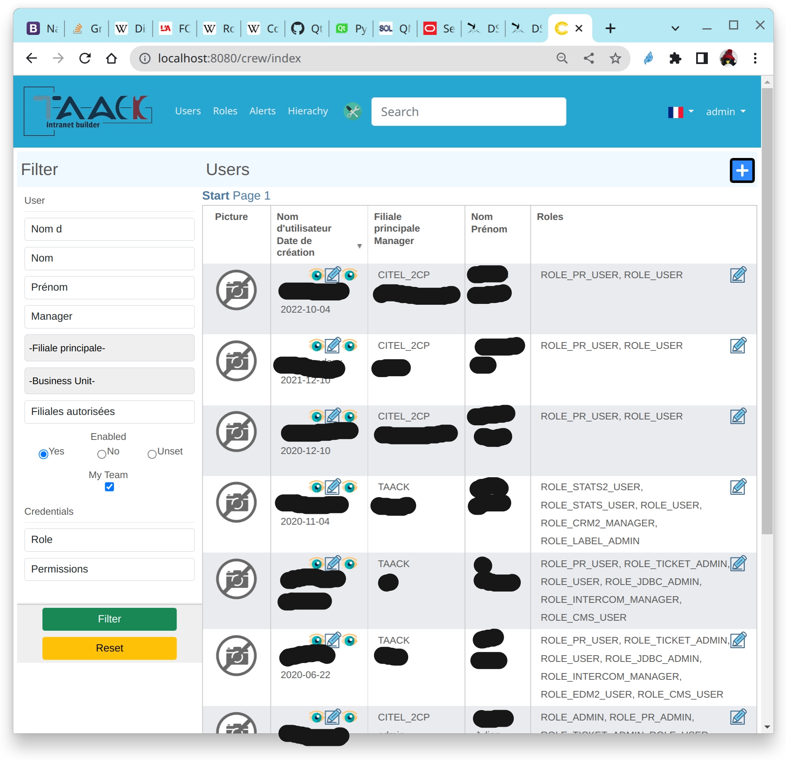

= FilterTable DSL
:doctype: book
:taack-category: 5|doc/DSLs
:toc:
:source-highlighter: rouge

== Filter

* [*] Rendered into HTML
* [ ] Rendered into PDF
* [ ] Rendered into Mail
* [ ] Rendered into CSV

Filter DSL is always associated with a Table or a Chart. A bloc cannot contain only a filter.

[[filter-code-sample]]
== Code Sample

[source,groovy]
[[filter-sample1]]
.Filter Sample 1
----
        UiFilterSpecifier f = new UiFilterSpecifier() <1>

        f.ui User, { <2>
            section "User", { <3>
                filterField u.username_ <4>
                filterField u.lastName_
                filterField u.firstName_
                filterField u.manager_, u.manager.username_ <5>
                filterField u.mainSubsidiary_
                filterField u.allowedSubsidiaries_
                filterField u.enabled_
                filterFieldExpressionBool "My Team", <6>
                    new FilterExpression(u.selfObject_,
                            Operator.IN,
                            cu.allManagedUsers_),
                    true
            }
        }
----

<1> Create the filter
<2> pass the object class and the closure containing the specifications of the filter via the `ui` method
<3> Create a section labeled "User"
<4> Add field to the filter, note the *underscore* at the end of the field name
<5> if the field is an object, pass an array with all steps necessary to target the field you want to filter on
<6> `filterFieldExpressionBool` allow more complex filter

[source,groovy]
[[sample2]]
.Filter Sample 2
----
        UiFilterSpecifier f = new UiFilterSpecifier()

        CmsImage i = new CmsImage(cmsPage: new CmsPage())

        f.ui CmsImage, cmsPage ? [id: cmsPage.id] : null, { <1>
            section "Image", {
                filterField i.hide_
                filterField i.filePath_
                filterField i.imageType_
            }
            section "Origin", {
                filterField i.cmsPage_, i.cmsPage.name_
                filterField i.cmsPage_, i.cmsPage.subsidiary_
                filterField i.cmsPage_, i.cmsPage.pageLayout_
                filterField i.cmsPage_, i.cmsPage.pageType_
            }
        }
        f
----

<1> We can pass optional parameters to the action

=== DSL Symbols Hierarchy

[graphviz,format="svg",align=center]
.Symbols hierachy diagram for Filter DSL
----
digraph mygraph {
  node [shape=box];
  "ui"
  "ui" -> "section" [label = "1,N"]
  "section" -> "section"
  "section" -> "filterField", "filterFieldExpressionBool", "filterFieldInverse" [label = "0,N"]
}
----

=== DSL Elements

=== Root
* `ui`: one version allows passing additional parameters to the filter action (see <<sample2>>)

=== Inputs
* `filterField`: add object field to be transmitted to the filter action
* `filterFieldInverse`: filter objects if another objects point to it.
* `filterFieldExpressionBool`: allows changing where clause in the filter action by using FilterExpression, last parameter is the default value.

=== Structure
* `section`: add a graphical filter section

== Table

* [*] Rendered into HTML
* [*] Rendered into PDF
* [*] Rendered into CSV

== Code Sample

The right part of the preview corresponds to the DSL sample below.
The filter is on the left of the image, see <<DslDescriptions/FilterDSL.adoc#filter-sample1>> for the corresponding code.

The table has *pagination*, it is sorted by default against *Date Created* column, all columns are *sortable* except Picture and Roles.
One column can contain multiple cells.
Date Created is empty for old users, and manager cells are also empty for some users.

[source,groovy]
[[table-sample1]]
.Table Sample: Header, Rows and a default sorting
----
        User u = new User(manager: new User(), enabled: true)
        UiTableSpecifier t = new UiTableSpecifier()
        ColumnHeaderFieldSpec.SortableDirection defaultDirection <1>
        t.ui User, { <2>
            header { <3>
                if (!hasSelect) {
                    column {
                        fieldHeader "Picture" <4>
                    }
                }
                column {
                    sortableFieldHeader u.username_ <5>
                    defaultDirection = sortableFieldHeader u.dateCreated_,
                        ColumnHeaderFieldSpec.DefaultSortingDirection.DESC <6>
                }
                column {
                    sortableFieldHeader u.mainSubsidiary_
                    sortableFieldHeader u.manager_, u.manager.username_ <7>
                }
                column {
                    sortableFieldHeader u.lastName_
                    sortableFieldHeader u.firstName_
                }
                column {
                    fieldHeader "Roles"
                }
            }

            def users = taackSimpleFilterService.list(
                    User, 10, f, null, defaultDirection) <8>

            for (User ru : users.aValue) { <9>
                row { <10>
                    Attachment picture = ru.attachments.find {
                        it.type == Att.PICTURE
                    }
                    rowColumn {
                        rowField attachmentUiService.preview(picture?.id) <11>
                    }
                    rowColumn {
                        rowLink "Edit User", <12>
                            ActionIcon.EDIT,
                            this.&userForm as MC, ru.id
                        rowField ru.username_ <13>
                        rowField ru.dateCreated_
                    }
                    rowColumn {
                        rowField ru.mainSubsidiary_
                        rowField ru.manager?.username
                    }
                    rowColumn {
                        rowField ru.lastName_
                        rowField ru.firstName_
                    }
                    rowColumn {
                        if (!hasSelect)
                            rowLink "Edit Roles",
                                ActionIcon.EDIT,
                                this.&editUserRoles as MC, ru.id, true
                        rowField ru.authorities*.authority.join(', ')
                    }
                }
            }
            paginate(10, params.long("offset"), users.bValue) <14>
        }
----
<1> Default sort variable storage
<2> Pass the class of the object and the specifications of the table
<3> Header part of the table specifications
<4> Non-sortable field header
<5> Sortable field header, notice the underscore at the end of the variable name
<6> Initialise default sort
<7> If the field contains an object, the path to the value to sort is specified via an array
<8> `taackSimpleFilterService`, responsible for sorting, filtering and pagination
<9> Iterate over objects
<10> Specify a row
<11> Cell containing only 1 value, it is not mandatory to pass underscore version
<12> Icon that will call `userForm` on user displayed into the row
<13> Simple value added to a cell
<14> Pagination

ActionIcon can be modified by ActionIconModifier

Table style is specified by `Style` an optional parameter on `row` or `rowField` element.

== DSL Symbols Hierarchy

[graphviz,format="svg",align=center]
.Symbols hierachy diagram for Table DSL
----
digraph mygraph {
  node [shape=box];
  ui
  ui -> header, paginate [label = "1,1"]
  ui -> row [label = "1,N"]
  header -> column [label = "1,N"]
  column -> fieldHeader, sortableFieldHeader [label = "1,N"]
  row -> rowColumn [label = "1,N"]
  rowColumn -> rowLink, rowField [label = "1,N"]
}
----

