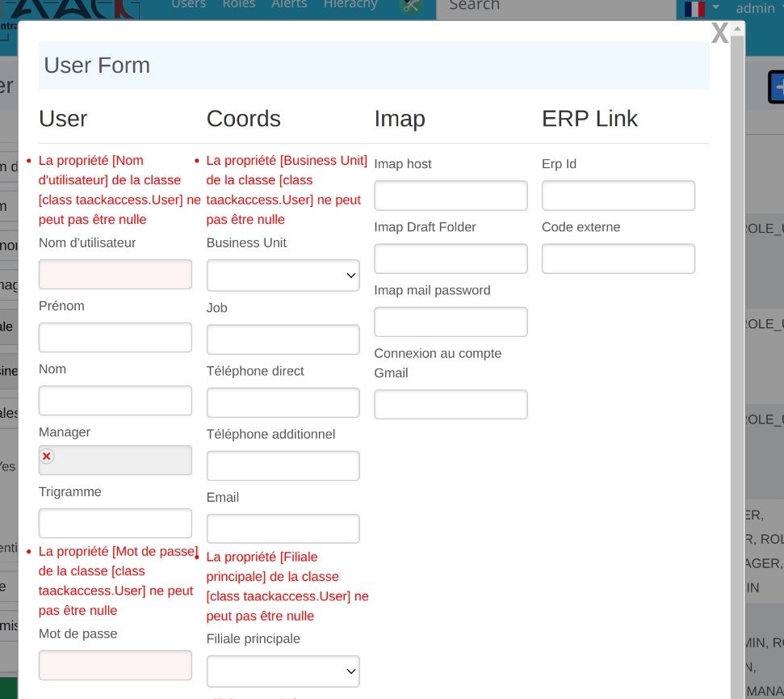
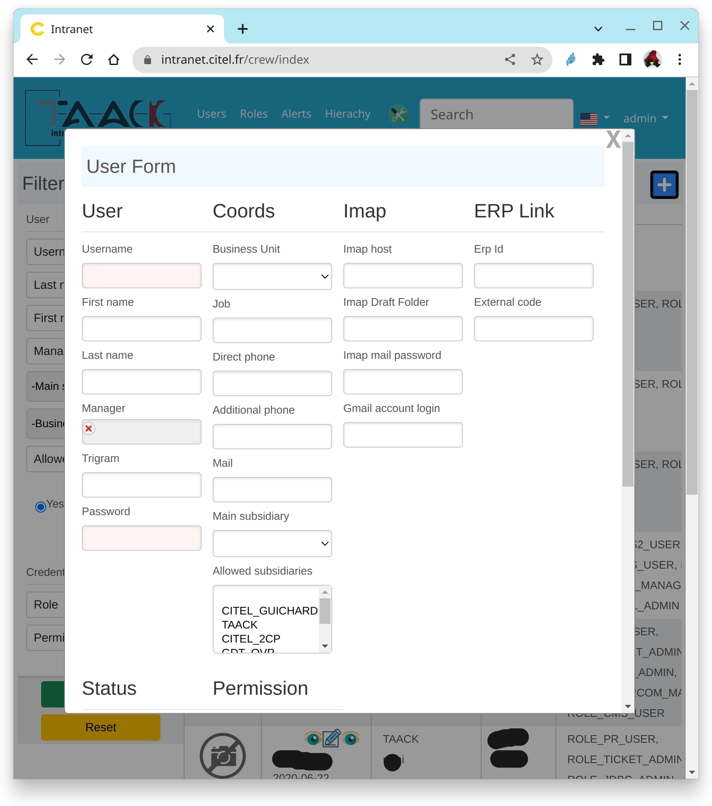

= Formulaire DSL
:doctype: book
:taack-category: 1|doc/DSLs
:toc:
:source-highlighter: rouge

* [*] Rendu en HTML
* [ ] Rendu en Mails
* [ ] Rendu en PDF
* [ ] Rendu en CSV

== Validation du formulaire

.Formulaire localisé

Lors de l'enregistrement d'un objet, les erreurs sont signalées, localisées, sans coût supplémentaire...

Voir la documentation de Grails sur https://docs.grails.org/latest/ref/Constraints/Usage.html[Constraints Usage] pour vérifier la validité de votre objet avant de l'enregistrer.

== Exemple de code

[source,groovy]
.Exemple de code de formulaire 1.
----
def userForm(User user) {
    user ?= new User(params)

    UiFormSpecifier f = new UiFormSpecifier()   <1>
    f.ui user, {                                <2>
        section "User", {                       <3>
            field user.username_                <4>
            field user.firstName_
            field user.lastName_
            ajaxField user.manager_,            <5>
                this.&selectUserM2O as MC
            field user.password_
        }
        section "Coords", {
            field user.businessUnit_
            field user.mail_
            field user.subsidiary_
        }
        section "Status", {
            field user.enabled_
            field user.accountExpired_
            field user.accountLocked_
            field user.passwordExpired_
        }
        formAction this.&saveUser as MC, <6>
                   user.id
    }

    UiBlockSpecifier b = new UiBlockSpecifier()  <7>
    b.ui {
        modal {
            form f, BlockSpec.Width.MAX
        }
    }
    taackUiService.show(b)                 <8>
}
----

<1> Créer le formulaire
<2> Passer l'objet à éditer et la spécification du formulaire
<3> Section appelée utilisateur
<4> Champ de base, se terminant par un trait de soulignement, ces symboles sont générés par Taack AST sur la classe avec l'annotation `TaackFieldEnum`
<5> Relation Many-To-One, l'action `selectUserM2O` ouvrira une fenêtre contextuelle pour sélectionner le gestionnaire de l'utilisateur
<6> Spécifier une action à laquelle le formulaire sera envoyé. Ici, c'est `saveUser`, cela va sauvegarder l'utilisateur
<7> Créer le bloc dans une fenêtre modale
<8> L'afficher...

.Formulaire dans une fenêtre modale.

== Hiérarchie des symboles DSL

[graphviz,format="svg",align=center]
.Diagramme de hiérarchie des symboles pour le formulaire DSL
----
digraph mygraph {
  node [shape=box];
  "ui"
  "ui" -> "hiddenField" [label = "0:N"]
  "ui" -> "section" [label = "0:N"]
  "ui" -> "col" [label = "0:N"]
  "section" -> "col" [label = "0:N"]
  "ui", "section", "col" -> "field", "ajaxField" [label = "0:N"]
  "ui" -> "formAction" [label = "0:N"]
}
----

== Éléments DSL

=== Entrées
* `hiddenField` : ajouter une entrée de type hidden dans le formulaire.
* `field` : ajouter une entrée avec une étiquette.
* `ajaxField` : ajouter un champ many 2 many ou many à un champ. La MethodClosure doit pointer vers un bloc affichant une *fenêtre modale*

=== Structure
* `section` : ajouter une section de formulaire, éventuellement Largeur de la section
* `col` : permet de diviser la section en colonnes

=== Action
* `formAction` : libellé, action appelée, paramètres de l'action (id et map), est ajax