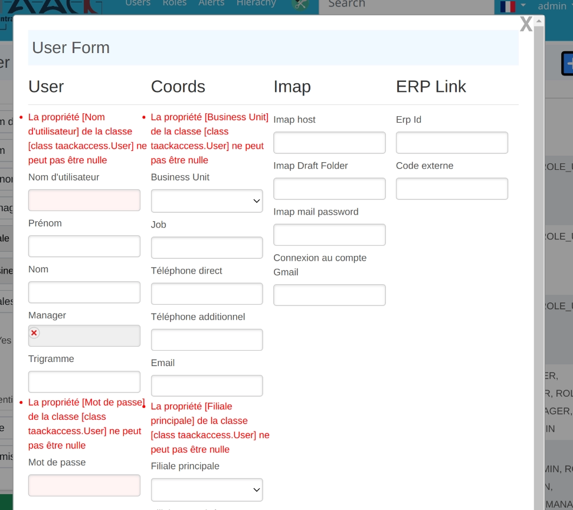

= 表单DSL
:doctype: book
:taack-category: 1|doc/DSLs
:toc:
:source-highlighter: rouge
:icons: font

* [*] 支持HTML
* [ ] 支持Mails
* [ ] 支持PDF
* [ ] 支持CSV

== 表单验证

.显示错误信息

数据对象的保存过程中，若验证失败，则会将错误报告打印在表单相应位置，无需手动处理...

请查阅link:https://docs.grails.org/latest/ref/Constraints/Usage.html[Constraints Usage]以获取关于数据验证的用法。

== 代码示例

[source,groovy]
.表单代码示例 1.
----
def userForm(User user) {
    user ?= new User(params)

    UiFormSpecifier f = new UiFormSpecifier()   <1>
    f.ui user, {                                <2>
        section "User", {                       <3>
            field user.username_                <4>
            field user.firstName_
            field user.lastName_
            ajaxField user.manager_,            <5>
                this.&selectUserM2O as MC
            field user.password_
        }
        section "Coords", {
            field user.businessUnit_
            field user.mail_
            field user.subsidiary_
        }
        section "Status", {
            field user.enabled_
            field user.accountExpired_
            field user.accountLocked_
            field user.passwordExpired_
        }
        formAction this.&saveUser as MC, <6>
                   user.id
    }

    UiBlockSpecifier b = new UiBlockSpecifier()  <7>
    b.ui {
        modal {
            form f, BlockSpec.Width.MAX
        }
    }
    taackUiService.show(b)                 <8>
}
----

<1> 创建表单块
<2> 将待编辑的数据对象装载进表单
<3> 创建一个名为User的子区域
<4> 最基本的字段写法，以下划线为结尾，由Taack AST生成。只有注解了 `TaackFieldEnum` 的Class类才会生成这些字段。
<5> 该字段类型为Many-To-One多对一关系，用户点击后将导向至 `selectUserM2O` 方法，在该方法内我们使页面生成新一轮弹窗，弹窗内列出所有manager供用户选择。
<6> 表单将要传输数据的目的地。这个例子中目的地为 `saveUser`，负责保存表单中填写的user数据。
<7> 创建块，用于容纳之前完成的表单块
<8> 显示该块

.弹窗中的表单
image::screenshot-dsl-user-form2.webp[]

== DSL架构

[graphviz,format="svg",align=center]
.表单DSL的架构图
----
digraph mygraph {
  node [shape=box];
  "ui"
  "ui" -> "hiddenField" [label = "0:N"]
  "ui" -> "section" [label = "0:N"]
  "ui" -> "col" [label = "0:N"]
  "section" -> "col" [label = "0:N"]
  "ui", "section", "col" -> "field", "ajaxField" [label = "0:N"]
  "ui" -> "formAction" [label = "0:N"]
}
----

== DSL元素

=== Input
* `hiddenField`: 添加一个隐藏类型的Input
* `field`: 添加一个常规Input，带有标签文本
* `ajaxField`: 添加一个Many-to-Many多对多的Input。MethodClosure必须导向至一个能生成新**弹窗**的Action

=== 架构
* `section`: 添加一个表单子区域，可选不同宽度
* `col`: 允许将区域拆分成列

=== 按钮
* `formAction`: 文本标签，链接目的地，表单参数 (id或map)，调用类型为ajax

