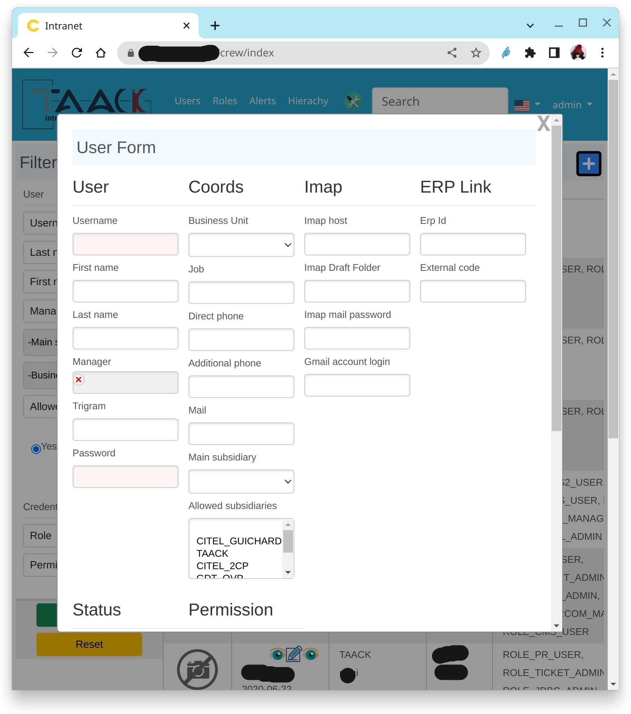

= Form DSL
:doctype: book
:taack-category: 1|doc/DSLs
:toc:
:source-highlighter: rouge

* [*] Rendered into HTML
* [ ] Rendered into Mails
* [ ] Rendered into PDF
* [ ] Rendered into CSV

== Form Validation

.Localized form
image::screenshot-form-validation.webp[]

When saving an object, errors are reported, localized, with no additional cost...

See Grails documentation on https://docs.grails.org/latest/ref/Constraints/Usage.html[Constraints Usage] to check your object validity before saving.

== Code Sample

[source,groovy]
.Form code sample 1.
----
def userForm(User user) {
    user ?= new User(params)

    UiFormSpecifier f = new UiFormSpecifier()   <1>
    f.ui user, {                                <2>
        section "User", {                       <3>
            field user.username_                <4>
            field user.firstName_
            field user.lastName_
            ajaxField user.manager_,            <5>
                this.&selectUserM2O as MC
            field user.password_
        }
        section "Coords", {
            field user.businessUnit_
            field user.mail_
            field user.subsidiary_
        }
        section "Status", {
            field user.enabled_
            field user.accountExpired_
            field user.accountLocked_
            field user.passwordExpired_
        }
        formAction "Save", this.&saveUser as MC, <6>
                   user.id, true
    }

    UiBlockSpecifier b = new UiBlockSpecifier()  <7>
    b.ui {
        modal {
            ajaxBlock "userForm", {
                form "User Form", f, BlockSpec.Width.MAX
            }
        }
    }
    taackUiService.show(b)                 <8>
}
----

<1> Create the form
<2> Pass object to be edited and spec of the form
<3> Section called user
<4> Basic field, terminating with an underscore, those symbols are generated by Taack AST on class with the `TaackFieldEnum` annotation
<5> Many To One relation, the action `selectUserM2O` will open a popup to select the manager of the user
<6> Specify an action where the form will be sent to. Here it is `saveUser`, it will save the user
<7> Create the block in a modal
<8> Display it ...

.Form inside a modal Window.

== DSL Symbols Hierarchy

[graphviz,format="svg",align=center]
.Symbols hierachy diagram for Form DSL
----
digraph mygraph {
  node [shape=box];
  "ui"
  "ui" -> "hiddenField" [label = "0:N"]
  "ui" -> "section" [label = "0:N"]
  "ui" -> "col" [label = "0:N"]
  "section" -> "col" [label = "0:N"]
  "ui", "section", "col" -> "field", "ajaxField" [label = "0:N"]
  "ui" -> "formAction" [label = "0:N"]
}
----

== DSL Elements

=== Inputs
* `hiddenField`: add an input of type hidden into the form.
* `field`: add an input with a label.
* `ajaxField`: add a many 2 many or many to one field. The MethodClosure must point to a block showing a *modal window*

=== Structure
* `section`: add a form section, optionally Width of the section
* `col`: Allows splitting section into columns

=== Action
* `formAction`: Label, action called, params of the action (either id and map), is ajax

