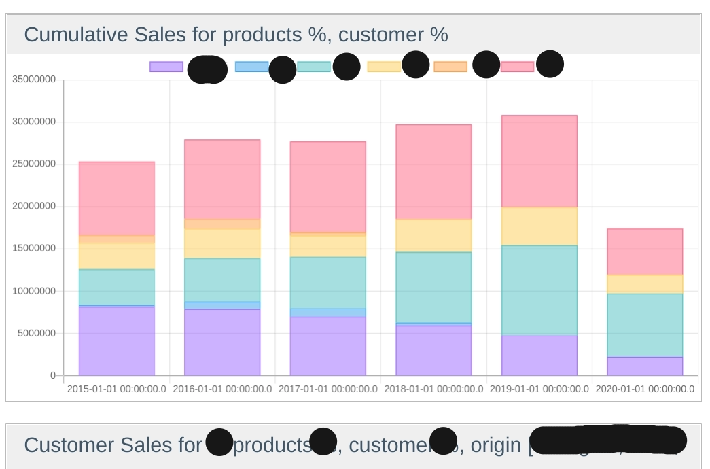

= Graph DSL
:doctype: book
:taack-category: 3|doc/DSLs
:toc:
:source-highlighter: rouge

* [*] Rendered into HTML
* [*] Rendered into PDF
* [*] Rendered into Mails
* [ ] Rendered into CSV

Graphs or Charts DSL allows to quickly draw charts. The most complex part is transforming the source data to dataset accepted by the API.

== Code Sample

[[graph-preview]]
.Barchart Graph.

[source,groovy]
[[graph-sample1]]
.Graph Sample for Barcharts
----
        Set<String> dates = []
        Set<String> origins = []
        Map<String, List<BigDecimal>> totalPerOrigin = [:]
        rowResults.each {
            String d = it['date_part'].toString()
            String o = it['origin'].toString()
            dates << d
            origins << o
            if (!totalPerOrigin[o]) totalPerOrigin[o] = []
            totalPerOrigin[o] << new BigDecimal(it['total_price']?.toString() ?: "0.0").round(0)
        }

        UiChartSpecifier chart = new UiChartSpecifier() <1>
        chart.ui {
            barChart(dates.sort(), { <2>
                origins.sort().eachWithIndex { o, i ->
                    dataset o, ChartDatasetSpec.Color.values()[i], totalPerOrigin[o] <3>
                }
            })
        }

----

<1> Create the charts description and call `ui` method
<2> Add one barChart with dates label
<3> create dataset for each origin

== DSL Symbols Hierarchy

[graphviz,format="svg",align=center]
.Symbols hierachy diagram for Graph DSL
----
digraph mygraph {
  node [shape=box];
  ui
  ui -> barChart, lineChart
  barChart, lineChart -> dataset
}
----
