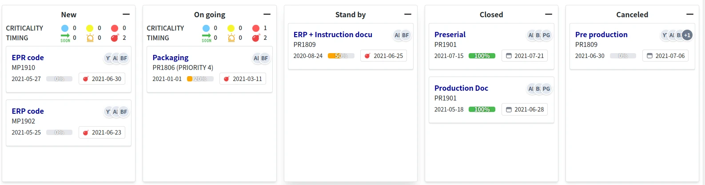

= Kanban DSL
:doctype: book
:taack-category: 6|doc/DSLs
:toc:
:source-highlighter: rouge
:icons: font
:experimental: true

* [*] Rendered into HTML
* [ ] Rendered into Mails
* [ ] Rendered into PDF
* [ ] Rendered into CSV

== Code Sample
[source,groovy]
.Kanban Sample Code 1
----
UiKanbanSpecifier buildTodoKanban() {
    new UiKanbanSpecifier().ui {                                                                   <1>
        column Gantt2Controller.&changeTodoProgression as MethodClosure, [newProgression: 0], {    <2>
            header "Title", Style.ALIGN_CENTER                                                     <3>
            custom "Custom html code"                                                              <4>
            todos.forEach { Todo todo ->
                card todo, Gantt2Controller.&showTodo as MethodeClosure, todo.id, {                <5>
                    cardField todo.what_                                                           <6>
                    cardFieldRaw "Custom html code"                                                <7>
                    cardAction ActionIcon.SHOW * IconStyle.SCALE_DOWN, Gantt2Controller.&doSomething as MethodClosure, todo.id   <8>
                }
            }
        }
    }
}

----

[source,groovy]
.Write in a service for register contextmenu
----
@PostConstruct
void init() {
    TaackUiService.registerContextualMenuClosure(Todo, new UiMenuSpecifier().ui {               <9>
        menu 'Show Gantt', Gantt2Controller.&showGanttByTodo as MethodClosure, [id: this.params['id']]    <10>
    }
}
----

<1> Create the kanban specifier
<2> Build kanban column, could pass an action and params as kbd:[Drag+Drop] for the column
<3> Build column header, could pass *Style*
<4> Could add custom html code for the column body
<5> Build cards in the column, could pass an action and params as kbd:[MouseDoubleClic] for the card
<6> Build a line with field in the card, note the *underscore* at the end of the field name
<7> Could add custom html code
<8> Could add an icon with action bind to clic
<9> Register contextmenu as kbd:[MouseRight] for the card
<10> Add a menu item with action bind

== DSL Symbols Hierarchy
[graphviz,format="svg",align=center]
.Symbols hierarchy diagram for Kanban DSL
----
digraph kanbanDslGraph {
  node [shape=box];
  ui -> column [label = "0,N"]
  column -> header [label = "0,1"]
  column -> custom, card [label = "0,N"]
  card -> cardField, cardFieldRaw, cardAction [label = "0,N"]
}
----

