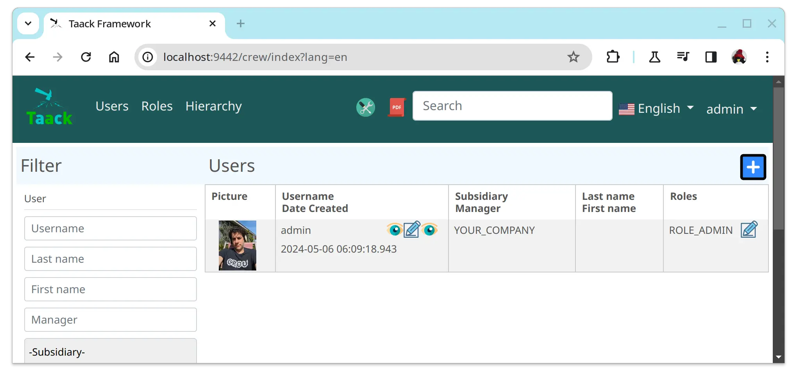

= 菜单DSL
:doctype: book
:taack-category: 1|doc/DSLs
:toc:
:source-highlighter: rouge
:icons: font

* [*] 支持HTML
* [ ] 支持Mails
* [ ] 支持PDF
* [ ] 支持CSV

菜单DSL将导航栏与各个顶层Action连接到一起。
菜单DSL最多支持2个层级 (不考虑 `section` )。

[source,groovy]
[[menu-sample1]]
.Menu Sample with conditional
----
private UiMenuSpecifier buildMenu(String q = null) {
    new UiMenuSpecifier().ui {                          <1>
        menu CrewController.&index as MC
        menu CrewController.&listRoles as MC
        menu CrewController.&hierarchy as MC
        menuIcon ActionIcon.CONFIG_USER, this.&editUser as MC   <4>
        menuIcon ActionIcon.EXPORT_PDF, this.&downloadBinPdf as MC
        menuSearch this.&search as MethodClosure, q     <2>
        menuOptions(SupportedLanguage.fromContext())    <3>
    }
}
----

<1> 创建菜单块
<2> 搜索框
<3> 语言栏
<4> 图标按钮 (鼠标悬停时会显示说明文本)

[graphviz,format="svg",align=center]
.菜单DSL架构图
----
digraph mygraph {
    node [shape=box];
    ui -> menu, menuIcon, subMenu, menuOption [label = "0,N"]
    ui -> menuSearch [label = "0,1"]
    subMenu -> menu [label = "1,N"]
}
----

