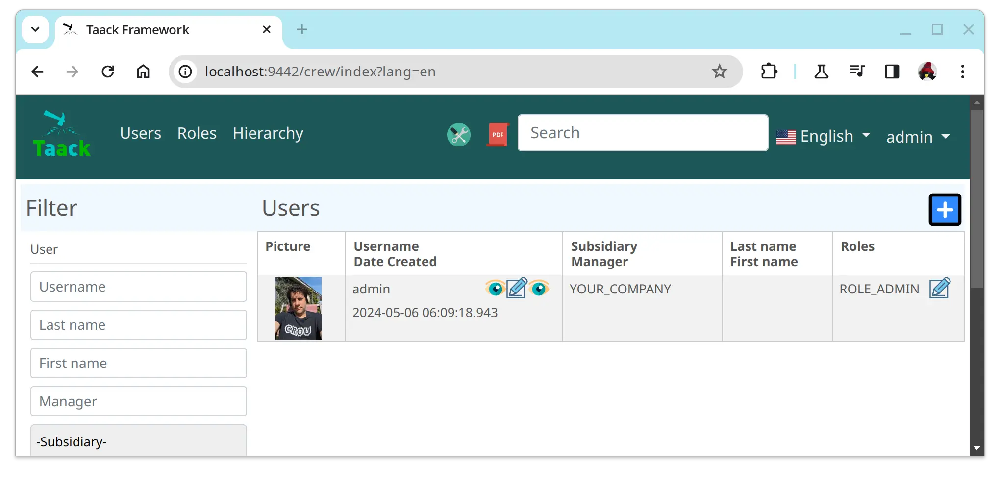

= Menu DSL
:doctype: book
:taack-category: 1|doc/DSLs
:toc:
:source-highlighter: rouge

* [*] Rendered into HTML
* [ ] Rendered into Mails
* [ ] Rendered into PDF
* [ ] Rendered into CSV

Menu DSL associate menu entries with top level actions.
Menu DSL supports only 2 levels max (without taking into account `section`).

[source,groovy]
[[menu-sample1]]
.Menu Sample with conditional
----
    private UiMenuSpecifier buildMenu(String q = null) {
        new UiMenuSpecifier().ui {                          <1>
            menu CrewController.&index as MC
            menu CrewController.&listRoles as MC
            menu CrewController.&hierarchy as MC
            menuIcon ActionIcon.CONFIG_USER, this.&editUser as MC   <4>
            menuIcon ActionIcon.EXPORT_PDF, this.&downloadBinPdf as MC
            menuSearch this.&search as MethodClosure, q     <2>
            menuOptions(SupportedLanguage.fromContext())    <3>
        }
    }
----

<1> Create a new menu
<2> Search menu
<3> Languages entries
<4> Icon entries (hoover message automatically deduced) .Corresponding Menu Rendering.

[graphviz,format="svg",align=center]
.Symbol's hierarchy diagram for Menu DSL
----
digraph mygraph {
    node [shape=box];
    ui -> menu, menuIcon, subMenu, menuOption [label = "0,N"]
    ui -> menuSearch [label = "0,1"]
    subMenu -> menu [label = "1,N"]
}
----

