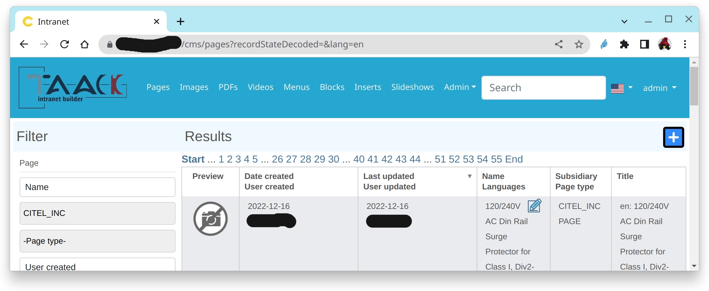

= Menu DSL
:doctype: book
:taack-category: 1|doc/DSLs
:toc:
:source-highlighter: rouge

* [*] Rendered into HTML
* [ ] Rendered into Mails
* [ ] Rendered into PDF
* [ ] Rendered into CSV

Menu DSL associate menu entries with top level actions. Menu DSL supports only 2 levels max (without taking into account `section`).

[source,groovy]
[[menu-sample1]]
.Menu Sample with conditional
----
    static private UiMenuSpecifier buildMenu(String q = null) {
        UiMenuSpecifier m = new UiMenuSpecifier() <1>
        m.ui {
            menu "Pages", this.&pages as MethodClosure
            menu "Images", this.&images as MethodClosure
            menu "PDFs", this.&pdfs as MethodClosure
            menu "Videos", this.&videos as MethodClosure
            menu "Menus", this.&menuEntries as MethodClosure
            menu "Blocks", this.&blocks as MethodClosure
            menu "Inserts", this.&inserts as MethodClosure
            menu "Slideshows", this.&slideshows as MethodClosure
            menu "Admin", { <2>
                menu "Sync Servers", this.&sync as MethodClosure
                menu "Conf Sites", this.&confSites as MethodClosure
            }
            menuSearch CmsController.&search as MethodClosure, q
        }
        m
    }

----

<1> Create a new menu
<2> Declare a secondary level menu

.Corresponding Menu Rendering.

[graphviz,format="svg",align=center]
.Symbols hierachy diagram for Menu DSL
----
digraph mygraph {
  node [shape=box];
  ui -> menu, menuIcon, section [label = "0,N"]
  ui -> menuSearch [label = "0,1"]
  menu -> subMenu [label = "1,N"]
  section -> subMenu [label = "1,N"]
  }
----

