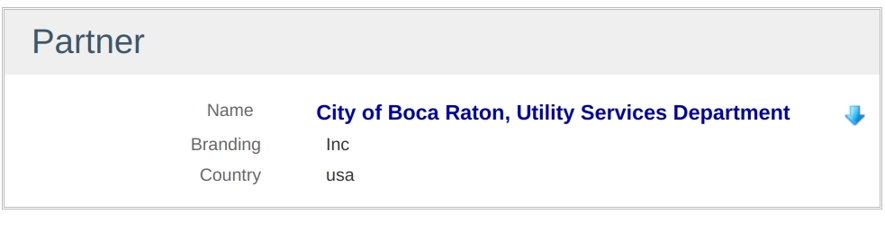

= Afficher le DSL
:doctype: book
:taack-category: 4|doc/DSLs
:toc:
:source-highlighter: rouge
:icons: font

* [*] Rendu en HTML
* [*] Rendu en PDF
* [ ] Rendu en CSV

Ce DSL est utilisé pour afficher des informations avec des capacités d'édition limitées. Le champ peut être stylisé.

[source,groovy]
----
UiShowSpecifier s = new UiShowSpecifier()
s.ui partner, {
    section "Partner", {
        fieldAction "Test Icon",
            ActionIcon.SHOW * ActionIconStyleModifier.SCALE_DOWN, <1>
            this.&showContact as MC, partner.id, false
        field partner.name_, Style.EMPHASIS + Style.BLUE          <2>
        field partner.branding
        field partner.address?.country
    }
}
----
<1> L'icône doit être réduite pour être à quelques pieds près du champ intitulé "Nom"
<2> Nous voyons que nous pouvons ajouter du style pour créer des combinaisons de styles

.Rendu correspondant

== Hiérarchie des symboles DSL

[graphviz,format="svg",align=center]
.Hiérarchie des symboles diagramme pour le menu DSL
----
digraph mygraph {
node [shape=box];
ui
ui -> section [label = "1,N"]
section -> "fieldAction+field", field [label = "0,N"]
}
----