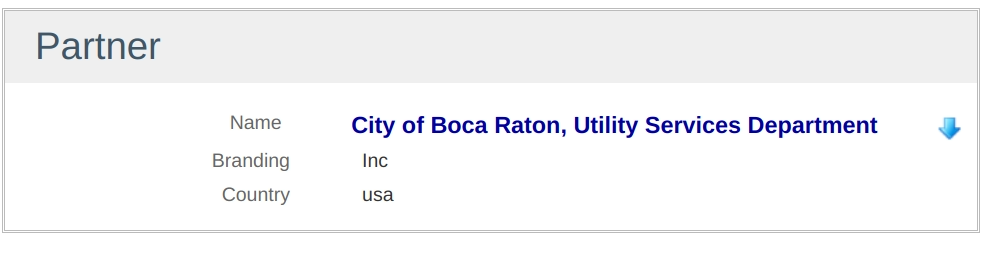

= Show DSL
:doctype: book
:taack-category: 4|doc/DSLs
:toc:
:source-highlighter: rouge

* [*] Rendered into HTML
* [*] Rendered into PDF
* [ ] Rendered into CSV

This DSL is used to display information with limited edition capabilities. Field can be styled.

[source,groovy]
----
        UiShowSpecifier s = new UiShowSpecifier()
        s.ui partner, {
            section "Partner", {
                fieldAction "Test Icon",
                    ActionIcon.SHOW * ActionIconStyleModifier.SCALE_DOWN,   <1>
                    this.&showContact as MethodClosure, partner.id, false
                field partner.name_, Style.EMPHASIS + Style.BLUE            <2>
                field partner.branding
                field partner.address?.country
            }
        }

----
<1> Icon has to be scaled down in order to feet near the field labeled "Name"
<2> We see we can add style to create combinations of style

.Coresponding Rendering

== DSL Symbols Hierarchy

[graphviz,format="svg",align=center]
.Symbols hierachy diagram for Menu DSL
----
digraph mygraph {
  node [shape=box];
  ui
  ui -> section [label = "1,N"]
  section -> "fieldAction+field", field [label = "0,N"]
}
----
