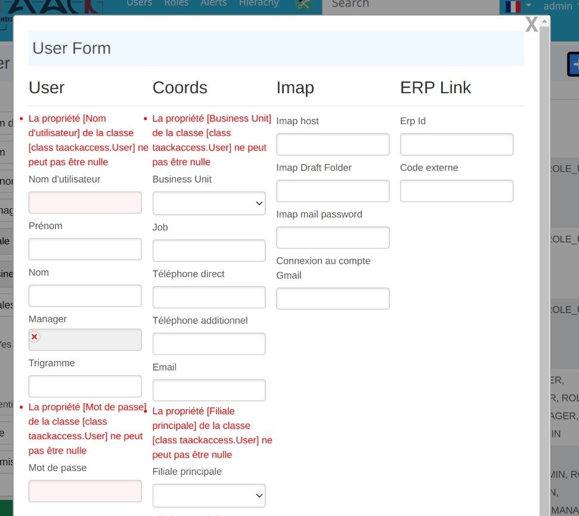

= Developing Steps Overview
:taack-category: 1|doc/UserGuide
:toc:

== Enabling Taack framework

In order to be able to display an object into a form or a filtered table, this class has to be annotated with the `@TaackFieldEnum` annotation.

When `@TaackFieldEnum` annotation is specified on a class, additional symbols are generated by the framework. Those symbols terminate with an underscore and are used with the different DSLs.

=== Regular Classes Case

.Enabling a Regular Classe code Sample
[source,groovy]
----
@GrailsCompileStatic <1>
@TaackFieldEnum <2>
final class QueryParameter implements Validateable { <3>
    Currency currency = Currency.EUR
    Short monthStart = 1
    Short monthStop = 12
    Set<Subsidiary> subsidiaries
    String sellerNamePattern
    String productNameOrCodePattern
    String customerNameOrCodePattern
    Value itemValue
    ItemRange range
    Integer yearStart
    Integer yearStop = Calendar.instance.get(Calendar.YEAR)

    static constraints = { <4>
        itemValue nullable: true
        range nullable: true
        monthStart min: 1, max: 12
        monthStop min: 1, max: 12, validator: { queryParameter, monthStop ->
            if (monthStop < queryParameter.monthStart)
                return "monthStop.greater.or.equals.to.monthStart" <5>
        }
    }
}

----

<1> Good practice to add `GrailsCompileStatic` annotation
<2> The annotation enabling AST Transformation
<3> Class has to implement Validateable to support constraints (not necessary for Domain Classes)
<4> Constraints definition
<5> Validation can be a closure returning a translation key.

This sample code show a standard class (i.e. not defined into the domain directory) being enabled to be used in Taack framework. It obviously cannot be saved and retrieve or listed, since it is not a persistent domain class.

It has to implement the Grails `Validateable` traits.

=== Domain Classes Case

.Enabling a Domain Classe code Sample
[source,groovy]
----
@GrailsCompileStatic
@TaackFieldEnum
class CmsPage { <1>
    Subsidiary subsidiary
    Date dateCreated
    Date lastUpdated

    User userCreated
    User userUpdated

    Boolean published = false

    CmsPageLayout pageLayout = CmsPageLayout.NO_SIDE_COLUMN
    CmsPageType pageType

    String name

    Map<String, String> urlPart
    Map<String, String> title
    Map<String, String> hatContent
    Map<String, String> bodyContent

    CmsImage mainImage
    CmsVideoFile mainVideo

    Set<CmsImage> bodyImages

    static hasMany = [
            bodyImages: CmsImage
    ]

    static mappedBy = [bodyImages: "none"]

    static constraints = {
        name nullable: true
        urlPart nullable: true
        title nullable: true
        hatContent nullable: true
        bodyContent nullable: true, widget: 'textarea'
        mainImage nullable: true
        mainVideo nullable: true
        bodyImages nullable: true
    }

    static mapping = {
        autoTimestamp true
    }
}
----

<1> No need to implement Validateable in case of domain class

Domain classes are first class citizen to be used with Taack framework. It can use magick tricks of `TaackSimpleSaveService`.

== Object Manipulation for Domain Classes

=== Listing Objects via Filter DSL

In the action where your filter is displayed, just call method `taackSimpleFilterService.list` the following code to get a list of object (taken from <<DslDescriptions/TableDSL.adoc#table-sample1>>)

[source, groovy]
----
            def users = taackSimpleFilterService.list(User, 10, f,
                            defaultDirection) <1>

            for (User ru : users.aValue) { <2>
                // [ . . . ]
            }
----

<1> We pass the filter to the `list` method (parameter *f*), but all arguments except the first 2 are optional. `defaultDirection` allows to specify the default ordering of the table. 10 results are displayed at the same time.
<2> Iteration over objects filtered

[source, groovy]
----

            def objects = taackSimpleFilterService.list(
                            ObjectClass, numberOfObjectReturned)
            objects.aValue // list of objects queried. Not all objects are returned (see second parameter)
            objects.bValue // total number of objects that can be reached by the query

----

Passing the filter to the `list` method allows to restrict the query for security purposes.

=== Saving Objects via Form DSL and show errors

In order to save a new object, or a modified object (we will see security consideration later), just call the following method into the form target action:

[source, groovy]
----
taackSimpleSaveService.saveThenRedirectOrRenderErrors(User, this.&index)
----

There are 3 possible situations:

 * Either the object is valid, and the user has the necessary credential to process the object, then the browser will be redirected to the action specified on the second parameter
 * Either the object has invalid fields, then the form will be updated with the wrong field annotated (see image below)
 * Either the user has no credential to process the object, an error is displayed

Here, `index` is the action to go in case of success, `User` is the object class.

[[form-html-errors-output]]
.Case the form is not valid, feedback to the user. Note the errors reported are localized.

