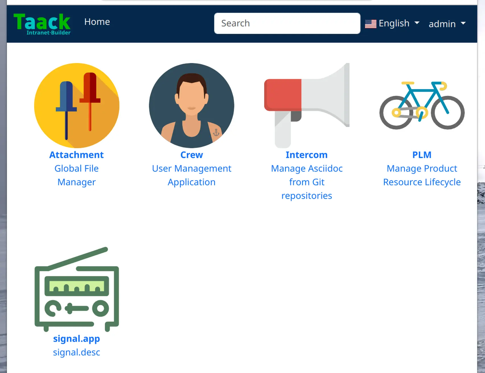

= À propos des plugins
:doctype: book
:toc:
:source-highlighter: rouge
:taack-category: 1|doc/plugin

== Enregistrer une application

Une application enregistre uniquement ses *points d'entrée* (c'est-à-dire les #actions# exécutées lors de l'accès à l'application) et les *icônes svg* correspondantes. Les noms des points d'entrée du contrôleur sont utilisés dans l'étiquetage et la description localisés dans les fichiers de propriétés `i18n`.

.Crew app registration
[source,groovy]
----
@PostConstruct
void init() {
TaackAppRegisterService.register TaackApp(          <1>
        CrewController.&index as MC,                <2>
        new String(
            this.class
            .getResourceAsStream("/crew/crew.svg")  <3>
            .readAllBytes())
    )
}

----

<1> Appeler la méthode statique `TaackAppRegisterService.save`
<2> Définir le point d'entrée
<3> Icône SVG

== I18n

Dans les propriétés `i18n`, ajoutez

[source,properties]
----
crew.app=Crew
crew.desc=Application de gestion des utilisateurs
attachment.app=Pièce jointe
attachment.desc=Gestionnaire de fichiers global
----

== Application par défaut Mosaïque

Par défaut, le https://github.com/Taack/intranet/blob/main/server/grails-app/controllers/taack/website/RootController.groovy[`RootController`] du serveur contient le point d'entrée. Il peut être facilement modifié.

.Default Apps Mosaic
