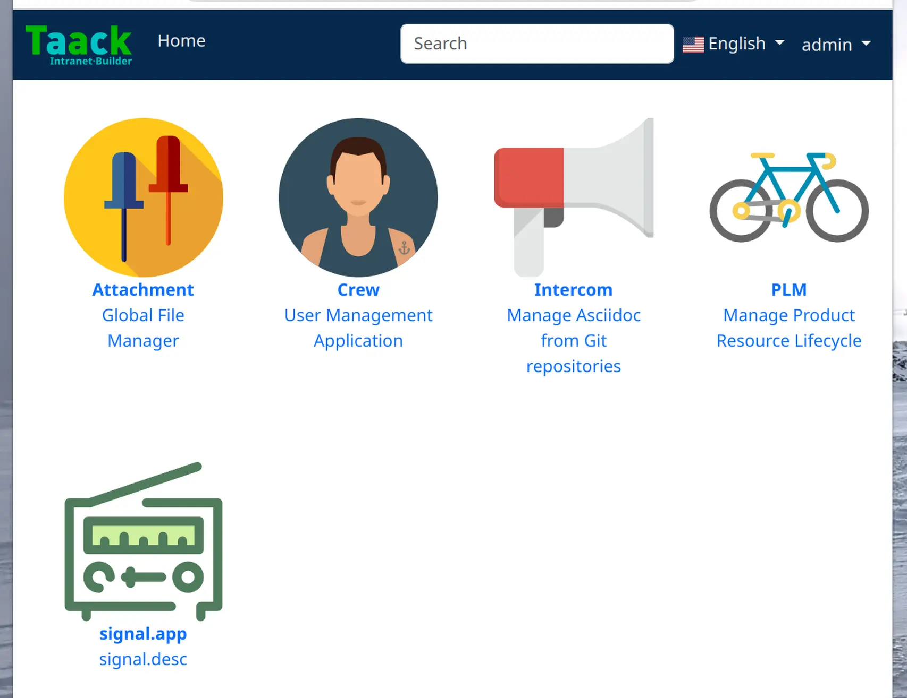

= 关于子应用
:doctype: book
:toc:
:source-highlighter: rouge
:taack-category: 1|doc/plugin
:icons: font

== 注册一个子应用

注册一个子应用只需注册它的**接入点** (即进入该应用时第一个被执行的##Action##) 和相应的**SVG图标**即可。控制器名称将被 `i18n` 文件用于翻译标签及描述。

.注册Crew
[source,groovy]
----
@PostConstruct
void init() {
TaackAppRegisterService.register TaackApp(          <1>
        CrewController.&index as MC,                <2>
        new String(
            this.class
            .getResourceAsStream("/crew/crew.svg")  <3>
            .readAllBytes())
    )
}

----

<1> 调用静态方法 `TaackAppRegisterService.register` 以注册该子应用
<2> 定义它的接入点
<3> Svg图标

== 翻译

在 `i18n` 文件中, 添加以下几行：

[source,properties]
----
crew.app=Crew
crew.desc=User Management Application
attachment.app=Attachment
attachment.desc=Global File Manager
----

== 嵌合所有子应用

默认情况下，主应用的 link:https://github.com/Taack/intranet/blob/main/server/grails-app/controllers/taack/website/RootController.groovy[`RootController`] 将会显示所有子应用接入点。更改相关配置并不困难。

.嵌合所有子应用
