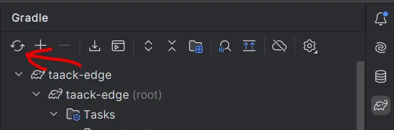

= First app
:doctype: book
:taack-category: 2
:toc:
:icons: font
:source-highlighter: rouge
:rouge-style: monokai
:experimental:

== How app works with Taack Framework

Your intranet project has two parts:

* The app plugins, contained in the `app` folder, they are micro-projects each containing their dependencies, build, etc. `Crew` for example is an app plugin.
For more in-depth explanation about how plugins are declared to the server, link:doc/plugin/taack-plugin.adoc#_about_plugins[check here].
* The main server, that uses all the app plugins that are implemented in its `build.gradle` and render them on the main intranet page.

== Creating a new app plugin

To create a new app plugin (a Gradle module), be sure to pull the latest version of your intranet from our GitHub repository (see link:install.adoc[installation])

Once it is done, you can execute the following command from your intranet root folder:

[,bash]
----
./gradlew -PmodName=myToto server:generateTaackAppTask
----

The newly created app should appear in the `app` folder.

If you want the IDE to detect the newly created app module, you have to reload gradle projects, clicking on the following icon:

.Gradle Reload

== Managing Future Updates

Most of the time, updating your intranet, should imply to update `buildSrc` folder, `gradle.properties`, and also, less often, apps `build.gradle` files.

NOTE: In fact, this process is common in long-term software dev, and should not scare newcomers.

== Building an app-wide menu

First, let's focus on the navigation for your new app.
The initial step is to define how the menu will be constructed.
The basic boilerplate code for that is as follows:

[,groovy]
----
static private UiMenuSpecifier buildMenu(String q = null) {
    new UiMenuSpecifier().ui {
        menu SomeController.&action as MC
        menu this.&anotherAction as MC
        // import org.codehaus.groovy.runtime.MethodClosure as MC
    }
}
----

We create a link:doc/DSLs/menu-dsl.adoc[UiMenuSpecifier] object to define the menu structure, and then specify the desired content for that menu.

[,groovy]
----
menu TurboController.&action as MC
----

In this case, `menu` creates a simple link in the navigation bar. `Action` is the displayed name of the link, and `TurboController.&action` (using MethodClosure) defines the action to which the link will redirect.

You can see a full list of items you can put in your menu in the link:doc/DSLs/menu-dsl.adoc[Menu DSL].

== Creating a table

Now let's display a table in our index page by incorporating the following boilerplate:

[,groovy]
----
UiTableSpecifier tableSpecifier = new UiTableSpecifier()
tableSpecifier.ui {
    //Add table content inside the closure here
}
----

Here we are defining a new Table that will list Book instances.
Then we can define the table headers by adding the following in the Closure:

[,groovy]
----
new UiTableSpecifier().ui {
    // -- Header --
    header {
        column {
            fieldHeader object.title_
        }
    }
}
----

Since we are defining our table in a closure, we can add conditions, loops, etc.
Let's add a column that will only be rendered if the user has the role `ROLE_ADMIN`.

[,groovy]
----
// Look if the current user has the Role "ROLE_ADMIN"
User cu = springSecurityService.currentUser as User
boolean isAdmin = cu.authorities*.authority.contains("ROLE_ADMIN")

new UiTableSpecifier().ui {
    header {
        column {
            label object.title_
        }
        // Column only shown to admin
        if (isAdmin) {
            column {
                label "Delete book"
            }
        }
    }
}
----

The column with the header "Delete book" will only appear if the current user is an admin.

Now we are going to populate our table, we are going to iterate Book instances in the database by using the `iterate` table DSL method.

[,groovy]
----
User cu = springSecurityService.currentUser as User
boolean isAdmin = cu.authorities*.authority.contains("ROLE_ADMIN")

new UiTableSpecifier().ui {
    header {
        column {
            label object.title_
        }
        // Column only shown to admin
        if (isAdmin) {
            column {
                label "Delete book"
            }
        }
    }

    iterate(taackFilterService.getBuilder(Book)
            .setMaxNumberOfLine(8)
            .setSortOrder(TaackFilter.Order.DESC, object.title_)
            .build()) { Book book ->
        rowColumn {
            rowField book.title_ //The underscore is needed here
        }
        // If the user is an admin display a column with a button link
        // to redirect towards the book deletion action
        if (isAdmin) {
            rowColumn {
                rowAction ActionIcon.DELETE,
                        this.&deleteBook as MC, book.id
            }
        }
    }
}
----

For each book in our list, we make a new row with the title of the book in the first column and a btn:[Delete] button in the second column if the user is an admin.
(We're redirecting to `index` since we didn't create a delete method yet).

Your table is now complete we just need to render it on the page.
To render previously built UiSpecifiers we need to use `taackUiService` it should already be imported in the controller created by the `create-taack-app` command.

Add the following code below your table code:

[,groovy]
----
taackUiService.show(new UiBlockSpecifier().ui {
    table tableSpecifier
}, buildMenu())
----

`taackUiService.show(UiBlockSpecifier block, UiMenuSpecifier menu)` will be in charge of rendering the specification we give him.
In this case we want to display an `ajaxBlock` that contains a `table` named "Book table", we pass our previously created `tableSpecifier` as an argument, and we set the width of the table to `MAX` so it takes the entire page.
We also use our previously created static `buildMenu()` method as the second arguments on `show()` to render your menu with the page.

You can now start the server and navigate to your new app.
The table should be functional, but currently you will only see the table headers since there are no books in your database.
So let's proceed with creating a form and saving objects into the database.

== Adding buttons to a table block

We are going to add a button to your Book table that will open a modal using AJAX to create a new Book.
To achieve this, we need to add a closure in the table, like so:

[,groovy]
----
taackUiService.show(new UiBlockSpecifier().ui {
    table 'Book table', tableSpecifier, BlockSpec.Width.MAX, {
        //Added Closure here
        if (isAdmin())
            action ActionIcon.CREATE, this.&bookForm as MC
    }
}, buildMenu())
----

Now an admin will see a btn:[Create] button on the top-right of the table.

The `action` method is composed of the following parameters:

. The icon used by the button must be an xref:doc/Concepts/docref.adoc#_actionicon[ActionIcon] enum value.
. The action that the button will redirect to

== Creating a form and saving objects

We are now going to make the form that will be used both for creating but also updating them.
To manage both case we are first going to define our `bookForm` action and then initialize either a new Book or read if a Book id has been passed as request parameters.

[,groovy]
----
def bookForm(Book book) {
    book ?= new Book(params)
}
----

Now we create a `FormSpecifier` defining our form and its content.

[,groovy]
----
UiFormSpecifier form = new UiFormSpecifier()
form.ui book, {
    //Section of fields
    section "Book details", {
        field book.title_
        field book.author_
    }
    //Save button
    formAction this.&saveBook as MC
}
----

Once your form is defined, you can display it using the `taackUiService`.show() method

[,groovy]
----
UiBlockSpecifier b = new UiBlockSpecifier()
b.ui {
    modal {
        form form, BlockSpec.Width.MAX
    }
}
taackUiService.show(b)
----

This time we don't specify `buildMenu` in our show since we don't want the menu to be rendered inside the modal!

Remember to create the `saveBook` action:

[,groovy]
----
@Secured("ROLE_ADMIN")
@Transactional
def saveBook(String redirectAction) {
    taackSaveService.saveThenReloadOrRenderErrors(Book)
}
----

N.B.: See link:doc/DSLs/block-dsl.adoc#_modal_stack_code_sample[Close Modal and reload page] for not having to use `redirectAction` when saving...

Since we only want admin to be able to create a book, we add the `@Secured` annotation, for more information about security annotations we recommend to check out the https://grails.github.io/grails-spring-security-core/5.0.0-RC1/index.html#secured-annotation[grails-spring-security-core] documentation.

== Showing an object

Now that we can create books and see a list of them in a table, let's display them in more details in a modal.
Once again we define the specifier, and we will render it in a block through `taackUiService.show()`.

[,groovy]
----
def showUser(Book book) {
    // Define the show displayed fields
    UiShowSpecifier showSpec = new UiShowSpecifier().ui(book, {
        fieldLabeled book.title_
        fieldLabeled book.author_
    })

    taackUiService.show(new UiBlockSpecifier().ui {
        modal {
            show showSpec
        }
    })
}
----

We also need to display a link to this page in the table. To add a link in the table, add the following line in the same rowColumn (Below the book title field) that you want the button to appear:

[,groovy]
----
rowAction
        ActionIcon.SHOW * StyleModifier.SCALE_DOWN, <1>
        TurboController.&showBook as MC, book.id
----

<1> Here, we reduce the size of the icon with the multiply operator

This will create a _small_ button in the table cell that will open a modal with the corresponding book information.

Note that `ActionIcon` was multiplied with a `ActionIconStyleModifier` to change it's size in this case.

== Deleting an object

Remember the btn:[Delete] button we added to our table?
Let's make it functional by updating the action name in the table to "[.code]``&deleteBook``" and creating a corresponding controller action with the same name.

[,groovy]
----
@Transactional
@Secured(['ROLE_ADMIN'])
def deleteBook(Book book) {
    book.delete()
    redirect action: 'index'
}
----

N.B.: In some cases, it is better to add a field `enable` to mask disabled objects instead of deleting them.

That's it!
We use Grails `delete` method to delete the book from the database and then redirect back to the `index` action where the book table is.

You now have a fully working CRUD for your book class without touching any HTML/GSP files!

*You are now fully prepared to explore the more advanced features of the Taack Ui Framework.*

*Welcome!*
