= First app

== How does the app work with the Taack Framework?

Your intranet project has two parts:

* The app plugins, located in the `app` folder, are micro-projects, each with its own dependencies, build, etc. (e.g., Crew).
For a more in-depth explanation of how plugins are declared, see link:doc/plugin/taack-plugin.adoc#_about_plugins[About Plugins].
* The main server uses all the app plugins that are implemented in its `build.gradle` and displays them on the main intranet page.

== Creating a new app plugin

To create a new app plugin (a Gradle module), make sure you pull the latest version of your intranet from our GitHub repository (see link:install.adoc[installation]).

.Execute the following command from your intranet root folder:

// setting system properties with the -D flag
// setting project properties with the -P flag

[,bash]
----
$ ./gradlew -DmodName=myBooks server:generateTaackAppTask
----

This creates a new folder `app/myBooks`.

[NOTE]
====
Under `intranet/app/myBooks/grails-app/domain`, replace the directory `myBooks` with `my.books`, which will ensure access to classes created in `domain` from the `controllers`  and `services` as they will be part of the same package.
====

.myBooks Content
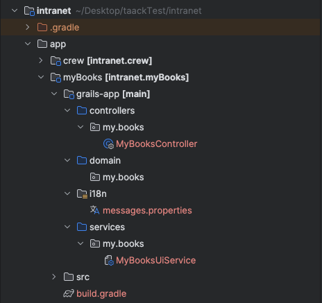

To make your IDE recognize the newly created module, reload Gradle by clicking the icon shown below:

.Gradle Reload
image::screenshot-new-app-gradle-reload.webp[Reload,width=520,align="left"]

== Managing Future Updates

Most of the time, updating your intranet should involve updating `buildSrc` folder, `gradle.properties`, and, less often, the app's `build.gradle` files.

[NOTE]
====
In fact, this process is common in long-term software development, and should not intimidate newcomers.
====

== Building an app-wide menu

[sidebar]
====
**TODO:**
We’re going to build two menus, one for books and one for authors. In each menu you’ll be able to add new items, filter them, and see every entry in a table.
====

Let's focus on the navigation for your new app, `myBooks`.
The initial step is to define how the menu will be constructed. Go to `grails-app/services/my/books/MyBooksUiService`.

.You should see the following code (which may vary slightly according to the version):
[,groovy]
----
static UiMenuSpecifier buildMenu(String q = null) { // <1>
    new UiMenuSpecifier().ui {
        menu MyBooksController.&index as MC
    }
}
----
<1> Add `static` if not already present.

We create a link:doc/DSLs/menu-dsl.adoc[UiMenuSpecifier] object to define the menu structure, then specify the content to display.

[,groovy]
----
menu MyBooksController.&index as MC
----

In this case, `menu` creates a simple link in the navigation bar. `index` is the name shown for the link, and `MyBooksController.&index` (using MethodClosure) defines the action to which the link will redirect.

== Creating classes
Create a Groovy Class called Author in `grails-app/domain/my/books`.

.Create a class
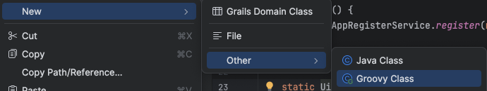

.Add the following code:
[,groovy]
----
import grails.compiler.GrailsCompileStatic
import taack.ast.annotation.TaackFieldEnum

@GrailsCompileStatic
@TaackFieldEnum
class Author {
    String firstName
    String lastName
    Date dateOfBirth
}
----

Create another Groovy Class called Book in `grails-app/domain/my/books`.

.Add the following code:
[,groovy]
----
import grails.compiler.GrailsCompileStatic
import taack.ast.annotation.TaackFieldEnum

@GrailsCompileStatic
@TaackFieldEnum
class Book {
    String title
    String authorName
    int numberOfPages
}
----

[NOTE]
====
Always use `@GrailsCompileStatic` for performance and type safety. Use `@TaackFieldEnum`, more information  link:doc/UserGuide/DevelopingStepsOverview[here].
====

== Creating a table

Now let's display a table in our listBook page. Go to `grails-app/controllers/my/books/MyBooksUiService`.

.Create a new table Specifier called buildBookTable:
[,groovy]
----

UiTableSpecifier buildBookTable() {
    Book book = new Book()
    UiTableSpecifier bookTableSpecifier = new UiTableSpecifier()
    bookTableSpecifier.ui {
    //Add table content inside the closure here
    }
}

----
Here we are defining a new table that will list Book instances. Use `import taack.ui.dsl.UiTableSpecifier`.

.To define the table headers add the following code in the closure (import necessary classes):
[,groovy]
----
bookTableSpecifier.ui {
    // -- Header --
    header {
        column {
            sortableFieldHeader book.title_ //<1>
        }
        column {
            label book.authorName_
        }
        column {
            label book.numberOfPages_
        }
        column {
            label "Delete book"
        }
    }
}
----
<1> Note here we use `sortableFieldHeader`, this makes the column sortable, you can sort the books in alphabetical order by clicking on the book.title header.
Now we are going to populate our table, we'll iterate over Book instances in the database by using the `iterate` table DSL method.

.Add the following code (initialize and import necessary classes):
[,groovy]
----
bookTableSpecifier.ui {
    //table headers...

    iterate(taackFilterService.getBuilder(Book) // <1>
        .setMaxNumberOfLine(8) // <2>
        .setSortOrder(TaackFilter.Order.DESC, book.title_) // <3>
        .build()) { Book bookIterator ->
    rowColumn {
        rowField bookIterator.title_ // <4>
    }
    rowColumn {
        rowField bookIterator.authorName_
    }
    rowColumn {
        rowField bookIterator.numberOfPages_
    }
    rowColumn {
        rowAction ActionIcon.DELETE * IconStyle.SCALE_DOWN, // <5>
            MyBooksController.&deleteBook as MethodClosure, bookIterator.id
        }
    }
}

----
<1> Use `import taack.domain.TaackFilterService`.
<2> Only the first eight books will be displayed.
<3> Sets the order of display according to the title of the books in descending order (use `import taack.domain.TaackFilter`).
<4> The underscore is needed here.
<5> Use `import taack.ui.dsl.common.ActionIcon
import taack.ui.dsl.common.IconStyle`.

[NOTE]
====
We need to create the action `deleteBook`. For now, we'll leave it empty.
====

Go to `grails-app/controllers/my/books/MyBooksController.groovy`.

.Add the following method after the `index` action:
[,groovy]
----
def deleteBook () {}
----

For each book in our list, we make a new row with the title of the book in the first column, followed by the author, the number of pages, and a btn:[Delete] button in the fourth column.

Your table is now complete; we just need to render it on the page.
To render previously built UiSpecifiers, we need to use `taackUiService` it should already be imported in the controller created by the `create-taack-app` command.

We will do this in a module called `listBook` inside the `index` method, replace its content with a redirect to the `listBook` action.

.Redirect to the listBook action:
[,groovy]
----
def index() {
    redirect action: 'listBook'
}
----

.Create an action called `listBook` and add the following code:
[,groovy]
----
UiTableSpecifier tableBookSpecifier = myBooksUiService.buildBookTable() // <1>

        taackUiService.show(new UiBlockSpecifier().ui {
            table tableBookSpecifier
        }, MyBooksUiService.buildMenu())
----
<1> Obtains the tableSpecifier we created from  `MyBooksUiServices`.

Use `import taack.ui.dsl.UiTableSpecifier`.

`taackUiService.show(UiBlockSpecifier block, UiMenuSpecifier menu)` will be in charge of rendering the specification we give him.
We use the previously created static `buildMenu()` method from `MyBooksUiService` as the second argument of `show()` to render the menu alongside the page.

You can now start the server and navigate to your new app (`myBooks.app`).
The table should be functional, but currently you will only see the table headers since there are no books in your database.
So let's proceed with creating a form and saving objects into the database.

.Empty Books Table
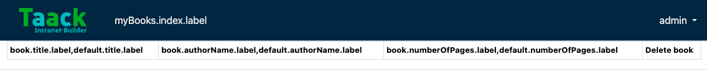

== Adding buttons to a table block

Let's add a button to the Book table that opens a modal via AJAX to create a new Book.
To achieve this, we need to add a closure in the table.

.Add the following code:
[,groovy]
----
taackUiService.show(new UiBlockSpecifier().ui {
    table tableBookSpecifier, {
        //Added Closure here
        menuIcon ActionIcon.CREATE, this.&bookForm as MethodClosure // <1>
    }
}, MyBooksUiService.buildMenu())

----
<1> You will have to define the `bookForm` action, just as we did with `deleteBook`.

Don't forget to use `import taack.ui.dsl.common.ActionIcon`

Now start the server and navigate to your new app again, you will see a btn:[Create] button on the top-right of the table.

.Button
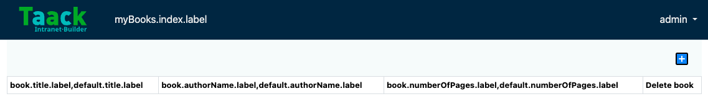

The `menuIcon` method is composed of the following parameters:

. The icon used by the button must be an ActionIcon enum value.
. The action that the button will redirect to.

== Creating a form and saving objects

We are now going to make the form that will be used to create and update books.
To manage both cases we are going to initialize a new Book or read if a Book ID has been passed in the request parameters in `MyBooksUiService`.

.Create a new Form Specifier called buildBookForm:
[,groovy]
----
UiFormSpecifier buildBookForm(Book book) {
    book ?= new Book(params) // <1>
}
----
<1> This means if `book` is null, assign it a new instance using request parameters.

Now we define its form and content.

.Add the following in buildBookForm (import the necessary classes):
[,groovy]
----
UiFormSpecifier bookFormSpecifier = new UiFormSpecifier()
bookFormSpecifier.ui book, {
    //Section of fields
    section "Book details", {
        field book.title_
        field book.authorName_
        field book.numberOfPages_
    }
    //Save button
    formAction MyBooksController.&saveBook as MethodClosure // <1>
}
----
<1> You will have to define the saveBook action (same as deleteBook) in `MyBooksController`

Use `import taack.ui.dsl.UiFormSpecifier`.

Once your form is defined, you can display it using the `taackUiService.show()` method.

.Add the following inside the `bookForm` method in `MyBooksController`:
[,groovy]
----
def bookForm(Book book) {
    UiFormSpecifier tableFormSpecifier = myBooksUiService.buildBookForm book

    taackUiService.show new UiBlockSpecifier().ui {
        modal {
            form tableFormSpecifier
        }
    }
}
----

Use `import taack.ui.dsl.UiFormSpecifier`.

This time we don't specify `buildMenu` in our show since we don't want the menu to be rendered inside the modal.

.Modify the `saveBook` action (import and initialize the necessary classes):

[,groovy]
----
@Transactional
def saveBook() {
    taackSaveService.saveThenReloadOrRenderErrors(Book)
}
----
Use `import taack.domain.TaackSaveService` and `import grails.gorm.transactions.Transactional`.

[NOTE]
====
See link:doc/DSLs/block-dsl.adoc#_modal_stack_code_sample[Close Modal and reload page] for how to avoid the use of  `redirectAction` when saving...
====

Start the server again, you should now be able to click on the button and fill out the form.

.Form
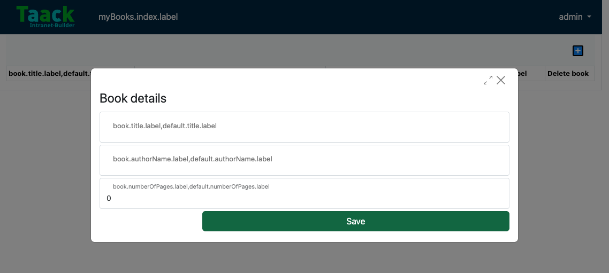

.Books saved
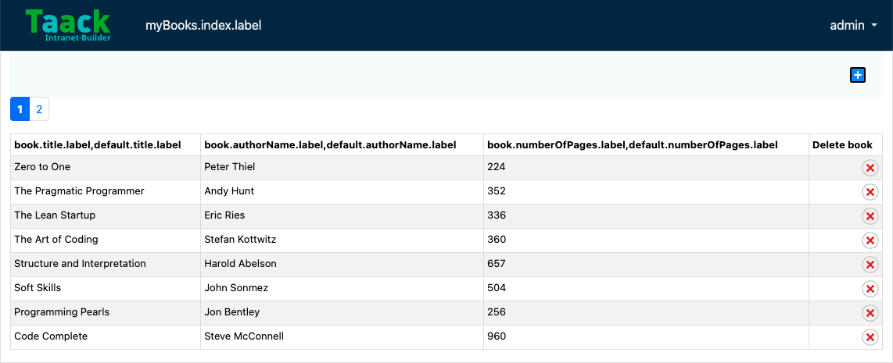

[NOTE]
====
In the top-left corner, you can switch between sets of books using the page numbers (1 or 2). This navigation appears because the list is limited to 8 books per set.
====

== Showing an object

Now that we can create books and see a list of them in a table, let's display each book in more detail using a modal.
Once again we define the specifier, and we will render it inside a modal block using `taackUiService.show()`.

.Create showBook (import the necessary class):
[,groovy]
----
def showBook(Book book) {
    // Define the show displayed fields
    UiShowSpecifier showSpec = new UiShowSpecifier().ui(book, {
        fieldLabeled book.title_
        fieldLabeled book.authorName_
    })

    taackUiService.show(new UiBlockSpecifier().ui {
        modal {
            show showSpec
        }
    })
}
----
Use `import taack.ui.dsl.UiShowSpecifier`.

We also need to display a link to this modal in the table. To do that, add the following line in the same rowColumn (Below the book title field) that you want the button to appear in `MyBooksUiService`:

.Add 2 lines in `buildBookTable`:
[,groovy]
----

UiTableSpecifier buildBookTable() {
    //Section of code
    rowColumn {
        //Add these 2 lines
        rowAction ActionIcon.SHOW * IconStyle.SCALE_DOWN, // <1>
        MyBooksController.&showBook as MethodClosure, bookIterator.id
        rowField bookIterator.title_
    }
    //Section of code
}

----

<1> Here, we reduce the size of the icon with the multiply operator.

This will create a _small_ icon button in the table cell that will open a modal with the corresponding book information.

Note that `ActionIcon` was multiplied by an `IconStyle` to change its size in this case.

.Showing object
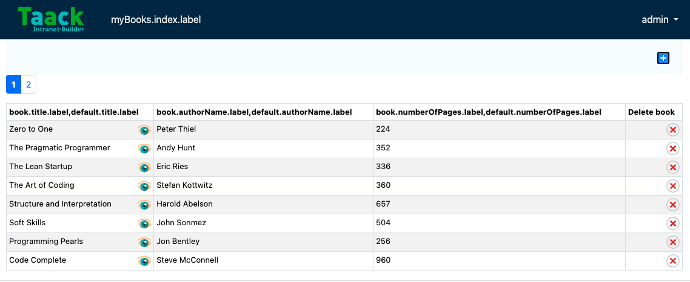
Click on the eye icon to display the book.

== Deleting an object

Remember the btn:[Delete] button we added to our table?
Let's make the btn:[Delete] button functional by defining the `deleteBook` action it calls.

[,groovy]
----
@Transactional
def deleteBook(Book book) {
    book.delete()
    redirect action: 'index'
}
----

[NOTE]
====
In some cases, it is better to add a field `enable` to mask disabled objects instead of deleting them.
====

We use Grails `delete` method to delete the book from the database and then redirect to the `index` action where the book table is.

.Delete book
video::first-app-screenshots/first-app-15-delete-book.mp4[Reload,width=800,align="left",options="autoplay,loop,muted"]

Note that the field names are not direct labels, but i18n keys like `book.numberOfPages.label,default.numberOfPages.label` (referring to the i18n keys in `messages.properties`). Let's change that!

== Name headers

To set the name of the headers, go to `app/myBooks/grails-app/i18n/messages.properties`.

.Set `default.numberOfPages.label` and the other labels to names of your choice:

[,properties]
----
default.authorName.label=Author Name
default.title.label=Title
default.numberOfPages.label=Number of Pages
myBooks.index.label=Books
myBooks.app=Book
myBooks.desc=Book storage
----

Run the server to view the updated label names.

== Filtering
If we add too many books we may waste time finding a specific book, filtering the books could make book search more efficient. Let's implement this in `MyBooksUiServices`.

.Create a new filter Specifier called buildBookFilter:
[,groovy]
----
UiFilterSpecifier buildBookFilter(Book book) {
    UiFilterSpecifier bookFilterSpecifier = new UiFilterSpecifier() // <1>

    bookFilterSpecifier.ui Book, { // <2>
        section "Book Filter", {  // <3>
            filterField book.title_ // <4>
        }
    }
}
----
<1> Create the filter. Use `import taack.ui.dsl.UiFilterSpecifier`.
<2> Pass the object class and the closure containing the specifications of the filter via the `ui` method.
<3> Create a section labeled "Book Filter".
<4> Add field to the filter, note the *underscore* at the end of the field name.

The next step is to display this recently created filter.

.Modify `taackUiService.show` in `listBook` (located in `MyBooksController`):
[,groovy]
----
def listBook() {
    Book book = new Book()
    UiTableSpecifier tableBookSpecifier = myBooksUiService.buildBookTable()
    UiFilterSpecifier filterBookSpecifier = myBooksUiService.buildBookFilter book

    taackUiService.show(new UiBlockSpecifier().ui {
        tableFilter filterBookSpecifier, tableBookSpecifier, {
            menuIcon ActionIcon.CREATE, this.&bookForm as MethodClosure
        }
    }, MyBooksUiService.buildMenu())
}
----
Use `import taack.ui.dsl.UiFilterSpecifier`.

.Filtering
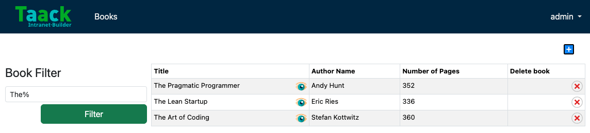

For more detailed information about filtering refer to the link:doc/DSLs/filter-table-dsl[Filter Table Doc].

== Adding second menu
Remember the Author class we created at the beginning? It's time to use it! We are going to create a second menu where we will be able to add authors and filter them.

.Add this line of code in `buildMenu` in `MyBooksUiService`:
[,groovy]
----
menu MyBooksController.&listAuthor as MC
----
This creates a second menu in the top-left corner for accessing the author page.

[NOTE]
====
You can also create nested submenus inside the main menu.
[,groovy]
----
label("Menu", {
    subMenu(MyBooksController.&index as MC)
    subMenu(MyBooksController.&listAuthor as MC)
})
----
This creates a submenu labeled " Menu" containing a link to the `index` action (which corresponds to the `listBook` action) and the `listAuthor` action. This is useful if you want to group related links under a single menu item.
====
.Add the following builders in `MyBooksUiServices`:
[,groovy]
----
UiTableSpecifier buildAuthorTable(Boolean isSelect = false ) {
    Author author = new Author()
    UiTableSpecifier authorTableSpecifier = new UiTableSpecifier()
    authorTableSpecifier.ui {
        header {
            column {
                sortableFieldHeader author.firstName_
            }
            column {
                sortableFieldHeader author.lastName_
            }
            column {
                label author.dateOfBirth_
            }
            column {
                label "Delete Author"
            }
        }

        iterate(taackFilterService.getBuilder(Author)
                .setMaxNumberOfLine(8)
                .setSortOrder(TaackFilter.Order.DESC, author.lastName_)
                .build()) { Author authorIterator ->
            rowColumn {
                rowField authorIterator.firstName_
                rowAction ActionIcon.SHOW * IconStyle.SCALE_DOWN,
                        MyBooksController.&showAuthor as MethodClosure, authorIterator.id
            }
            rowColumn {
                rowField authorIterator.lastName_
            }
            rowColumn {
                rowField authorIterator.dateOfBirth_
            }
            rowColumn {
                rowAction ActionIcon.DELETE * IconStyle.SCALE_DOWN,
                        MyBooksController.&deleteAuthor as MC, authorIterator.id
            }
        }
    }
}

UiFormSpecifier buildAuthorForm(Author author) {
    author ?= new Author(params)
    UiFormSpecifier authorFormSpecifier = new UiFormSpecifier()
    authorFormSpecifier.ui author, {
        section "Author details", {
            field author.firstName_
            field author.lastName_
            field author.dateOfBirth_
        }
        formAction MyBooksController.&saveAuthor as MC
    }
}

UiFilterSpecifier buildAuthorFilter() {
    Author author = new Author()
    UiFilterSpecifier authorFilterSpecifier = new UiFilterSpecifier()

    authorFilterSpecifier.ui Author, {
        section "Author Filter", {
            filterField author.lastName_
        }
    }
}
----
Note the `isSelect` in the buildAuthorTable will be used later.

.Create the `listAuthor` method in `MyBooksController`:
[,groovy]
----
def listAuthor() {
    UiTableSpecifier tableAuthorSpecifier = myBooksUiService.buildAuthorTable()
    UiFilterSpecifier filterAuthorSpecifier = myBooksUiService.buildAuthorFilter()

    taackUiService.show(new UiBlockSpecifier().ui {
        tableFilter filterAuthorSpecifier, tableAuthorSpecifier, {
            menuIcon ActionIcon.CREATE, this.&authorForm as MethodClosure
        }
    }, MyBooksUiService.buildMenu())
}
----

.Add the necessary methods `deleteAuthor`, `saveAuthor`, `authorForm`, and `showAuthor`:
[,groovy]
----
def authorForm(Author author) {
    UiFormSpecifier tableFormSpecifier = myBooksUiService.buildAuthorForm author

    taackUiService.show new UiBlockSpecifier().ui {
        modal {
            form tableFormSpecifier
        }
    }
}

@Transactional
def deleteAuthor(Author author) {
    author.delete()
    redirect action: 'index'
}

@Transactional
def saveAuthor() {
    taackSaveService.saveThenReloadOrRenderErrors(Author)
}

def showAuthor(Author author) {
    UiShowSpecifier showSpec = new UiShowSpecifier().ui(author, {
        fieldLabeled author.firstName_
        fieldLabeled author.lastName_
    })

    taackUiService.show(new UiBlockSpecifier().ui {
        modal {
            show showSpec
        }
    })
}
----

.Set the new default labels to the name of your choice:

[,properties]
----
default.firstName.label=First Name
default.lastName.label=Last Name
default.dateOfBirth.label=Date of Birth
myBooks.listAuthor.label= Authors

----

You now have separate menus for Books and Authors, but they currently operate independently. What if you could select an author directly from the list of registered authors when creating a book? Let's implement that feature.

.Author Table
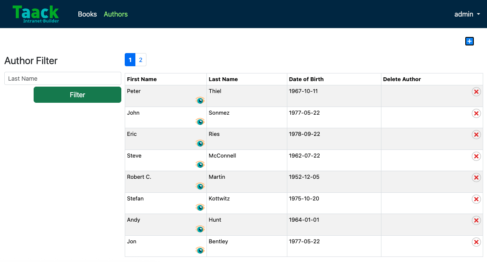

== Link Authors to Books

.Add the following method to the `Author` class:
[,groovy]
----
String toString() {
    return firstName + ' ' + lastName
}
----

.Modify the variable in the book class:
[,groovy]
----
Author author
----

[NOTE]
====
Change all instances of `book.authorName_` to `book.author_` and `bookIterator.authorName_` to `bookIterator.author_`, located in `MyBooksController` and `MyBooksUiService`.
====

[WARNING]
====
Changing the name or field of a class is strongly discouraged, as it will require to erase files containing the previously added data.
You must delete `intranet/server/intranetDb.mv.db` and `intranet/server/intranetDb.trace.db`  to avoid integrity errors. This will delete all previously saved data.
====

.Add a line to `messages.properties`:
[,properties]
----
default.author.label=Author Name
----

.Modify the `buildAuthorTable` located in `MyBooksUiService`:
[,groovy]
----
rowColumn {
    rowField authorIterator.firstName_
    rowAction ActionIcon.SHOW * IconStyle.SCALE_DOWN,
            MyBooksController.&showAuthor as MethodClosure, authorIterator.id
    // Add the following if statement
    if (isSelect)
        rowAction tr('default.role.label'), ActionIcon.SELECT * IconStyle.SCALE_DOWN, authorIterator.id, authorIterator.toString()
}
----
This will add a select button to select the author when filling out the `bookForm`. Use `import static taack.render.TaackUiService.tr`.

.Modify the `buildBookForm` located in `MyBooksUiService`, replace `field book.author_`:
[,groovy]
----
ajaxField book.author_, MyBooksController.&selectAuthor as MC
----
This line will call `selectAuthor`, when  selecting an author in the `bookForm`.

Let's implement selectAuthor.

.Implement `selectAuthor` in `MyBooksController`:
[,groovy]
----
def selectAuthor() {
    UiTableSpecifier t = myBooksUiService.buildAuthorTable true // <1>
    UiFilterSpecifier f = myBooksUiService.buildAuthorFilter()
    taackUiService.show new UiBlockSpecifier().ui {
        modal {
            tableFilter f, t
        }
    }
}
----
<1> Note that isSelect is true.
This will render a compact version of the `Author` table and its filter when selecting an author for the book form.

.Adding a book with an author from the Author table
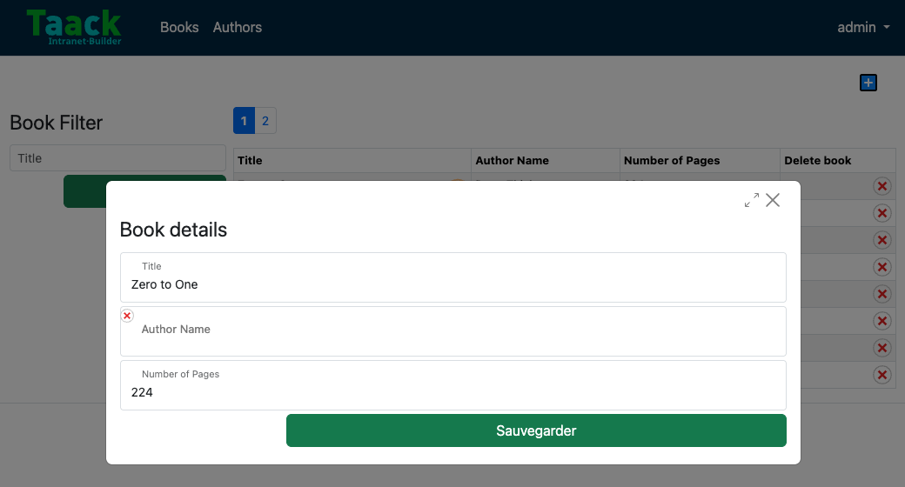

.Selecting the author (click on the blue button)
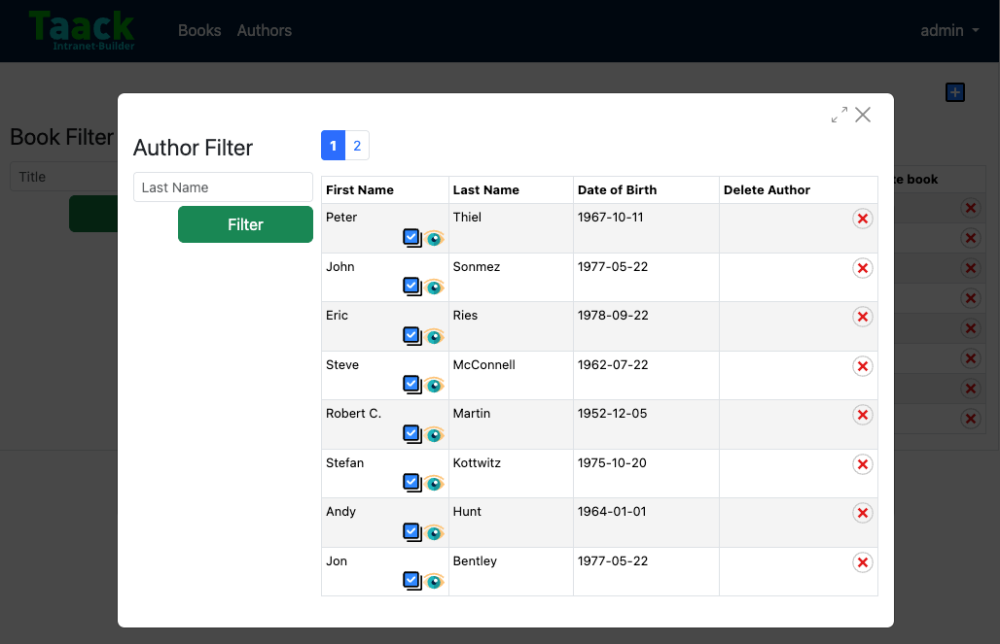

You now have a fully functional CRUD interface for your `Book` and `Author` entities using the Taack DSL framework, without needing to write HTML or GSP views manually.

*You are now ready to explore the more advanced features of the Taack Ui Framework.*

*Welcome!*

== Troubleshooting and Common Errors

.Error Output:
[source,console]
----
ERROR: Cannot resolve symbol 'MyBooksUiService'
----
You forgot to reload Gradle after creating the plugin. Click the Gradle reload button in your IDE.

.Error Output:
[,console]
----
ERROR:  Field 'authorName_' not found
----
You renamed the `authorName` field to `author` (a reference to Author). Make sure you changed all `authorName_` to `author_` in both the form and the table.

.Error Output:
[,console]
----
ERROR: No matching method for action...
----
Make sure you declared the corresponding method in `MyBooksController`, and used `MethodClosure` syntax correctly: `MyBooksController.&myMethod as MethodClosure`.

.Form shows but does not save:
You may be missing the `@Transactional` annotation in the `saveBook` method or forgot to import `taackSaveService`.

.Database error after renaming fields:
If you changed fields in domain classes, you must delete the database files:
`intranet/server/intranetDb.mv.db`
`intranet/server/intranetDb.trace.db`.  Be careful, as this will erase all previously saved data.
