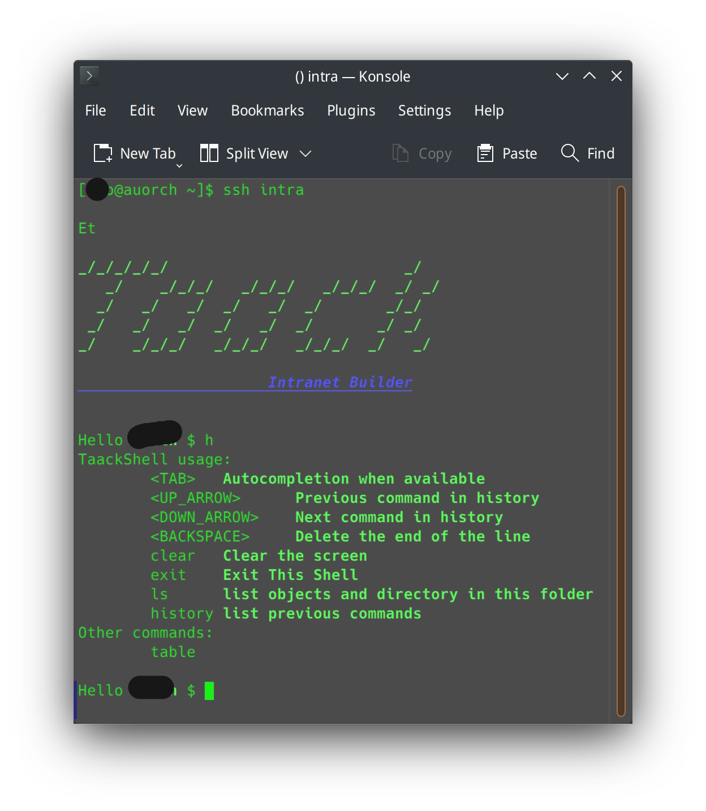
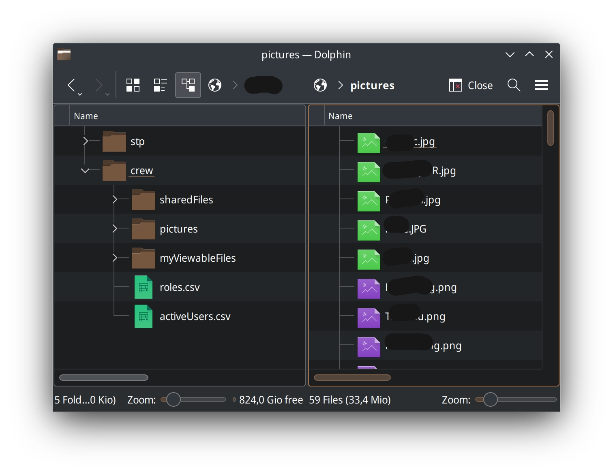

= DSL for Grails
:taack-category: 1

https://github.com/Taack/infra[Taack-UI] is a plugin extending https://grails.org/[Grails] by allowing to describe user interface and other features by using http://docs.groovy-lang.org/docs/latest/html/documentation/core-domain-specific-languages.html[Groovy DSL] (Domain Specific Language) statically typed.

This extension add the following functionalities to classical Grails Application:

* Security:
** Transforming and displaying objects by checking user right to modify *each field*;
** *links* and *form actions* are automatically masked if user is not allowed to process the  *action* with given parameters;
** Limit object listing user is allowed to see (excepts for fulltext search ATM);

* *PDF*, *Mails*, *CSV* rendered for free. The link:doc/DSLs/block-dsl.adoc[block DSL] can be used for any kind of rendering;

* Localization for free: DSLs detect i18n translations automatically;

* Reporting errors when validating an Object for free (See link:doc/DSLs/form-dsl.adoc#_form_validation[*form validation*]);

* Solr for link:/more/Search/Search.adoc[fulltext search]:
** Indexing and fulltext Search of domain objects statically typed;
** Faceting;
** Ranking;

* link:/doc/DSLs/filter-table-dsl.adoc[Filtering, paginate and sorting] data without queries and session data;
* File previews can be extended;
* *JDBC Driver* to query Domain Objects using #TQL# (Taack Query Language) from Intellij, link:more/JDBC/libreoffice-base.adoc#_open_query_as_a_pivot_table[LibreOffice Base] or DBeaver, as a classical datasource (See link:more/JDBC/taack-jdbc-driver.adoc[*Taack JDBC Driver*]);

* File sharing via *SFTP* (Available soon):
** Virtual File System for each user (see <<sftp_screenshot>>);
** Direct access to parts of the server storage for fast sharing, checking user credentials;

* *Git server* to manage user documentation (Available soon)

* *Ssh* support accessible (Available soon), running shell UI directly within the server process (see <<ssh_screenshot>>);

[[ssh_screenshot]]
.Ssh server session

[[sftp_screenshot]]
.Sftp file browser

