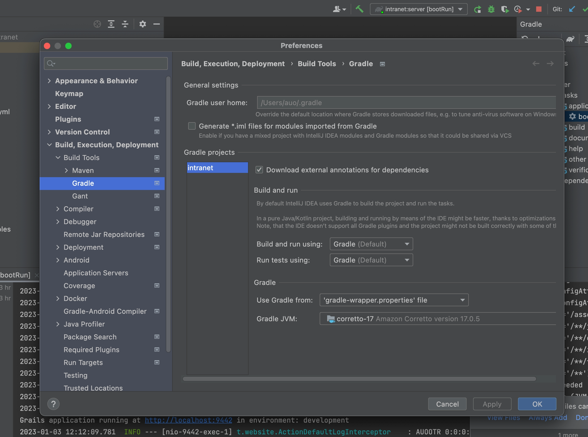

= 安装

== 提前配置

安装以下：

* *Java* (JDK-17或JDK-19)
* *git*

可选安装以下：

* *Solr-9.6.x* (用于内联网中的搜索栏)
* *Postgresql*

=== Java版本

使用以下命令查看版本号：

[sh]
----
java -fullversion
openjdk full version "17.0.5+1"
----

Mac系统可使用brew命令安装Jdk-17：

[sh]
----
brew install openjdk@17
----

== 克隆内联网模板项目

[,bash]
----
git clone https://github.com/Taack/intranet.git
----

该模板项目为精简版的内联网，您可以在其基础上构建更多应用。目前已包含人员管理系统“Crew”应用以及其安全依赖项：*Spring Security Plugin*。

== 运行您的内联网

进入克隆完成的内联网项目中，以下述命令运行其服务器：

[,bash]
----
./gradlew server:bootRun
----

如果您希望Gradle能实时监测文件改动以热重启服务器，请在运行服务器时添加 `-Dgrails.run.active=true` 选项：

[,bash]
----
./gradlew -Dgrails.run.active=true server:bootRun
----

短暂时间后，您应当能在控制台中看见：

`Grails application running at http://localhost:9442`

此时您就可以通过浏览器访问该网址以进入内联网，并用默认账户登陆 (用户名：*admin*；密码：*ChangeIt*)。密码可在 `server/grails-app/conf/application.yml` 中更改。

=== 配置持久化数据库

如果您希望长久保存数据，请至 `server/grails-app/conf/application.yml` 文件中更改 `dataSource` 项。

例如处于开发者模式时我们希望使用H2存储数据：

[source,yaml]
----
environments:
    development:
        dataSource:
            dbCreate: update        <1>
            url: jdbc:h2:./prodDb;LOCK_TIMEOUT=10000;DB_CLOSE_ON_EXIT=FALSE <2>
----

<1> 模式：创建 (具体请见Grails GORM文档)
<2> `prodDb`: 用于存储数据的文件的根目录

=== 为Tomcat生成Jar文件

在这一步中，取代 `bootRun` 使用的是 `assemble` ：

[source,bash]
----
./gradlew server:assemble
----

Jar文件将生成至 `server/build/libs` 文件夹。利用下述命令将其导入至您的Tomcat中：

[source,bash]
----
cd server/build/libs
java -jar server-[version].jar
----

该次执行会更快, 并且静态文件将被压缩与串联。

TIP: 请确保此时您尚未运行服务器

== 配置您的IDE

我们强烈建议您使用最新版**IntelliJ Ultimate Edition**，基于它对**Groovy**和**Grails**的全面支持。此外，我们也在探索更多可供选择的IDE，例如**Eclipse**或**Visual Studio Code**，又例如支持非Ultimate Edition版的IntelliJ。

=== IntelliJ Ultimate Edition

我们建议一并安装**Taack插件**，可从Intellij市场link:https://plugins.jetbrains.com/plugin/20792-taackuiastautocomplete[TaackUiASTAutocomplete]或直接从link:https://github.com/Taack/infra/releases/tag/v0.1[源码库]安装。

如何打开项目： menu:File[Open project] ，然后选择 `intranet/settings.gradle` 。

请确保Gradle使用的JDK版本为17 (或19)：

.打开 Gradle Settings
image:open-settings-gradle-intellij.webp[]

.检查 Gradle Jdk 版本

=== Visual Studio Code

如果您强烈希望使用Visual Studio Code，我们建议以下扩展包以此使得Taack框架正常工作：

* https://marketplace.visualstudio.com/items?itemName=vscjava.vscode-java-pack[Extension Pack for Java]
* https://marketplace.visualstudio.com/items?itemName=marlon407.code-groovy[code-groovy]
* https://marketplace.visualstudio.com/items?itemName=vscjava.vscode-gradle[Gradle for Java]
* https://marketplace.visualstudio.com/items?itemName=MellowMarshmallow.groovy[Groovy]

请谨记，即便VSCode无法识别Grails和Taack框架的大部分功能，但其仍然可正常使用。此外，VSCode也不会帮助您进行导入、代码导航等诸多便捷功能，因为其对Groovy的支持始终不如Intellij全面。
