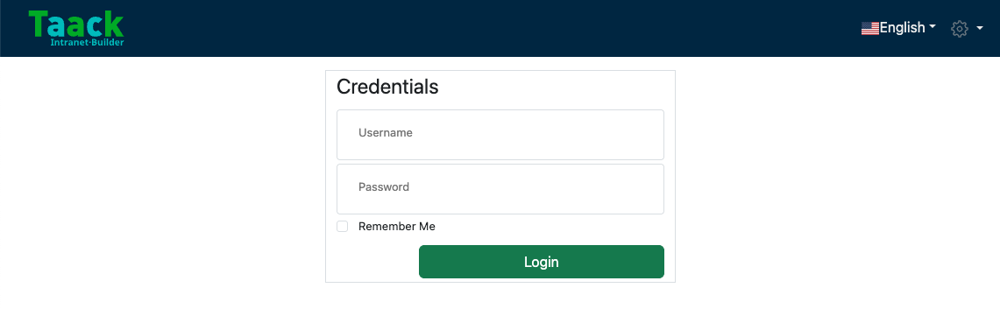

= Installation Guide

== Requirements

To get started, make sure the following tools are installed on your machine:

* *Java* (JDK 17 or JDK 24)
* *Git*

=== Install prerequisites

==== macOS (Homebrew)

.Install JDK 24 and Git using Homebrew
[source,bash]
----
$ brew install openjdk@24
$ brew install git
----

==== Windows (Winget)

.Install JDK 24 and Git using Winget
[source,bash]
----
winget install --id Microsoft.OpenJDK.24
winget install --id Git.Git
----

== Cloning the ready-to-dev Intranet

.Clone the starter repository:

[source,bash]
----
$ git clone https://github.com/Taack/intranet.git
----

This repository includes a minimal intranet skeleton (Crew user management + *Spring Security plugin*) ready for development.

== Start your intranet

.Navigate inside the newly cloned intranet folder and launch the server:

[source,bash]
----
$ cd intranet
$ ./gradlew server:bootRun
----

[NOTE]
====
The `./gradlew` command uses the Gradle Wrapper, so you don’t need to install Gradle manually.
====

.Once the build completes, you should see:
[source,bash]
----
Grails application running at http://localhost:9442
----

[sidebar]
====
**TODO:**
Access the intranet by going to that address in your browser.
Use the default login credentials:

* **Username**: `admin`
* **Password**: `ChangeIt`
====

.Credentials

To change the default admin password, edit the following files:

* `server/grails-app/conf/application.yml`
* `server/grails-app/conf/application-MACOSX.yml`

Look for the line:
[source,yaml]
taack.admin.password: ChangeIt

After making the change, delete the file `intranetDb.mv.db` to apply the new password.

[NOTE]
====
`application-MACOSX.yml` is only used when the app detects a macOS environment. If you're using Linux or Windows, it will be ignored.
====

[WARNING]
====
Deleting the `intranetDb.mv.db` file will permanently erase all previously stored data.
====

=== Configure a persistent database

If you want data to be persistent, change the `server/grails-app/conf/application.yml` and
`server/grails-app/conf/application-MACOSX.yml` file to use a persistent database.

.Here we want H2 to persist data in a file in development mode:

[source,yaml]
----
environments:
    development:
        dataSource:
            dbCreate: update        <1>
            url: jdbc:h2:./intranetDb;LOCK_TIMEOUT=10000;DB_CLOSE_ON_EXIT=FALSE <2>
----

<1> Creation mode (see Grails GORM docs)
<2> `intranetDb`: root of the filename containing data

=== Producing a Jar file for Tomcat

.Use the assemble task instead of bootRun:

[source,bash]
----
$ ./gradlew server:assemble
----
The assembled JAR (e.g., `server-0.6.jar`) will be located in `server/build/libs`.

.You can deploy it to your production server or test it locally

[source,bash]
----
cd server/build/libs
java -jar server-[version].jar   <1>
----
<1> The version number is located in `build.gradle`. The default value is 0.6

[TIP]
====
Make sure you are not already running the application when starting a new instance.
====

== Set up your IDE

We highly recommend using the latest version of *IntelliJ Ultimate Edition* for its comprehensive support of *Groovy* and *Grails*.

=== IntelliJ Ultimate Edition

We recommend installing the *IntelliJ Taack Plugin* which you can install from the IntelliJ Marketplace https://plugins.jetbrains.com/plugin/20792-taackuiastautocomplete[TaackUiASTAutocomplete] or directly from the https://github.com/Taack/infra/releases/tag/v0.1[source code repository].

Open the project, go to File > Open... and select `intranet/settings.gradle`.

Make sure that Gradle is using JDK 17 (or 24):

.Open Gradle Settings
image:open-settings-gradle-intellij.webp[]

.Check Gradle JDK Version
image:settings-gradle-intellij.webp[]

=== Visual Studio Code

If you prefer Visual Studio Code, we recommend the following extensions to use this framework:

* https://marketplace.visualstudio.com/items?itemName=vscjava.vscode-java-pack[Extension Pack for Java]
* https://marketplace.visualstudio.com/items?itemName=marlon407.code-groovy[code-groovy]
* https://marketplace.visualstudio.com/items?itemName=vscjava.vscode-gradle[Gradle for Java]
* https://marketplace.visualstudio.com/items?itemName=MellowMarshmallow.groovy[Groovy]

[NOTE]
====
Most of the Grails and Taack Framework features will not be recognized by VS Code. Imports, navigation, and code assistance may be limited. IntelliJ remains the preferred IDE for full support.
====
