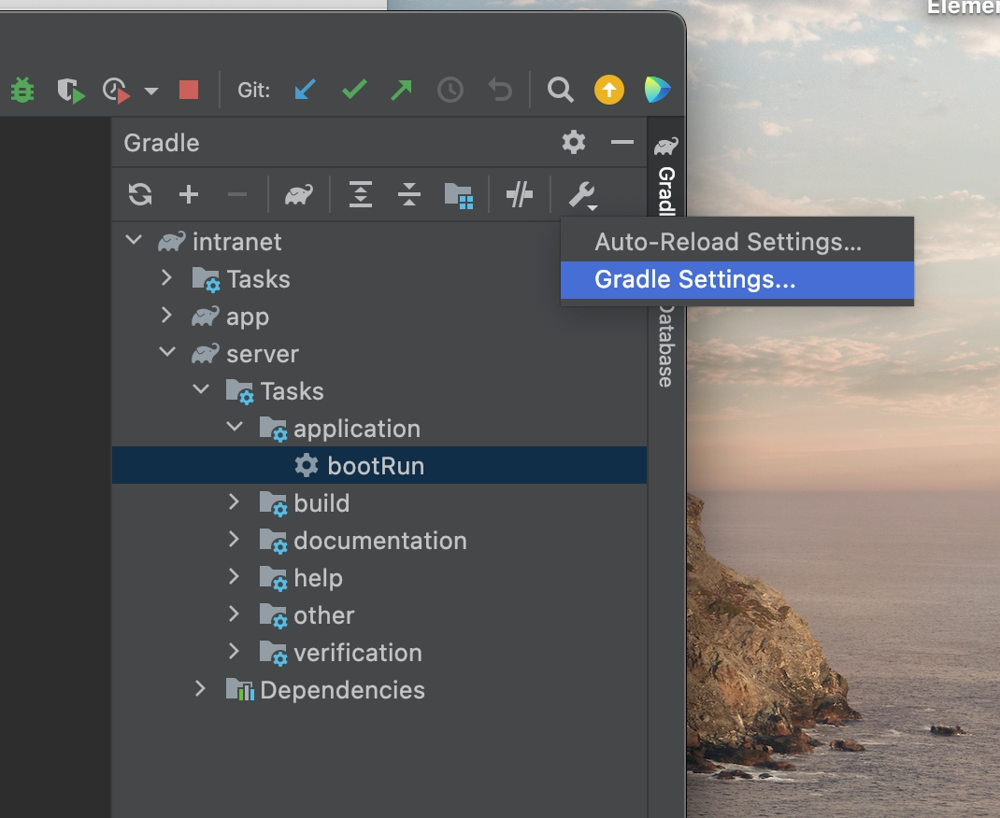
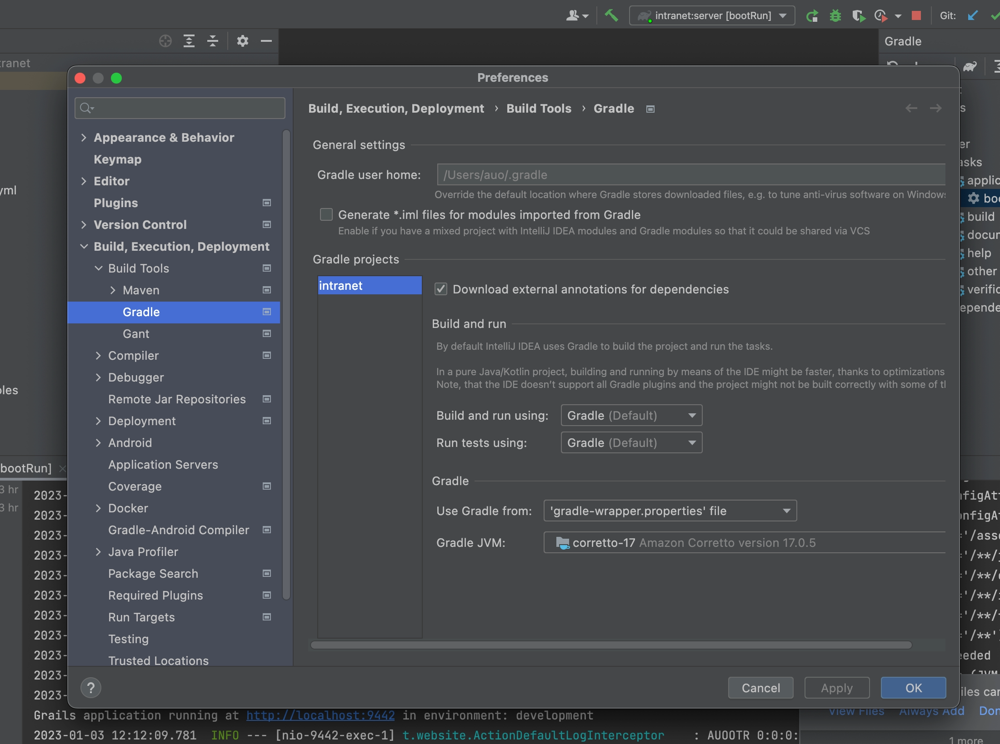

= Installation
:doctype: book
:taack-category: 1
:toc:

== Requirements

First of all, you will need the following:

* *Java* (JDK-17)
* *git*

You can also optionally install:

* *Solr-9.1.0* (Used for intranet-wide search bar)
* *Postgresql* (You will need to use the Grails in-memory database if you don't have any database manager)

=== Java Version

It is mandatory to use Java Jdk 17. In order to check Java version, type the following command:

[sh]
----
java -fullversion
openjdk full version "17.0.5+1"
----

On Mac, you can install Jdk-17 via brew command:

[sh]
----
brew install openjdk@17
----

== Cloning the ready-to-dev Intranet

[,bash]
----
git clone https://github.com/Taack/intranet.git
----

This repository includes a stripped-down version of an intranet on top of which you can build more applications. It includes "Crew", the user management system and it's security dependency: *Spring Security Plugin*.

== Start your intranet

Navigate inside the newly cloned intranet folder and start the server by executing this command:

[,bash]
----
./gradlew server:bootRun
----

If you want gradle to watch app module to hot restart the server at each save, launch the server adding `-Dgrails.run.active=true` option:

[,bash]
----
./gradlew -Dgrails.run.active=true server:bootRun
----

After a while you should see in the console:

`Grails application running at http://localhost:9442`

You can now access the intranet by going to that address in your browser. You can also login with the default credentials (username: *admin*; password: *ChangeIt*). The password can be changed in server/grails-app/conf/application.yml.

=== Configuring persistent Db

If you want data to be persistent, change the `server/grails-app/conf/application.yml` file to use a persistent database.

Here we want H2 to persist data in a file in development mode:

[source,yaml]
----
environments:
    development:
        dataSource:
            dbCreate: update
            url: jdbc:h2:./prodDb;LOCK_TIMEOUT=10000;DB_CLOSE_ON_EXIT=FALSE
----

=== Producing a War file for Tomcat

Instead of `bootRun` task, use `assemble` task:

[source,bash]
----
./gradlew server:assemble
----

The server war are produced into `server/build/libs` folder. You can import it in your Tomcat production server or test it with:

[source,bash]
----
cd server/libs/libs
java -jar server-[version].jar
----

It will be faster, assets will be compiled and merged.

== Set up your IDE

We heavily recommend the latest *IntelliJ Ultimate Edition* for its extensive *Groovy* and *Grails* support. We are investigating other IDE support (*Eclipse*, *Visual Studio Code*), and also support for IntelliJ non Ultimate Edition.

=== IntelliJ Ultimate Edition

We recommend installing the *IntelliJ Taack Plugins* that you can install from the Intellij marketplace https://plugins.jetbrains.com/plugin/20792-taackuiastautocomplete[TaackUiASTAutocomplete] or directly from the https://github.com/Taack/infra/releases/tag/v0.1[source code repository].

To open the project, select "Open project" and select `intranet/server/settings.gradle`.

Check Jdk used with gradle is at version 17:

.Open Gradle Settings

.Check Gradle Jdk Version

=== Visual Studio Code

If you really want to use Visual Studio Code, we recommend the following extensions to use this framework:

* https://marketplace.visualstudio.com/items?itemName=vscjava.vscode-java-pack[Extension Pack for Java]
* https://marketplace.visualstudio.com/items?itemName=marlon407.code-groovy[code-groovy]
* https://marketplace.visualstudio.com/items?itemName=vscjava.vscode-gradle[Gradle for Java]
* https://marketplace.visualstudio.com/items?itemName=MellowMarshmallow.groovy[Groovy]

Keep in mind that most of the Grails and Taack Framework features will not be recognized by VSCode but are still usable. In addition, VSCode will not help you with imports, code navigation, and many QoL features will be unavailable since groovy support is not as extensive as IntelliJ.
