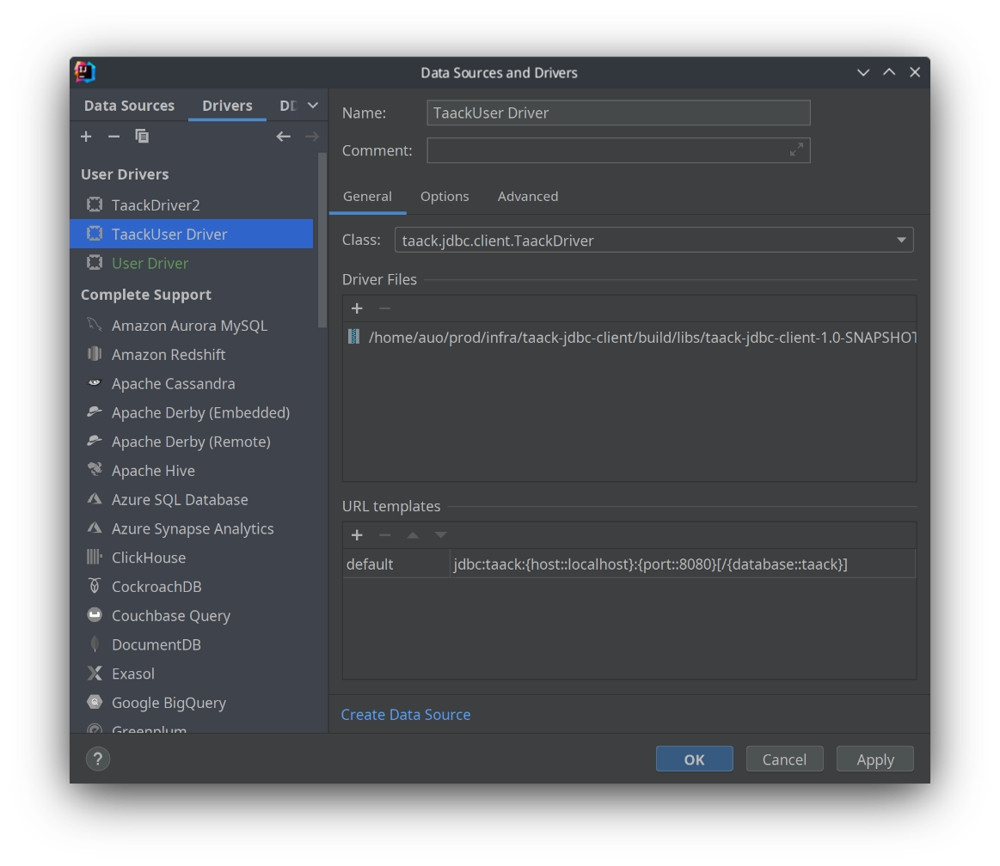

= Intellij connexion JDBC
:doctype: book
:taack-category: 1|more/JDBC
:source-highlighter: rouge
:toc:
:icons: font

== Ajout du pilote

Dans le panneau de la base de données, cliquez sur le signe `+\`, puis sur `Driver`



L'ajout de la classe du pilote doit définir le champ `Classe`

== Ajout d'une source de données pour ce pilote

Dans le panneau de la base de données, cliquez sur le signe `+`, puis sur `Source de données`, puis sélectionnez le pilote avec le nom que vous venez de définir à l'étape précédente.

image::intellij-jdbc-dataSource-configuration.webp[]

Utilisez votre nom d'utilisateur et votre mot de passe Intranet.

L'URL doit ressembler à ce qui suit :

```
jdbc:taack:localhost:8080/taack
```

Nous forçons l'utilisation de la connexion https pour les hôtes non locaux.

== Requête

Vous devriez pouvoir parcourir la classe de domaine, extraire des données CSV ou exécuter des requêtes TQL.