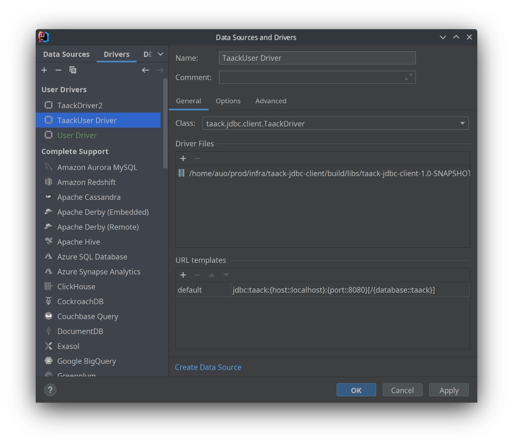
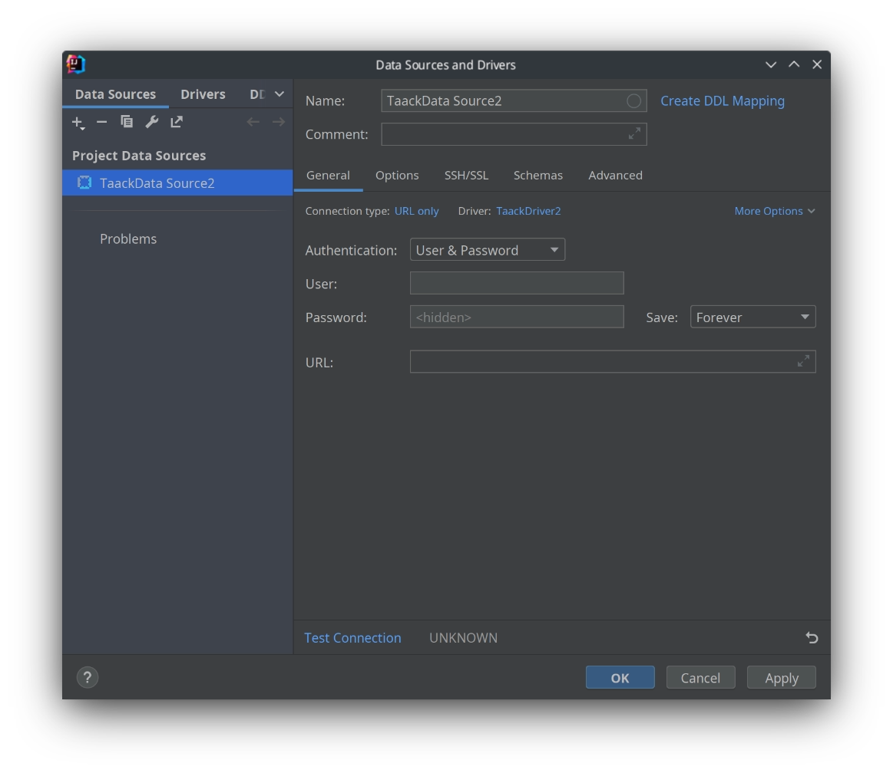

= Intellij JDBC Connection
:doctype: book
:taack-category: 1|more/JDBC
:source-highlighter: rouge

== Adding the Driver

In the database panel click on the `+` sign, then `Driver`



Adding the driver class should set tje `Class` field

== Adding a Datasource for this driver

In the database panel click on the `+` sign, then `Data Source`, then select the Driver with the name you just set in the previous step.



Use your Intranet username and password.

The URL should look like the following:

```
jdbc:taack:localhost:8080/taack
```

We force the use of https connection for non-local hosts.

== Querying

You should be able to browse domain class, extract CSV data or execute TQL Queries.