= Libreoffice Base
:doctype: book
:taack-category: 1|more/JDBC
:source-highlighter: rouge
:toc:

== Configurer LibreOffice pour utiliser Jdk 17

Cliquez sur les outils `Outils` > `Options`, puis dans la boîte de dialogue *Options - LibreOffice - Données utilisateur*, cliquez sur `LibreOffice` > `Avancé` dans l'arborescence.

La case à cocher `Utiliser un environnement d'exécution Java` doit être cochée et vérifiez qu'une version JRE 17 est détectée.

Si ce n'est pas le cas, installez Java 17 et répétez le processus. Vous pouvez cliquer sur le bouton `Ajouter` et suivre la procédure s'il n'est pas détecté, mais que vous savez qu'il est installé.

.Java 17 est détecté et sélectionné
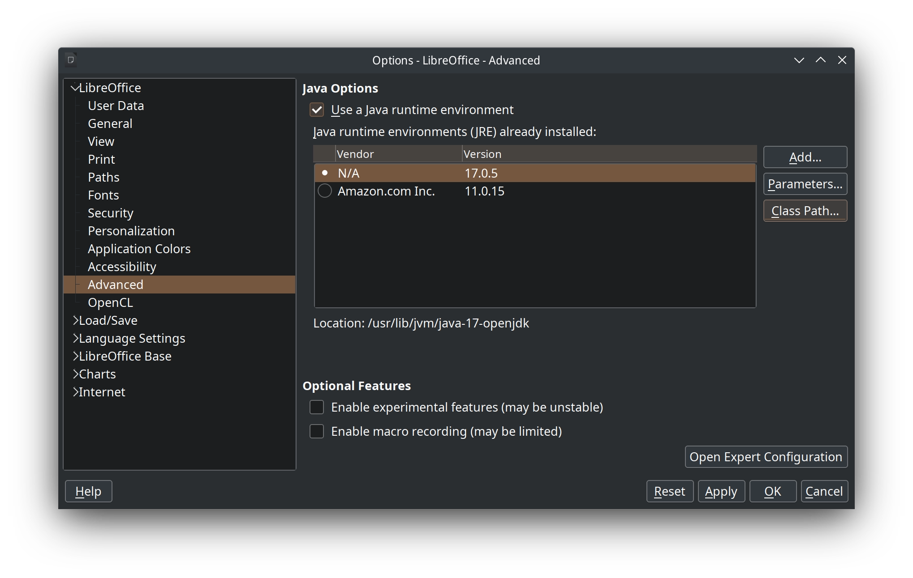

Cliquez sur le bouton `Appliquer` ou `Ok`.

== Ajouter le pilote Jar

Télécharger https://github.com/Taack/infra/releases/tag/v0.1[taack-jdbc-client-0.2-SNAPSHOT-all.jar]

Revenir à la boîte de dialogue avancée.

Cliquer sur `Class Path...`, dans la boîte de dialogue, cliquer sur `Add Archive...`, sélectionner le fichier que vous avez téléchargé.

.Pilote ajouté au runtime
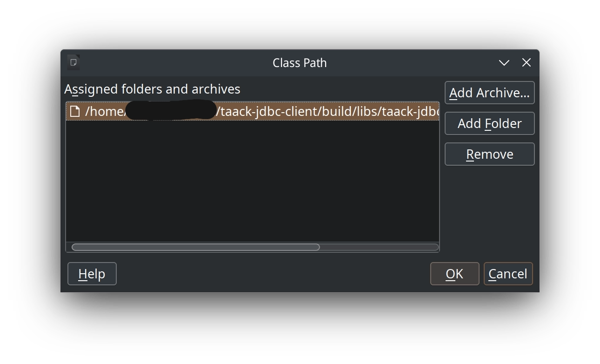

Cliquer sur le bouton `Ok`.

== Créer un fichier de base LibreOffice

Ouvrez #LibreOffice#, cliquez sur `Base Database`

=== Sélectionnez JDBC

.Étape 1 : sélectionnez JDBC
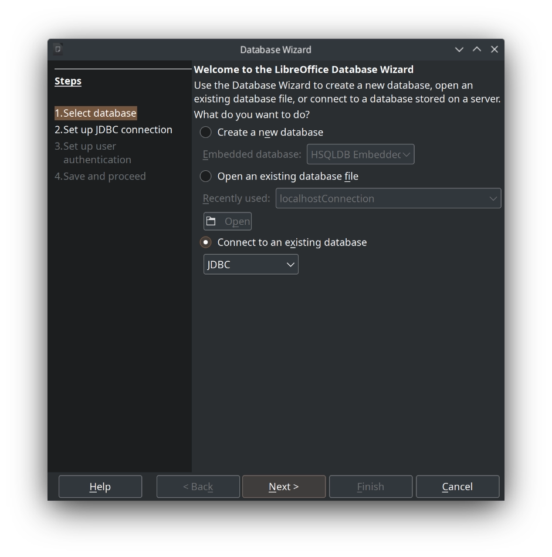

Cliquer sur le bouton `Next`.

=== Entrez l'emplacement du pilote dans le fichier Jar

jdbc : `taack:localhost:8080/taack`

Remplacez localhost et port par l'URL et le port de votre instance.

Classe de pilote JDBC : `taack.jdbc.client.TaackDriver`

.Étape 2 : chaîne de connexion du pilote
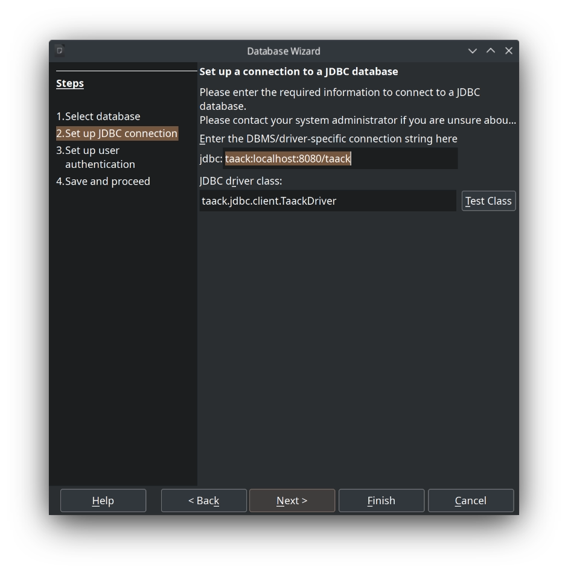

=== Définir le nom d'utilisateur

Le `Nom d'utilisateur` doit être un utilisateur actif de votre application Intranet (avec `ROLE_ADMIN` ou `ROLE_JDBC_ADMIN`).

Voir https://github.com/Taack/infra/blob/main/taack-ui/grails-app/controllers/taack/support/TaackJdbcController.groovy[class TaackJdbcController].

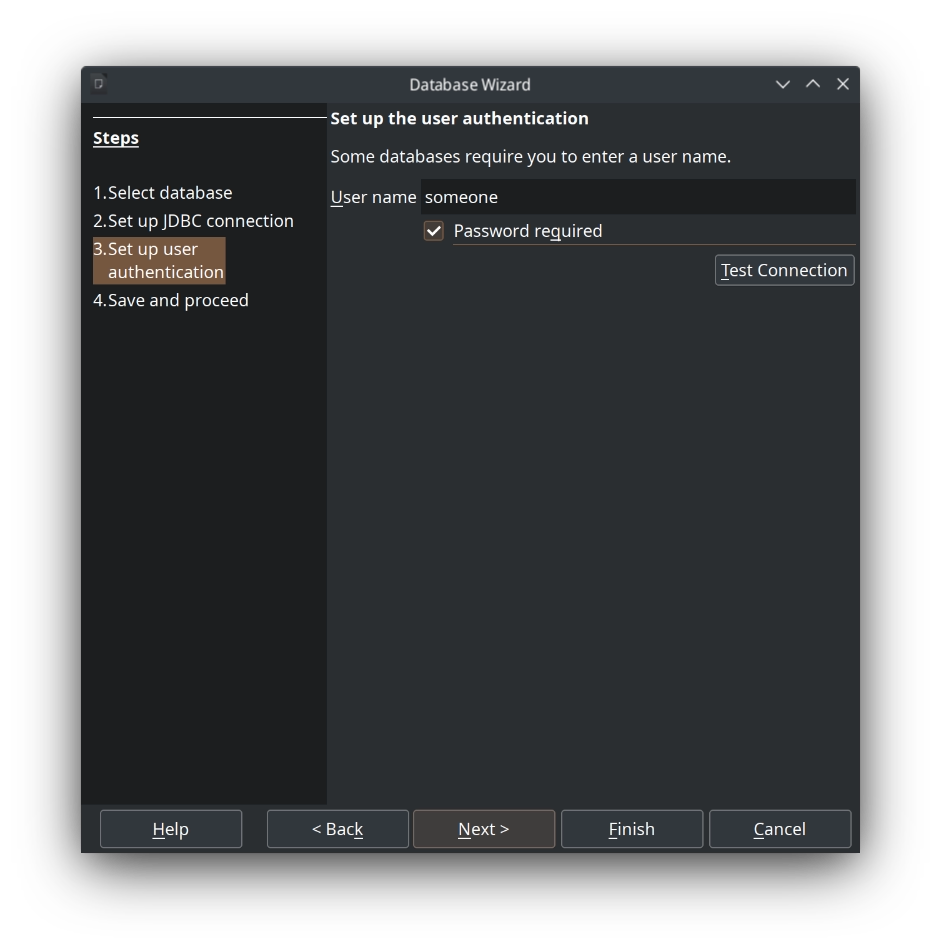

Cliquez sur le bouton `Terminer`, définissez un nom de fichier

== Utilisation dans Base

Ouvrez le fichier enregistré à l'étape précédente, entrez votre mot de passe lorsque vous y êtes invité.

.Tables lues par le pilote
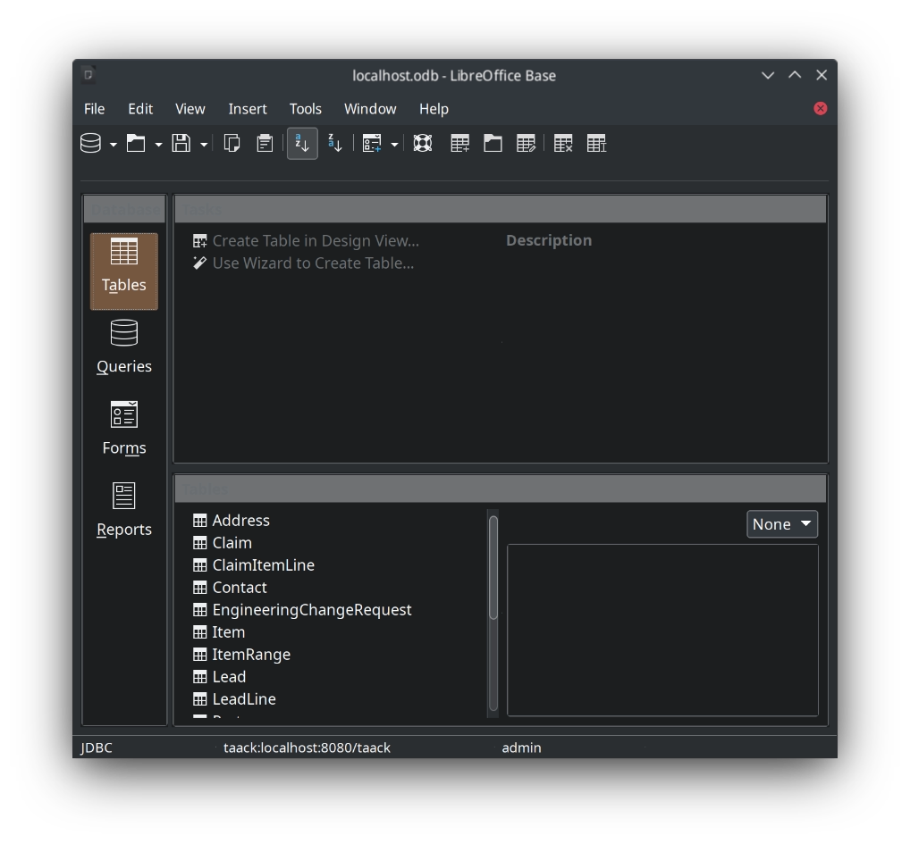

Cliquez sur le bouton Requêtes, puis sur `Créer une requête dans la vue SQL`

ATTENTION : n'utilisez pas l'assistant. L'Intranet utilise le langage TQL pour interroger les données, LibreOffice ne connaît pas ce langage.

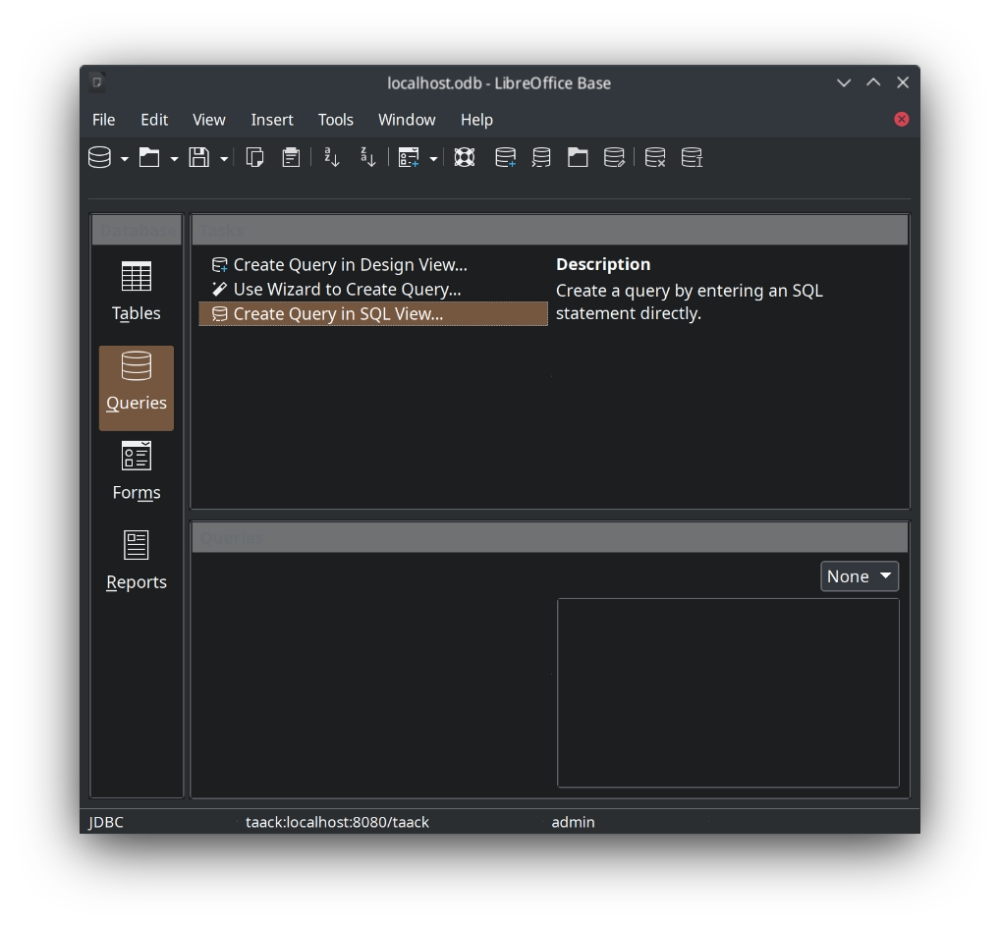

Avant de pouvoir saisir des requêtes, cliquez sur `Exécuter directement la commande SQL`

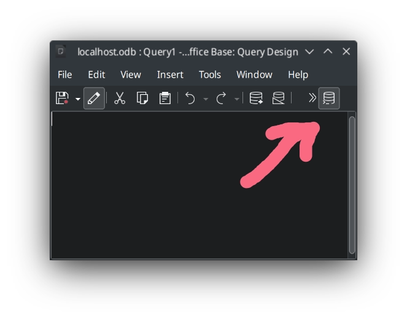

Maintenant, vous pouvez saisir vos requêtes TQL...

Voir le lien :taack-jdbc-driver.adoc#_tql_queries[Requêtes TQL].

== Utilisation dans Calc

Une fois que vous avez créé des requêtes et que vous les avez enregistrées, vous pouvez accéder aux données directement depuis Calc.

=== Ouvrir la requête en tant que tableau croisé dynamique

`Données` > `Tableau croisé dynamique` puis `Source de données dans Calc enregistré`

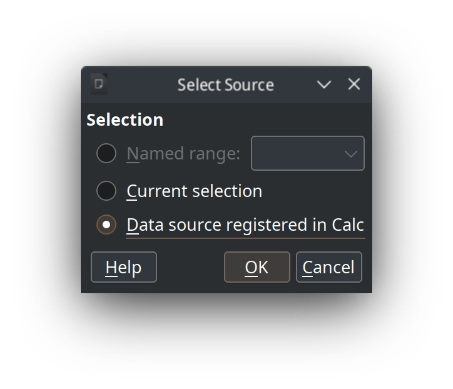

Sélectionnez le fichier dans lequel vous enregistrez vos requêtes, entrez votre mot de passe Intranet, puis vous devez sélectionner la source de données.

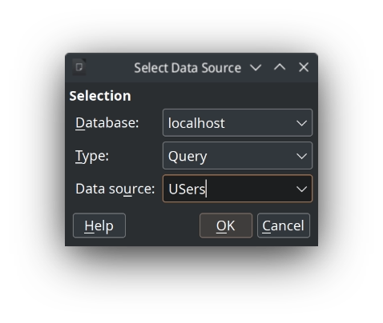

Ici, je choisis Requête et je sélectionne Requête des utilisateurs.

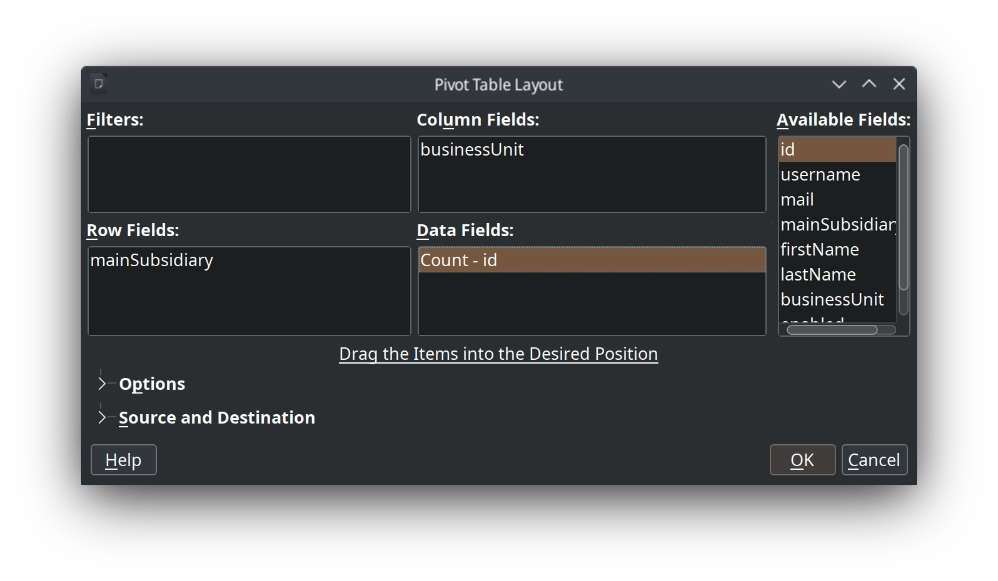

C'est tout. Vous pouvez modifier votre tableau croisé dynamique selon vos besoins.

image::lo-calc-pivotTable-results.webp[]

=== En tant que source de données

TODO