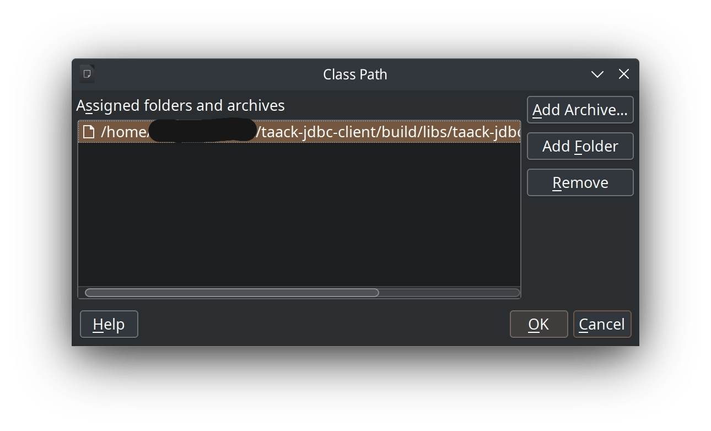
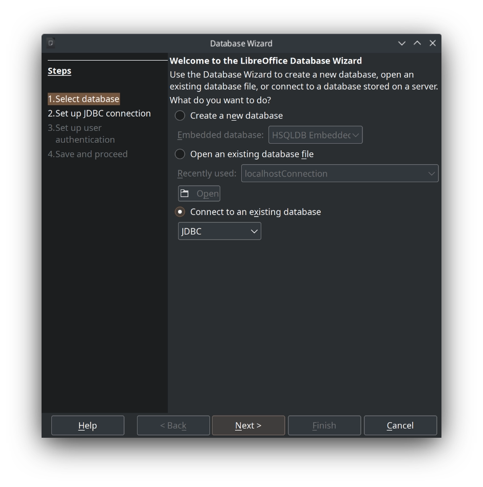
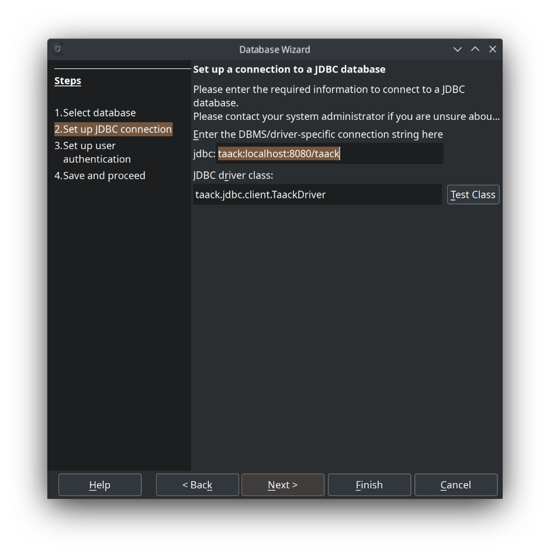
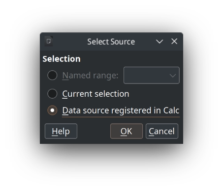
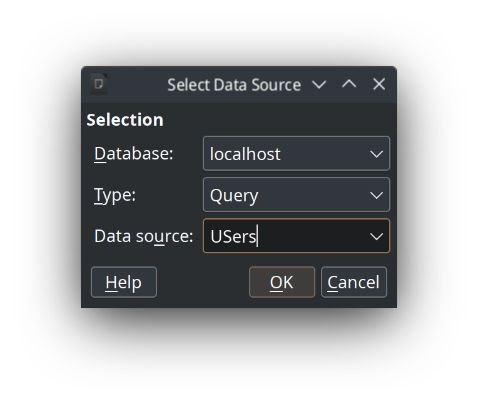

= Libreoffice Base
:doctype: book
:taack-category: 1|more/JDBC
:source-highlighter: rouge
:toc:
:toc-title: 目录
:icons: font

== 配置 LibreOffice 使用 Jdk 17

单击工具 `Tools` > `Options`，然后在 *Options - LibreOffice - User Data* 对话框中，单击 `LibreOffice` > `Advanced`。

必须选中复选框 `Use a Java runtime environment`，并验证是否检测到 JRE 版本 17。

如果没有，请安装 Java 17 并重复该过程。如果未检测到，但您知道它已安装，则可以单击 `Add` 按钮并按照步骤操作。

. 检测到并选择 Java 17
image::lo-java17-conf.webp[]

单击 `Apply` 或 `Ok` 按钮。

== 添加 Jar 驱动程序

下载 https://github.com/Taack/infra/releases/tag/v0.1[taack-jdbc-client-0.2-SNAPSHOT-all.jar]

返回高级对话框。

单击 `Class Path...`，在对话框中单击 `Add Archive...`，选择您下载的文件。

.添加到运行时的驱动程序

点击 `Ok` 按钮。

== 创建 LibreOffice 基础文件

打开 #LibreOffice#，点击 `Base Database`

=== 选择 JDBC

.步骤 1：选择 JDBC

点击 `Next` 按钮。

=== Enter Driver Location in Jar

jdbc: `taack:localhost:8080/taack`

用您的 URL 和端口替换 localhost 和 port。

JDBC 驱动类: `taack.jdbc.client.TaackDriver`

.步骤 2：驱动程序连接字符串

=== 设置用户名

`User name` 必须是您的 Intranet 应用程序的活跃用户 (带有 `ROLE_ADMIN` 或 `ROLE_JDBC_ADMIN`)。

参见 https://github.com/Taack/infra/blob/main/taack-ui/grails-app/controllers/taack/support/TaackJdbcController.groovy[类 TaackJdbcController].

image::lo-base-databaseWizard-3.webp[]

点击 `Finish` 按钮，设置文件名

== 在基础中的使用

打开上一步保存的文件，按照提示输入密码。

.驱动程序读取的表
image::lo-base-tables-screenshot.webp[]

点击查询按钮，然后点击 `Create Query in SQL View`

WARNING: 不要使用 向导。Intranet 使用 TQL 语言查询数据，LibreOffice 不了解这种语言。

image::lo-base-queries-screenshot.webp[]

在输入查询之前，请点击 `Run SQL Command directly`

image::lo-base-queries-designer-screenshot.webp[]

现在，您可以输入您的 TQL 查询...

请参阅 link:taack-jdbc-driver.adoc#_tql_queries[TQL 查询].

== 在 Calc 中的用法

一旦您创建一些查询并保存它们，您就可以直接从 Calc 访问数据。

=== 将查询作为数据透视表打开

`Data` > `Pivot Table` 然后 `Data source in registered Calc`

选择保存查询的文件，输入您的 Intranet 密码，然后您必须选择数据源。

这里我选择查询，并选择用户查询。

image::lo-calc-pivotTable-layout.webp[]

就是这样。您可以根据需要编辑数据透视表。

image::lo-calc-pivotTable-results.webp[]

=== 作为数据源

TODO