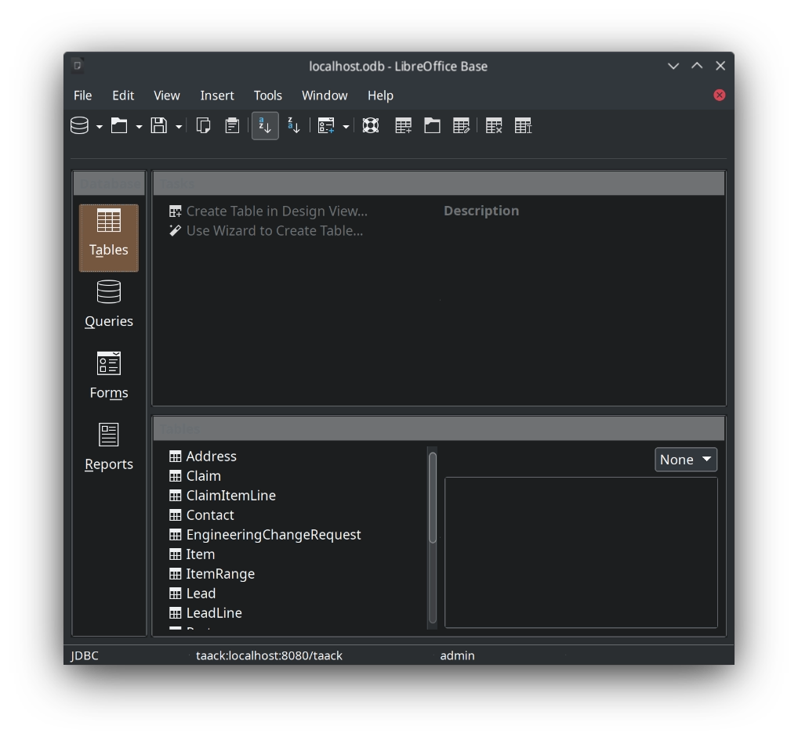
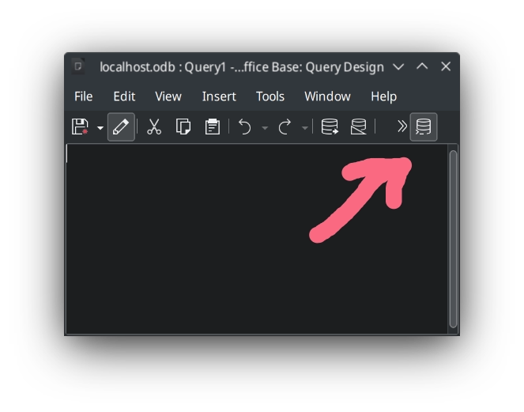
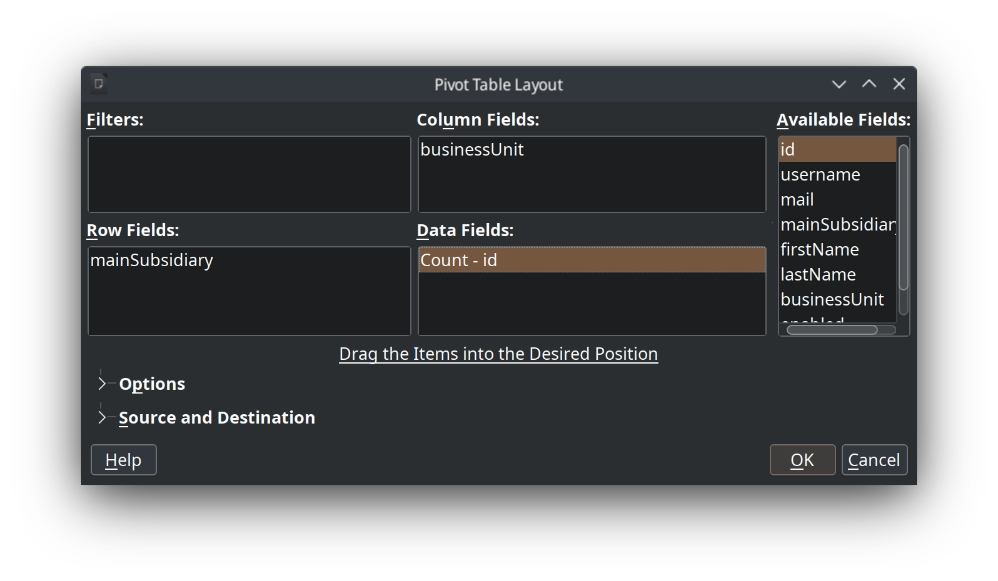
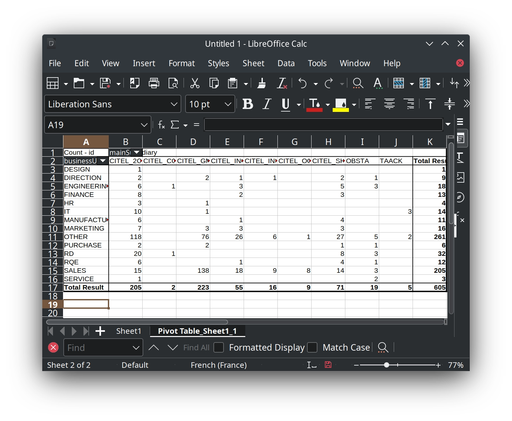

= Libreoffice Base
:doctype: book
:taack-category: 1|more/JDBC
:source-highlighter: rouge
:toc:
:icons: font

== Configure LibreOffice to use Jdk 17

Click on tools `Tools` > `Options`, then in the *Options - LibreOffice - User Data* dialog, click on `LibreOffice` > `Advanced` in the tree.

The checkbox `Use a Java runtime environment` must be checked, and verify a JRE version 17 is detected.

If not, install Java 17 and repeat the process. You can click on `Add` button and follow the procedure if it is not detected, but you know it is installed.

.Java 17 is detected and selected
image::lo-java17-conf.webp[]

Click on `Apply` or `Ok` button.

== Add the Jar Driver

Download https://github.com/Taack/infra/releases/tag/v0.1[taack-jdbc-client-0.2-SNAPSHOT-all.jar]

Go back to the advanced dialog.

Click on `Class Path...`, in the Dialog, click on `Add Archive...`, select the file you downloaded.

.Driver Added to the Runtime
image::lo-java17-driver-conf.webp[]

Click on `Ok` button.

== Create a LibreOffice Base File

Open #LibreOffice#, Click on `Base Database`

=== Select JDBC

.Step 1: Select JDBC
image::lo-base-databaseWizard-1.webp[]

Click on `Next` button.

=== Enter Driver Location in Jar

jdbc: `taack:localhost:8080/taack`

Replace localhost and port by your instance URL and port.

JDBC driver class: `taack.jdbc.client.TaackDriver`

.Step 2: Driver Connection String
image::lo-base-databaseWizard-2.webp[]

=== Set username

The `User name` must be an active user of your Intranet application (with `ROLE_ADMIN` or `ROLE_JDBC_ADMIN`).

See https://github.com/Taack/infra/blob/main/taack-ui/grails-app/controllers/taack/support/TaackJdbcController.groovy[class TaackJdbcController].

image::lo-base-databaseWizard-3.webp[]

Click on `Finish` button, set a file name

== Usage In Base

Open the file saved on previous step, enter your password when prompted.

.Tables read by the driver

Click on Queries button, then on `Create Query in SQL View`

WARNING: Do not use wizard. The Intranet use TQL Language for querying data, LibreOffice does not know about this language.

image::lo-base-queries-screenshot.webp[]

Before being able to type queries, click on `Run SQL Command directly`

Now, you can type your TQL queries...

See link:taack-jdbc-driver.adoc#_tql_queries[TQL Queries].

== Usage In Calc

Once you create some queries, and saved them, you can access data directly from Calc.

=== Open Query as a pivot table

`Data` > `Pivot Table` then `Data source in registered Calc`

image::lo-calc-datasrouce-screenshot.webp[]

Select the file you save your Queries, enter your Intranet password, then you have to select the Datasource.

image::lo-calc-datasrouce-2.webp[]

Here I choose Query, and select Users query.

That's it. You can edit your pivot table according to your needs.

=== As a datasource

TODO