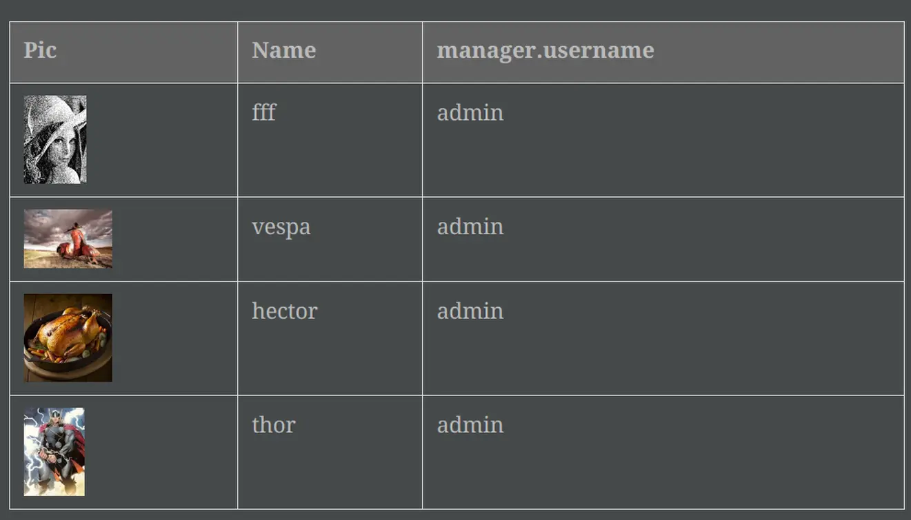

= News
:doctype: book
:taack-category: 3
:toc:
:source-highlighter: rouge

== Version 0.5.4

* Travail sur les diagram DSL (Voir link:doc/DSLs/diagram-dsl-fr.adoc[])

== Version 0.5.3

* Correction des checkboxes dans les formulaires
* Autorise les alias en *TQL* pour les colonnes de formule
* Nettoyage du code

== Version 0.5.2

* Le client JDBC est aussi une extension AsciidoctorJ
* Ajout de l'accès au getter dans la clause select du driver JDBC pour les classes du domain.
* Ajout du DSL <<tql_tdl>> pour décrire comment afficher les données des requêtes
* Les libéllé manuel sur les menus sont de nouveau autorisé
* Meilleure customisation du thème

[[tql_tdl]]
.TQL and TDL (Taack Display Language)
[source,sql]
----
select
    u.rawImg,
    u.username,
    u.manager.username
from User u
where u.dateCreated > '2024-01-01' and u.manager.username = 'admin';
--
table rawImg as "Pic", username as "Name", manager as "Manager"
----

.Results

== Version 0.5.1

* <<_replacement_tp>>, les modules applicatifs se déclare de façon décorrélée du plugin Grails
* Suppression des Charts DSL
* Correction de Diagram DSL, <<_replacement_chart>>
* Autorise les diagrammes dans les PDF (Voir <<_diagrams_into_pdf>> et <<_diagrams_output>>)

[[_replacement_tp]]
.Remplacement de `TaackPlugin`
[source,groovy]
----
@PostConstruct
void init() {
    TaackUiEnablerService.securityClosure(
        this.&securityClosure,
        CrewController.&editUser as MC,
        CrewController.&saveUser as MC)
    TaackAppRegisterService.register(
        new TaackApp(
            CrewController.&index as MC,                    <1>
            new String(
                this.class
                    .getResourceAsStream("/crew/crew.svg")  <2>
                    .readAllBytes()
            )
        )
    )
}
----

<1> Entry Point
<2> Icon

[[_replacement_chart]]
.Remplacement des Charts : Diagrams
[source,groovy]
----
private static UiDiagramSpecifier d1() {
    new UiDiagramSpecifier().ui {
        bar(["T1", "T2", "T3", "T4"] as List<String>, false, {
            dataset 'Truc1', [1.0, 2.0, 1.0, 4.0]
            dataset 'Truc2', [2.0, 0.1, 1.0, 0.0]
            dataset 'Truc3', [2.0, 0.1, 1.0, 1.0]
        }, DiagramTypeSpec.HeightWidthRadio.ONE)
    }
}
----

[[_diagrams_into_pdf]]
.PDF contenant des diagrammes
[source,groovy]
----
printableBody {
    diagram(d1(), BlockSpec.Width.HALF)
    diagram(d2(), BlockSpec.Width.HALF)
}
----

[[_diagrams_output]]
.Diagramme Stacked Bar
image:news-diagram.svg[width=480]

== Version 0.5.0

slide::[fn=slideshow-whatsnew050-fr]
