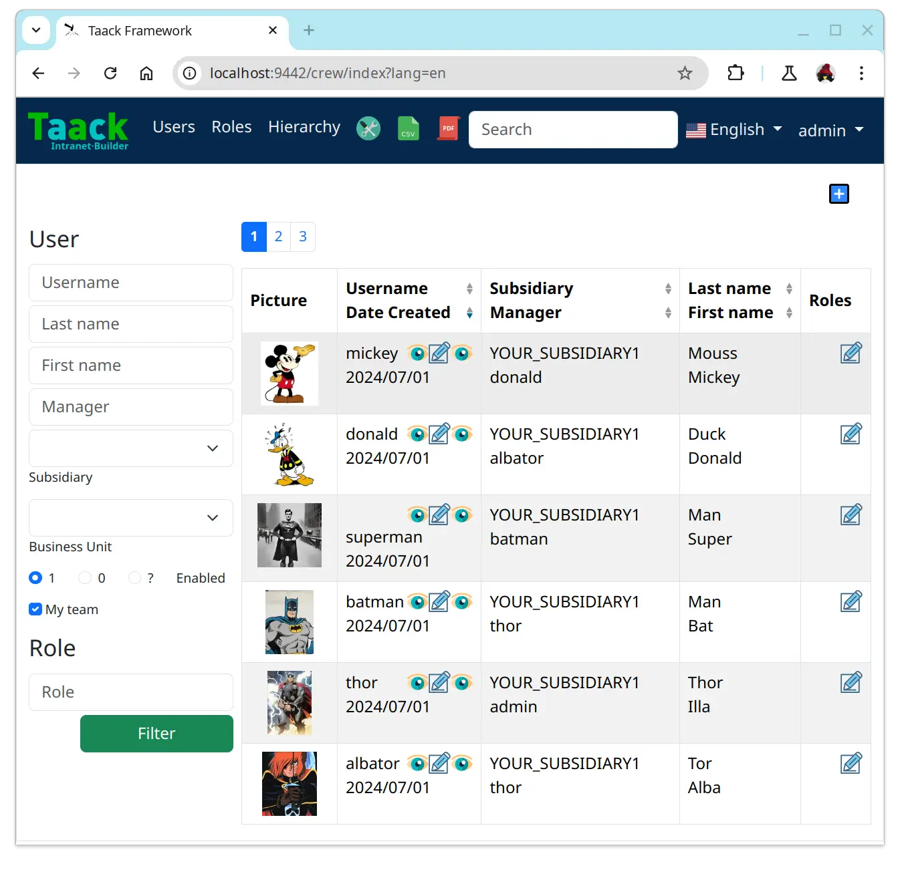

= 更新日志
:doctype: book
:taack-category: 3
:toc:
:toc-title: 目录
:source-highlighter: rouge
:icons: font

== 0.5.6 版（修复 0.5.5 版中的错误）

* 显示表格可排序列和排序方向（参见 <<sorting-screenshot>>）
* 菜单现在像块一样刷新
* 对于复杂布局，可以轻松重用代码。现在，我们可以保留变量，以便轻松将布局情境化（参见 <<context-keeper>>）

[[sorting-screenshot]]
.列标题显示排序方向

[[context-keeper]]
.如何在单击表格时保留上下文
[source,groovy]
----
def showPart(PlmFreeCadPart part, Long partVersion, Boolean isHistory) {<1>
    taackUiService.show(
            plmFreeCadUiService.buildFreeCadPartBlockShow(
                    part, partVersion, false, isHistory),               <2>
            buildMenu(),
            "isHistory")                                                <3>
}
----

<1> `isHistory` 是一个动作参数
<2> `isHistory` 用于绘制块；我们需要重新传输它以绘制完全相同的块布局，通过保留上下文
<3>`isHistory` 键作为最后一个 `taackUiService.show` 参数传递。您可以输入许多要保留的键。

== 0.5.4 版本

* 对图表DSL的重做 (详情见link:doc/DSLs/diagram-dsl.adoc[])

== 0.5.3 版本

* 修复表单复选框
* 允许在 *TQL* 中为公式列使用别名
* 代码清理和增加依赖的版本

== 0.5.2 版本

* JDBC 客户端现在也是 AsciidoctorJ 扩展
* 向 JDBC 可访问域字段添加 getter
* 添加 DSL <<tql_tdl>> 用于描述如何显示查询数据（表格或条形图）
* 恢复菜单上的手动标签
* 关于图表 DSL 的更多内容（感谢 Chong 和 ZhenQing）
* 更好的自定义方式

[[tql_tdl]]
.TQL 和 TDL (Taack 语法示范)
[source,sql]
----
select
    u.rawImg,
    u.username,
    u.manager.username
from User u
where u.dateCreated > '2024-01-01' and u.manager.username = 'admin';
--
table rawImg as "Pic", username as "Name", manager as "Manager"

----

.结果
image::news-table.webp[width=1024]

== 0.5.1 版本

* <<_replacement_tp>>, app 模块可以独立注册
* 删除图表 DSL
* 修复图表 DSL, <<_replacement_chart>>
* 允许 PDF 内呈现图表(详情见 <<_diagrams_into_pdf>> 和 <<_diagrams_output>>)

[[_replacement_tp]]
.TaackPlugin 的替换
[source,groovy]
----
@PostConstruct
void init() {
    TaackUiEnablerService.securityClosure(
        this.&securityClosure,
        CrewController.&editUser as MC,
        CrewController.&saveUser as MC)
    TaackAppRegisterService.register(
        new TaackApp(
            CrewController.&index as MC,                    <1>
            new String(
                this.class
                    .getResourceAsStream("/crew/crew.svg")  <2>
                    .readAllBytes()
            )
        )
    )
}
----

<1> 切入点
<2> 图标

[[_replacement_chart]]
.将 Charts 替换成 Diagrams
[source,groovy]
----
private static UiDiagramSpecifier d1() {
    new UiDiagramSpecifier().ui {
        bar(["T1", "T2", "T3", "T4"] as List<String>, false, {
            dataset 'Truc1', [1.0, 2.0, 1.0, 4.0]
            dataset 'Truc2', [2.0, 0.1, 1.0, 0.0]
            dataset 'Truc3', [2.0, 0.1, 1.0, 1.0]
        }, DiagramTypeSpec.HeightWidthRadio.ONE)
    }
}
----

[[_diagrams_into_pdf]]
.包含图表的 PDF
[source,groovy]
----
printableBody {
    diagram(d1(), BlockSpec.Width.HALF)
    diagram(d2(), BlockSpec.Width.HALF)
}
----

[[_diagrams_output]]
.层叠柱状图
image:news-diagram.svg[width=480]

== 0.5.0 版本

slide::[fn=slideshow-whatsnew050-en]

== 0.4.2 版本

此版本有一些不错的改进（摒弃一些旧代码）

- 改进 DSL 层次结构
* 隐藏字段置于顶部以提高可读性
* 表单中取消冗余参数传递
* 过滤器中取消冗余参数传递
* filterField 仅在 section 可用
* 表单顶层字段仅在 header 上
- 可以很好地显示表单字段 M2M 类型的 hook
- 用来注册典型的对象过滤器的 hook
- 改进恢复状态
- 修复带有分页的表格分组/树
- TBD

== 0.4.1 版本

- 合并搜索菜单、图标菜单和语言菜单, 详情见 <<new_menu_layout>>
- 通过菜单 DSL 保留一些参数...（语言、子公司、库存、其他...）
** 将支持的语言移入菜单（通过 plugin 声明）, 详情见 <<new_menu_layout_code>>
- 允许调试 Kotlin JS 代码, 详情见 <<new_allow_kotlinjs_debug>>
- 更新时修复文件路径。与 O2M 相同，带预览
- 改进恢复状态
- 测试 mac 运行和 devel 时可以冷自动重启
- Solr indexField 自动标记, 详情见 <<new_solr_code>>

[[new_menu_layout]]
.更新后的菜单布局
image:screenshot-news-menu-0.4.1.webp[]

[[new_menu_layout_code]]
.菜单布局代码
[source,groovy]
----
private UiMenuSpecifier buildMenu(String q = null) {
    new UiMenuSpecifier().ui {
        menu CrewController.&index as MC
        menu CrewController.&listRoles as MC
        menu CrewController.&hierarchy as MC
        menuIcon ActionIcon.CONFIG_USER, this.&editUser as MC
        menuIcon ActionIcon.EXPORT_PDF, this.&downloadBinPdf as MC
        menuSearch this.&search as MethodClosure, q
        menuOptions(SupportedLanguage.fromContext())            <1>
    }
}
----

<1> 语言选择在搜索栏的右侧，也可以添加其他枚举类

[[new_allow_kotlinjs_debug]]
.Kotlin JS 调试方法
[source,bash]
----
$ cd infra/browser/client                             <1>
$ ./gradlew browserDevelopmentRun                     <2>
$ vi intranet/server/grails-app/conf/application.yml  <3>
# Uncomment line bellow
# client.js.path: 'http://localhost:8080/client.js'

# Then your browser should show Kotlin code !
----

<1> 移动到生成 JS 代码的 client 路径下
<2> 启动一个服务 client.js 和 client.js.map 的服务器...
<3> 编辑你的 `application.yml` 文件

[[new_solr_code]]
.新的 Solr DSL 简化（不再需要标签）
[source,groovy]
----
@PostConstruct
private void init() {
    taackSearchService.registerSolrSpecifier(this,
            new SolrSpecifier(User,
                CrewController.&showUserFromSearch as MethodClosure,
                this.&labeling as MethodClosure, { User u ->
        u ?= new User()
        indexField SolrFieldType.TXT_NO_ACCENT, u.username_
        indexField SolrFieldType.TXT_GENERAL, u.username_
        indexField SolrFieldType.TXT_NO_ACCENT, u.firstName_
        indexField SolrFieldType.TXT_NO_ACCENT, u.lastName_
        indexField SolrFieldType.POINT_STRING, "mainSubsidiary", true, u.subsidiary?.toString()
        indexField SolrFieldType.POINT_STRING, "businessUnit", true, u.businessUnit?.toString()
        indexField SolrFieldType.DATE, 0.5f, true, u.dateCreated_
        indexField SolrFieldType.POINT_STRING, "userCreated", 0.5f, true, u.userCreated?.username
    }))
}
----

== 0.4.0 版本

* 表格中不再有 `paginate`. 详情见 <<new_iterate_code>>
* 没有 `list`, 但有 `iterate`, 用closure作为参数，并使用构建器传递参数
* 菜单自动标记 (用URL中的 `lang=test` 翻译). 详情见 <<new_menu_code>>
* 表格中不再有 #isAjax# 参数... 详情见 <<new_rowAction_code>>
* 将 rowLink 替换为为 rowAction  <<i18n_isAjax>>
* 表格中的 #rowAction# 不需要标签. 详情见 <<new_rowAction_code>>
* 表格、表单、tableFilter 不再需要 ajaxBlock
* formAction 不再有 #isAjax# 参数
* formAction 不再强制使用 i18n 参数
* 表单不再有强制的 i18n 参数，i18n 会基于当前 action 名称
* block action 不再有强制的 i18n 参数，i18n 会基于目标动作
* block action 不再强制使用 isAjax 参数

[[new_iterate_code]]
.`iterate` 用法
[source,groovy]
----
iterate(taackFilterService.getBuilder(Role)                     <1>
        .setMaxNumberOfLine(20)                                 <2>
        .setSortOrder(TaackFilter.Order.DESC, u.authority_)     <3>
        .build()) { Role r, Long counter ->
            row {
                rowColumn {
                    rowField r.authority
                    if (hasSelect)
                        rowAction
                            ActionIcon.SELECT * IconStyle.SCALE_DOWN,
                            CrewController.&selectRole as MC
                            r.id                                <4>
                }
            }
        }

----

<1> 迭代
<2> 如果有更多行，定义 max 来触发分页
<3> 替换旧的低效模式来描述初始排序和顺序
[[i18n_isAjax]]
<4> 不再有 i18n 和 isAjax 参数

[[new_menu_code]]
.新的 `menu` 代码
[source,groovy]
----
private UiMenuSpecifier buildMenu(String q = null) {
    UiMenuSpecifier m = new UiMenuSpecifier()
    m.ui {
        menu CrewController.&index as MC        <1>
        menu CrewController.&listRoles as MC
        menu CrewController.&hierarchy as MC
        menuSearch this.&search as MethodClosure, q
    }
    m
}
----

<1> 没有 i18n 参数

[[new_rowAction_code]]
.新的 `rowAction` 代码
[source,groovy]
----
if (hasActions) {
    rowColumn {
        rowAction ActionIcon.EDIT * IconStyle.SCALE_DOWN, this.&roleForm as MC, r.id <1>
    }
}
----

<1> 没有 i18n 参数，没有 `isAjax` 参数

== 0.3.9 版本

此版本提供：

- Grails 6.2.0
- Groovy 3.0.21
- Bumping Various deps ... (详情见 https://github.com/Taack/infra/compare/v0.3.8...v0.3.9[Changelog])
