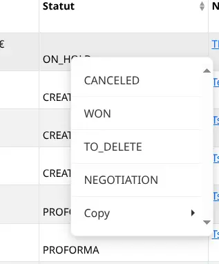
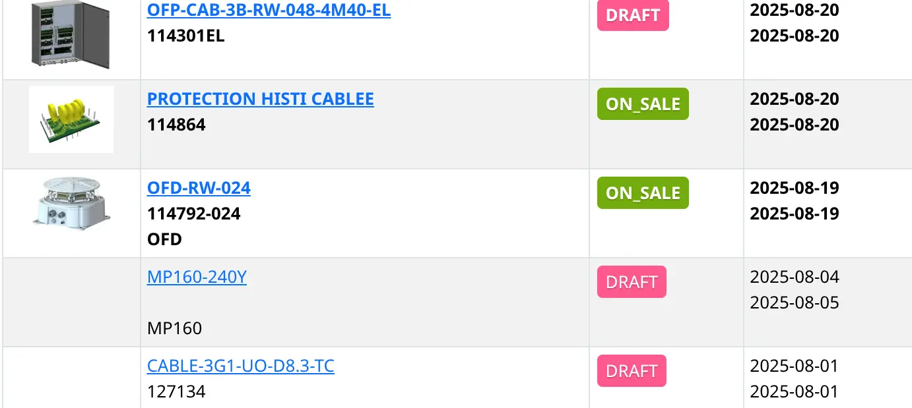
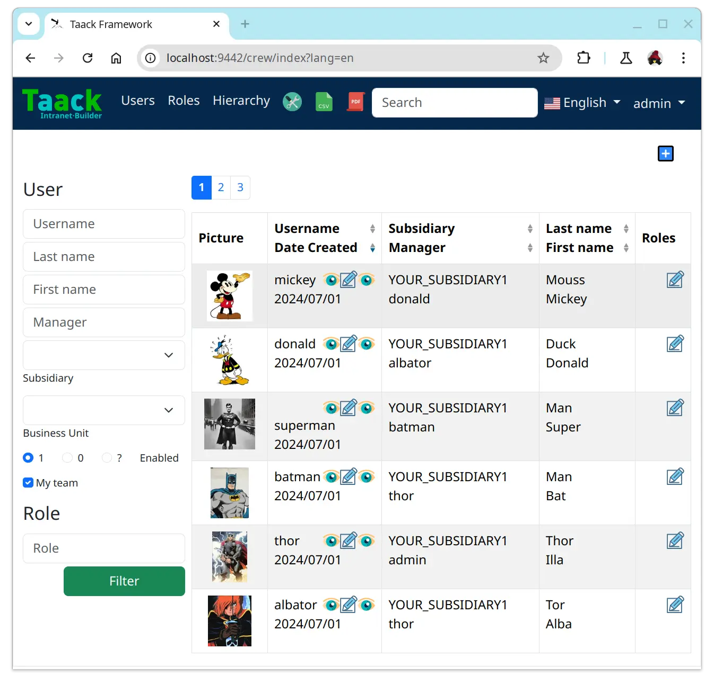
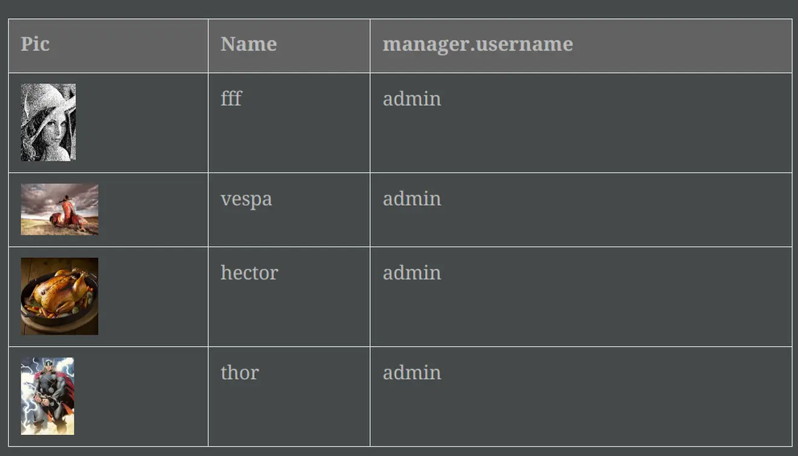
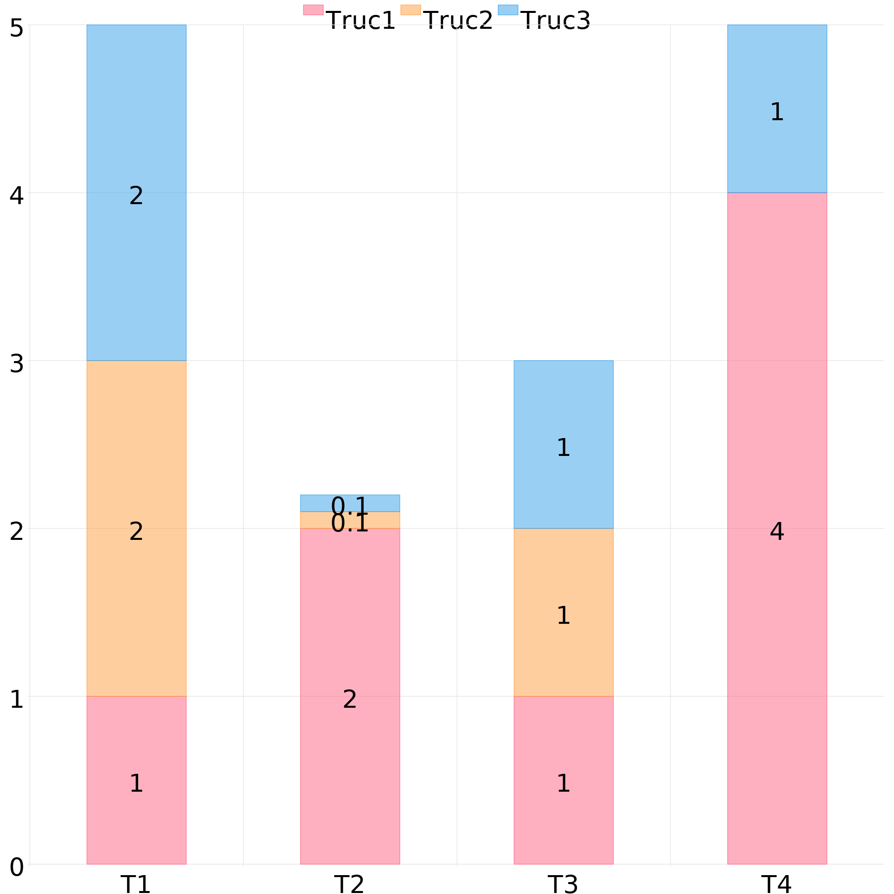
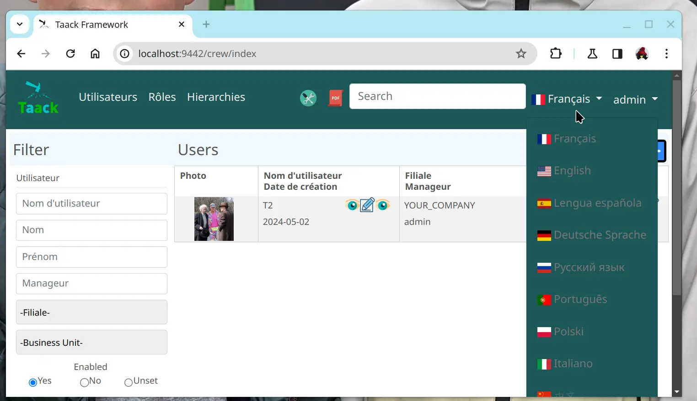

= News
:doctype: book
:taack-category: 3
:toc:
:source-highlighter: rouge
:icons: font

== Version 0.7.0

* Grails 7, Gradle 8.4, Java 24, Groovy 4.0.28 ...
* Split `taack-ui` into `taack-ui`, `taack-ui-jdbc`, `taack-ui-pdf`, `taack-ui-ssh`, `taack-ui-search`, `taack-ui-asciidoc`. Minimal server using only `taack-ui` should be a Jar around 70 MB in size
* Contextual Menus for fields and classes (See <<contextual-menu-code-sample>>)
* Notification helper: allow to mark unread rows on a table via `setLastReadingDate` filter setter. (See <<notification-setLastReadingDate-sample>>)
* #SolrSearch changes#: objects context have to be registered in a generic manner (See <<TaackGormClassRegisterService>>)
* Asciidoc Editor with copy/past capabilities (See <<asciidoc-editor>>)
* Improve Mail and PDF Diagram output

[[contextual-menu-code-sample]]
.Contextual Menu Code Sample
[source,groovy]
----
TaackUiService.registerContextualMenuClosure(   <1>
    new Lead().leadStatus_,
    new UiMenuSpecifier().ui { Long id ->       <2>
        label 'Change Status'
        Lead.read(id)?.leadStatus?.transitionsTo()?.each {
            menu it.toString(),                 <3>
                CrmController.&changeLeadStatus as MC,
                [id: id, leadStatus: it.toString()]
    }
})
----

<1> Register a contextual menu for a field
<2> Use Regular MenuSpecifier closure (as for any menus)

.Result of a right click on Lead Status

[[notification-setLastReadingDate-sample]]
.Create filter marking unread entries
[source,groovy]
----
TaackFilter.FilterBuilder tf = taackFilterService.getBuilder(Item)
        .setMaxNumberOfLine(10)
        .setSortOrder(TaackFilter.Order.DESC, i.dateCreated_)

tf.setLastReadingDate(lastAccessDateFromUser)   <1>
----

<1> Newest objects, will be bold, See <<unread-notif>>

[[unread-notif]]
.Unread rows where object `lastUpdated` > `lastAccessDateFromUser`

[[TaackGormClassRegisterService]]
.Register how an object will be shown
[source,groovy]
----
TaackGormClassRegisterService.register(
        new TaackGormClass(ItemRange.class).builder
                .setShowMethod(Bp2Controller.&showRange as MethodClosure)   <1>
                .build(),
        new TaackGormClass(Item.class).builder
                .setShowMethod(Bp2Controller.&showItem as MethodClosure)    <1>
                .setShowLabel({ Long id ->                                  <2>
                    def i = Item.read(id)
                    return "${i.name} ${i.ref ?: ''} ($id)"
                })
                .setTypeLabel({ Long id ->                                  <3>
                    return TaackUiService.tr('default.item.label')
                }).build()
)
----

<1> How to Show the Object
<2> Custom Label
<3> Type for Faceting

[[asciidoc-editor]]
.Asciidoc Editor
[source,groovy]
----
//...
EditorOption.EditorOptionBuilder editor = EditorOption.getBuilder()
editor.addSpanRegexes(TaackBaseAsciidocSpans.spans)         <1>
editor.addSpanRegexes(TaackAsciidocTable.spans)             <1>
editor.addSpanRegexes(TaackAsciidocPlantUML.spans)          <1>
editor.uploadFileAction(this.&dropEditor as MC, cmsPage.id) <2>
fieldEditor cmsPage.bodyContent_, editor.build()            <3>
innerFormAction this.&previewBody as MC                     <4>
//...

@Transactional
def dropEditor() {                                          <2>
    CmsPage page = CmsPage.get(params.long('cmsPage'))
    params.remove('cmsPage')
    String past = params.get('onpaste')
    if (past) {                                             <5>
        render taackAsciidocService.convertFromHtml(past)
    } else {                                                <6>
        final List<MultipartFile> mfl = (request as MultipartHttpServletRequest).getFiles('filePath')
        final mf = mfl.first()

        if ([AttachmentContentType.SHEET_ODS.mimeType,
             AttachmentContentType.LO_TEXT.mimeType
            ].contains(mf.contentType)) {                   <7>
            render taackAsciidocService.convert(page, mf.inputStream)
        } else {                                            <8>
            CmsImage cmsImage = taackSaveService.save(CmsImage)
            if (cmsImage && page) {
                cmsImage.cmsPage = page
            }
            render "image::${cmsImage.originalName}[]"
        }
    }
}
----

<1> Add syntax spans extensions (basically a regex and a class to colorise the code)
<2> Callback when a file is drop, or a past from another page or application is done
<3> The field in the form
<4> Optional Preview Action
<5> Past a html content. Content will be converted into Asciidoc
<6> Drop file part
<7> The file is an ODS or Writer file, it will be converted into Asciidoc, image will be imported
<8> The file is an image, it will be saved into the CMS.

WARNING: taackAsciidocService uses `TaackEditorService` service from `taack-ui-asciidoc`, see link:doc/DSLs/form-dsl.adoc#_asciidoc[form DSL]

== Version 0.6.1

* Diagram Action (see <<_diagram_action>>)
* Fullscreen modal
* Static helpers (see <<_static_helper>>)

[[_diagram_action]]
.Diagram Action Usage
[source,groovy]
----
new UiDiagramSpecifier().ui {
    bar {
        labels 'date1', 'date2', 'date3'
        dataset 'Stuff1', 3.0, 4.0, 5.0

        diagramAction this.&clickDiagram as MC, id, <1>
        [optionalParam: 'value']                    <2>
    }
}

def clickDiagram() {
    println(params)
    // [id: 123456, dataset: "Stuff1",
    // optionalParam: "value"                       <3>
    // x: "date1", y: "3.0"]
}

----

<1> Diagram Action
<2> Can pass map
<3> Action params contain *label*, *value*, *dataset name* and *map*

[[_static_helper]]
.Static Helpers Usage
[source,groovy]
----
import org.codehaus.groovy.runtime.MethodClosure as MC

import static taack.ui.TaackUi.createMenu           <1>

@Override
UiMenuSpecifier editorCreate() {
    createMenu {                                    <2>
        menu this.&createFromTemplate as MC
        menuIcon
            CollaboraIcons.WRITER,
            this.&createFromTemplate as MC,
            [collaboraApp: CollaboraApp.WRITER]
    }
}
----

<1> Static Import
<2> `createMenu` static call, shortcut for `new UiMenuSpecifier().ui`, other shortcuts include `createModal`, returning `UiBlockSpecifier`

video::wF323zHFa94[youtube, 480]

== Version 0.6

* Load animation
* Diagram zoom / scroll
* Diagram tooltips
* Table Multiselect (see <<doc/DSLs/filter-table-dsl.adoc#table-sample1>>)
* Tabs lazy loading
* Improve pagination
* Optimize drawing, avoiding unnecessary draw
* Avoid case where blocks were drawn twice
* Improve search layout
* Allow Big decimal on tables, shown in user's locale
* WiP: Simple Asciidoc WYSIWYG Editor

== Version 0.5.7

* Clean up `show` DSL code, deprecates passing object parameter to `UiShowSpecifier().ui`
* Initial Asciidoctor WYSIWYG editor
** Support for Drag and Drop images and files
* More diagram DSLs
** timeSeries
** areaChart
** bubbleChart
* Security
** Sanitize displayed information by default (use `fieldRaw` to avoid sanitizing)
** Check access on all entry points
* Bug fixes and dependencies bump

WARNING: Replace `field <html code>` by `fieldRaw <html code>`

== Version 0.5.6 (fix bugs from 0.5.5)

* reduce Solr and tika dependency scoping
* Show table sortable column and sorting direction (see <<sorting-screenshot>>)
* Block menus are now refreshed like blocks
* For complexe layout, code can be reused easily. We can now keep variables that contextualize the layout easily (see <<context-keeper>>)

[[sorting-screenshot]]
.Column headers show sorting directions

[[context-keeper]]
.How to keep the context when clicking on a table
[source,groovy]
----
def showPart(PlmFreeCadPart part, Long partVersion, Boolean isHistory) {<1>
    taackUiService.show(
            plmFreeCadUiService.buildFreeCadPartBlockShow(
                    part, partVersion, false, isHistory),               <2>
            buildMenu(),
            "isHistory")                                                <3>
}
----

<1> `isHistory` is an action parameter
<2> `isHistory` is used when drawing the block; we need to retransmit it to draw the exact same block layout, by keeping the context
<3> `isHistory` key is passed as the last `taackUiService.show` argument. You can put many keys to keep.

== Version 0.5.4

* Rework diagram DSL (See link:doc/DSLs/diagram-dsl.adoc[])

== Version 0.5.3

* Fix form checkbox
* Allow alias in *TQL* for formula columns
* Code cleanup and increment dependency versions

== Version 0.5.2

* JDBC client is now also an AsciidoctorJ extension
* Add getters to JDBC accessible domain fields
* Add DSL <<tql_tdl>> for describing how to display queried data (either table or barchart)
* Restore manual labeling on menus
* More on diagram DSL (Thanks Chong and ZhenQing)
* Better customisation

[[tql_tdl]]
.TQL and TDL (Taack Display Language)
[source,sql]
----
select
    u.rawImg,
    u.username,
    u.manager.username
from User u
where u.dateCreated > '2024-01-01' and u.manager.username = 'admin';
--
table rawImg as "Pic", username as "Name", manager as "Manager"

----

.Results

== Version 0.5.1

* <<_replacement_tp>>, app module registers itself independently
* Remove Charts DSL
* Fix Diagram DSL, <<_replacement_chart>>
* Allow Diagrams into PDF (See <<_diagrams_into_pdf>> and <<_diagrams_output>>)

[[_replacement_tp]]
.Replacement of TaackPlugin
[source,groovy]
----
@PostConstruct
void init() {
    TaackUiEnablerService.securityClosure(
        this.&securityClosure,
        CrewController.&editUser as MC,
        CrewController.&saveUser as MC)
    TaackAppRegisterService.register(
        new TaackApp(
            CrewController.&index as MC,                    <1>
            new String(
                this.class
                    .getResourceAsStream("/crew/crew.svg")  <2>
                    .readAllBytes()
            )
        )
    )
}
----

<1> Entry Point
<2> Icon

[[_replacement_chart]]
.Replacement of Charts: Diagrams
[source,groovy]
----
private static UiDiagramSpecifier d1() {
    new UiDiagramSpecifier().ui {
        bar(["T1", "T2", "T3", "T4"] as List<String>, false, {
            dataset 'Truc1', [1.0, 2.0, 1.0, 4.0]
            dataset 'Truc2', [2.0, 0.1, 1.0, 0.0]
            dataset 'Truc3', [2.0, 0.1, 1.0, 1.0]
        }, DiagramTypeSpec.HeightWidthRadio.ONE)
    }
}
----

[[_diagrams_into_pdf]]
.PDF containing diagrams
[source,groovy]
----
printableBody {
    diagram(d1(), BlockSpec.Width.HALF)
    diagram(d2(), BlockSpec.Width.HALF)
}
----

[[_diagrams_output]]
.Stacked Bar Diagram

== Version 0.5.0

slide::[fn=slideshow-whatsnew050-en]

== Version 0.4.2

To be released... this version should come with some nice changes (breaking some old code sometime)

- Improve DSL hierarchy
* hidden fields on top only for readability
* no redundant parameter passing in form
* no redundant parameter passing in filter
* filterField only under section only
* form top level field only on header
- hook for form fields to display M2M nicely
- hook to register typical object filter
- Improve restore state
- Fix table grouping / trees with paginate
- TBD

== Version 0.4.1

- Merge search menu, icon menu, and language Menu, see <<new_menu_layout>>
- Keep some params ... (lang, subsidiary, stock, others ...) via menu DSL
** Move supported Language into menus (from plugin declaration), see <<new_menu_layout_code>>
- Allow debugging Kotlin JS code, see <<new_allow_kotlinjs_debug>>
- Fix file path when updating. The same way as for O2M, with preview
- Improve restore state
- Test mac runtime and devel cold auto-restart
- Solr indexField auto-labeling, see <<new_solr_code>>

[[new_menu_layout]]
.Updated Menus layout

[[new_menu_layout_code]]
.Menus layout code
[source,groovy]
----
private UiMenuSpecifier buildMenu(String q = null) {
    new UiMenuSpecifier().ui {
        menu CrewController.&index as MC
        menu CrewController.&listRoles as MC
        menu CrewController.&hierarchy as MC
        menuIcon ActionIcon.CONFIG_USER, this.&editUser as MC
        menuIcon ActionIcon.EXPORT_PDF, this.&downloadBinPdf as MC
        menuSearch this.&search as MethodClosure, q
        menuOptions(SupportedLanguage.fromContext())            <1>
    }
}
----

<1> Language choice is on the right of the searchbar, and other enums can be added

[[new_allow_kotlinjs_debug]]
.Kotlin JS Debug HowTo
[source,bash]
----
$ cd infra/browser/client                             <1>
$ ./gradlew browserDevelopmentRun                     <2>
$ vi intranet/server/grails-app/conf/application.yml  <3>
# Uncomment line bellow
# client.js.path: 'http://localhost:8080/client.js'

# Then your browser should show Kotlin code !
----

<1> Move to client folder where JS code is generated
<2> Launch a server serving client.js and client.js.map ...
<3> edit your intranet `application.yml` file

[[new_solr_code]]
.New Solr DSL Simplification (no more labeling needed)
[source,groovy]
----
@PostConstruct
private void init() {
    taackSearchService.registerSolrSpecifier(this,
            new SolrSpecifier(User,
                CrewController.&showUserFromSearch as MethodClosure,
                this.&labeling as MethodClosure, { User u ->
        u ?= new User()
        indexField SolrFieldType.TXT_NO_ACCENT, u.username_
        indexField SolrFieldType.TXT_GENERAL, u.username_
        indexField SolrFieldType.TXT_NO_ACCENT, u.firstName_
        indexField SolrFieldType.TXT_NO_ACCENT, u.lastName_
        indexField SolrFieldType.POINT_STRING, "mainSubsidiary", true, u.subsidiary?.toString()
        indexField SolrFieldType.POINT_STRING, "businessUnit", true, u.businessUnit?.toString()
        indexField SolrFieldType.DATE, 0.5f, true, u.dateCreated_
        indexField SolrFieldType.POINT_STRING, "userCreated", 0.5f, true, u.userCreated?.username
    }))
}
----

== Version 0.4.0

* No more `paginate` in tables. See <<new_iterate_code>>
* No `list`, but an `iterate` taking a closure as parameter, with a builder pattern approach to pass args
* Menu are auto labeled now (use `lang=test` in url to translate menus). See <<new_menu_code>>
* No more #isAjax# parameter in tables ... See <<new_rowAction_code>>
* change rowLink into rowAction  <<i18n_isAjax>>
* No label needed on #rowAction# in tables. See <<new_rowAction_code>>
* No more ajaxBlock required for tables, forms, tableFilters
* formAction has no more #isAjax# parameter
* formAction has no more mandatory i18n parameter
* form has no more mandatory i18n parameter, i18n is based on current action name
* block action has no more mandatory i18n parameter, i18n is based on target action
* block action has no more mandatory isAjax parameter

[[new_iterate_code]]
.New `iterate` usage
[source,groovy]
----
iterate(taackFilterService.getBuilder(Role)                     <1>
        .setMaxNumberOfLine(20)                                 <2>
        .setSortOrder(TaackFilter.Order.DESC, u.authority_)     <3>
        .build()) { Role r, Long counter ->
            row {
                rowColumn {
                    rowField r.authority
                    if (hasSelect)
                        rowAction
                            ActionIcon.SELECT * IconStyle.SCALE_DOWN,
                            CrewController.&selectRole as MC
                            r.id                                <4>
                }
            }
        }

----

<1> iterate
<2> Specifying max is enough to trigger paginate if more lines
<3> Replace the old inefficient pattern to describe initial sort and order
[[i18n_isAjax]]
<4> No more i18n and isAjax parameter

[[new_menu_code]]
.New `menu` code
[source,groovy]
----
private UiMenuSpecifier buildMenu(String q = null) {
    UiMenuSpecifier m = new UiMenuSpecifier()
    m.ui {
        menu CrewController.&index as MC        <1>
        menu CrewController.&listRoles as MC
        menu CrewController.&hierarchy as MC
        menuSearch this.&search as MethodClosure, q
    }
    m
}
----

<1> No i18n parameter

[[new_rowAction_code]]
.New `rowAction` code
[source,groovy]
----
if (hasActions) {
    rowColumn {
        rowAction ActionIcon.EDIT * IconStyle.SCALE_DOWN, this.&roleForm as MC, r.id <1>
    }
}
----

<1> No i18n parameter, no last `isAjax` parameter

== Version 0.3.9

No updates since too long, hibernation is coming to an end. This version offer:

- Grails 6.2.0
- Groovy 3.0.21
- Bumping Various deps ... (See https://github.com/Taack/infra/compare/v0.3.8...v0.3.9[Changelog])
