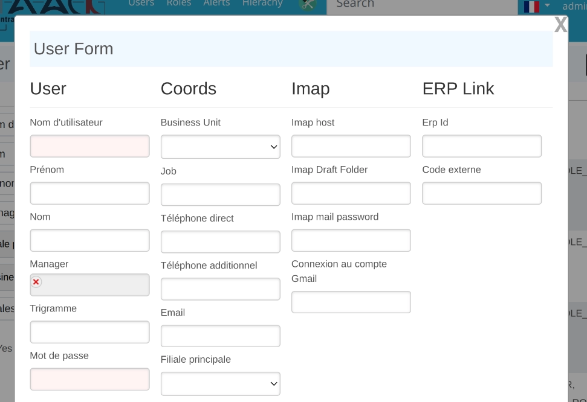

include::_settings_reveal.adoc[]
:source-highlighter: highlightjs
:highlightjs-languages: groovy, gnuplot
:title-slide-transition: zoom
:title-slide-transition-speed: fast
:icons: font
:docinfo: shared
:customcss: custom.css
:revealjs_height: 512

= French Slides

== Langage dédié pour interface utilisateur

** Efficacité lors du développement et maintenance
** Mise en évidence des erreurs au moment du codage
** Concision du code

[transition=zoom]
=== Avantages

** Plus expressif
** Expressions statiques pour analyses
** Pas de JavaScript / ni de HTML

[transition=concave,transition-speed=fast,transition-background=zoom]
== Formulaires

[%notitle,transition=zoom]
=== Form Sample

[source,groovy]
----
        new UiFormSpecifier().ui user, {
            hiddenField user.subsidiary_
            hiddenField user.origin_
            section "User", {
                field user.username_
                field user.firstName_
                field user.lastName_
                ajaxField user.manager_, this.&selectUserM2O
                field user.trigram_
                field user.password_
            }
        // [ . . . ]
        }
----

[%notitle]
=== Forms

[.columns]
== Composants graphiques

[.column]
--
** Table
** Filtre
** Formulaire
--
[.column]
--
** Détails
** Graphiques
--

== Composants étendus

** Prévisualisation de fichiers
** Recherche textuelle
** Pilote JDBC pour interroger le modèle
